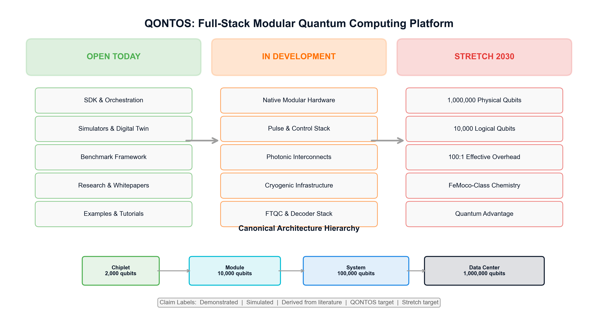

# QONTOS: A Full-Stack Modular Quantum Computing Architecture
## Executive Summary of the QONTOS Research Paper Series (Papers 01--10)

**QONTOS Research Wing, Zhyra Quantum Research Institute (ZQRI), Abu Dhabi, UAE**

*Contact: research@zhyra.xyz*

*Paper 00 of 10 | Version 3.0 | March 2026*

---

## Abstract

This document provides a comprehensive executive summary of the ten-paper QONTOS research series. QONTOS is a full-stack quantum computing program combining an operational, open-source software orchestration platform with a staged hardware research program targeting modular, fault-tolerant quantum computation at scale. The software platform---comprising circuit ingestion, partitioning, scheduling, execution management, and observability---is operational today and backend-agnostic by design. The hardware research program proposes a hybrid superconducting-photonic modular architecture based on superconducting qubits with photonic interconnects, scaling from 2,000-qubit chiplets to a 1,000,000-physical-qubit data center configuration, contingent on achieving validated milestones in qubit fabrication, quantum error correction, photonic interconnects, cryogenic engineering, and real-time decoding. This summary frames the program's claims using explicit status labels, scenario-based projections, and gated validation criteria. All performance targets are expressed as conditional engineering goals, not guaranteed outcomes.

**Keywords:** quantum computing, modular architecture, fault-tolerant quantum computation, quantum error correction, quantum software stack, photonic interconnects, superconducting qubits, hybrid superconducting-photonic architecture

---

## Table of Contents

1. [Introduction and Motivation](#1-introduction-and-motivation)
2. [Program Structure: Software Today, Hardware Tomorrow](#2-program-structure-software-today-hardware-tomorrow)
3. [The QONTOS Software Platform (Demonstrated)](#3-the-qontos-software-platform-demonstrated)
4. [Canonical Hardware Architecture (QONTOS Target)](#4-canonical-hardware-architecture-qontos-target)
5. [Technical Pillar Summaries](#5-technical-pillar-summaries)
6. [Scenario Framework](#6-scenario-framework)
7. [Target Workloads and Application Landscape](#7-target-workloads-and-application-landscape)
8. [Claim Status Summary](#8-claim-status-summary)
9. [Dependencies and Assumptions](#9-dependencies-and-assumptions)
10. [Validation Gates](#10-validation-gates)
11. [Risks and Failure Modes](#11-risks-and-failure-modes)
12. [Paper Series Overview and Reading Guide](#12-paper-series-overview-and-reading-guide)
13. [Conclusion](#13-conclusion)
14. [References](#14-references)

---

## 1. Introduction and Motivation

Quantum computing has progressed from theoretical curiosity to early experimental demonstration over the past three decades. Shor's algorithm for integer factorization [1] and Grover's search algorithm [2] established the theoretical foundations for quantum advantage. More recently, experimental milestones---including Google's demonstration of beyond-classical computation on a 53-qubit Sycamore processor [3] and IBM's evidence for quantum utility on a 127-qubit Eagle processor [4]---have shown that quantum hardware is approaching regimes of practical relevance.

However, a substantial gap remains between today's noisy intermediate-scale quantum (NISQ) devices, operating on the order of hundreds to low thousands of physical qubits with limited coherence, and the fault-tolerant quantum computers required for problems of genuine scientific and industrial impact. Preskill's influential framing of the NISQ era [5] remains apt: current hardware is too noisy for most algorithms of interest, yet too capable to simulate classically in all cases. Bridging this gap requires coordinated advances across multiple engineering disciplines---qubit fabrication, error correction, classical control, interconnects, cryogenics, and software.

The QONTOS program addresses this challenge through two complementary strategies:

1. **An operational software-first platform** that provides quantum circuit orchestration, scheduling, and execution management today, agnostic to the underlying hardware backend. This platform is open-source and usable with existing quantum processors and simulators.

2. **A staged hardware research program** that proposes a modular, hierarchical architecture designed to scale toward fault-tolerant quantum computation, subject to achieving validated engineering milestones at each stage.

This executive summary synthesizes the findings, designs, and projections of the full ten-paper QONTOS research series. It is intended for researchers, engineers, investors, and partners who require an honest, technically grounded overview of what QONTOS is today, what it aims to become, and what must go right for the program to succeed.

---

## 2. Program Structure: Software Today, Hardware Tomorrow

The QONTOS program is organized into three layers, each with a distinct maturity level and evidentiary basis. This three-layer structure is critical for honest communication about the program's status.

### Layer 1: Implemented and Operational Today

The QONTOS software platform is deployed and functional. Its capabilities include:

- Circuit ingestion and normalization from multiple frontend frameworks (Qiskit, Cirq, OpenQASM 3.0)
- Circuit partitioning and resource-aware scheduling
- Simulator-backed and hardware-backed execution
- Result aggregation with statistical post-processing
- Full execution replayability and observability
- Modular runtime abstractions designed for future multi-backend orchestration

**Claim status: Demonstrated.** These capabilities exist in open-source code and have been validated against simulator backends and select cloud-accessible quantum hardware.

### Layer 2: Research-Backed Technical Program

The following technical pillars are grounded in published research and form the basis of the QONTOS hardware development program. Each requires experimental validation at the system level:

- Modular superconducting qubit architecture with photonic interconnects (Paper 01)
- Tantalum-on-silicon qubit platform (Paper 02)
- Low-overhead quantum error correction (Paper 03)
- Photonic inter-module interconnects (Paper 04)
- AI-assisted real-time decoding (Paper 05)
- Integrated classical-quantum software stack (Paper 06)
- Scalable cryogenic infrastructure (Paper 07)

**Claim status: Derived from literature and QONTOS target.** Design parameters are grounded in published results from leading groups, but system-level integration at the proposed scale has not been demonstrated by QONTOS or, in most cases, by any group.

### Layer 3: Stretch Roadmap (2028--2032)

The long-range program targets include:

- 1,000,000 physical qubits across a data center configuration
- On the order of 10,000 logical qubits in the stretch scenario
- Fault-tolerant execution of classically intractable chemistry simulations
- FeMoco nitrogen fixation simulation as the flagship benchmark workload

**Claim status: Stretch target.** These outcomes are contingent on multiple independent technical assumptions being validated concurrently. They represent program ambitions, not projections.

---

## 3. The QONTOS Software Platform (Demonstrated)

Paper 06 describes the QONTOS software stack in detail. The platform is designed around several architectural principles that are operational today:

**Circuit Management.** The platform ingests quantum circuits from standard frameworks, normalizes them to an internal intermediate representation, and applies backend-specific transpilation. This layer abstracts hardware differences and supports reproducible execution across backends.

**Partitioning and Scheduling.** For circuits that exceed the capacity of a single execution unit---whether due to qubit count, gate depth, or connectivity constraints---the platform provides partitioning algorithms that decompose circuits into executable sub-circuits. A scheduling layer manages execution order, respects resource constraints, and supports priority-based queuing.

**Execution and Observability.** The runtime manages circuit dispatch, monitors execution status, and aggregates results. All executions are logged with sufficient metadata to enable full replay, which is essential for debugging, benchmarking, and auditability.

**Backend Agnosticism.** The platform is designed to operate across simulator backends, cloud-accessible quantum hardware (e.g., IBM Quantum, IonQ, Rigetti via standard APIs), and, in the future, QONTOS-native hardware. This design choice ensures that the software platform delivers value today, independent of the hardware research program's timeline.

**Claim status: Demonstrated.** The software platform is the most mature component of the QONTOS program and provides the foundation upon which hardware integration will be built.

---

## 4. Canonical Hardware Architecture (QONTOS Target)

Paper 01 defines the hybrid superconducting-photonic modular architecture that serves as the reference design across the entire paper series. The architecture employs photonically-interconnected superconducting modules organized at four levels:

| Level | Unit | Physical Qubits | Composition |
|-------|------|-----------------|-------------|
| L0 | Chiplet | 2,000 | Base fabrication unit |
| L1 | Module | 10,000 | 5 chiplets per module |
| L2 | System | 100,000 | 10 modules per system |
| L3 | Data Center | 1,000,000 | 10 systems per data center |

**Design rationale.** The chiplet size of 2,000 qubits is chosen to remain within the range that current and near-term fabrication processes can target with acceptable yield, based on extrapolation from demonstrated devices in the range of hundreds of qubits [3, 4, 6]. The modular hierarchy addresses the fundamental constraint that monolithic scaling of superconducting processors faces wiring density, thermal load, and yield limitations that grow superlinearly with qubit count. Photonic interconnects between modules are integral to this hybrid architecture, enabling quantum state transfer across physically separated cryogenic units.

**Inter-level connectivity.** Within a chiplet, qubits are connected via nearest-neighbor or limited-range couplers on-chip. Between chiplets within a module, high-bandwidth cryogenic interconnects provide coupling. Between modules, photonic interconnects (detailed in Paper 04) provide quantum state transfer at rates that must meet specific fidelity and bandwidth thresholds. Between systems, classical networking suffices for the envisioned workload distribution model.

**Claim status: QONTOS target.** The architecture is a design target. No multi-chiplet module has been fabricated by QONTOS. The architecture parameters are consistent with published modular quantum computing proposals, including Monroe et al.'s large-scale modular architecture [7] and IBM's quantum-centric supercomputing roadmap [6], but system-level validation remains ahead.

---

## 5. Technical Pillar Summaries

### 5.1 Tantalum-on-Silicon Qubit Platform (Paper 02)

The QONTOS qubit platform targets tantalum-based transmon qubits fabricated on high-resistivity silicon substrates. Tantalum has been shown by multiple groups to support longer coherence times than conventional aluminum-based transmons, with T1 times exceeding 300 microseconds reported in the literature. The QONTOS program targets T1 coherence times of order 500 microseconds as a stretch goal, with a base target in the range demonstrated by leading groups.

Two-qubit gate fidelities at the 99.5% level or above are targeted, consistent with recent results from Google Quantum AI [8] and IBM [6]. Single-qubit gate fidelities above 99.9% are targeted based on demonstrated state of the art.

**Claim status: Derived from literature (coherence and fidelity baselines); QONTOS target (specific platform integration goals).**

### 5.2 Quantum Error Correction (Paper 03)

Fault-tolerant quantum computation requires quantum error correction (QEC) to suppress logical error rates far below physical error rates. The QONTOS QEC program is built around surface codes [9], the most extensively studied family of topological codes, with investigation of alternative codes that may offer lower overhead.

Recent experimental results have demonstrated QEC below the surface code threshold [8], and high-threshold fault-tolerant quantum memory has been demonstrated with low overhead [10]. These results validate the basic feasibility of surface-code QEC but leave open the question of overhead at scale.

The QONTOS program targets a physical-to-logical qubit overhead ratio of approximately 100:1 in the stretch scenario, which would yield on the order of 10,000 logical qubits from 1,000,000 physical qubits. This target is aggressive relative to current demonstrated overhead ratios, which are substantially higher for practically useful logical error rates. Achieving this target would likely require advances in code construction (potentially leveraging newer code families such as concatenated cat codes [11] or bivariate bicycle codes [10]), improved physical error rates, and optimized decoding.

**Claim status: Simulated and derived from literature (surface code fundamentals); Stretch target (100:1 overhead ratio).**

### 5.3 Photonic Interconnects (Paper 04)

Modular architectures require high-fidelity quantum interconnects between modules. The QONTOS program proposes microwave-to-optical transduction to enable photonic links between cryogenic modules. This approach is motivated by the need to transmit quantum states over distances exceeding what microwave-frequency signals can support without prohibitive loss.

The target entanglement generation rate between modules is on the order of 10^4 to 10^5 entangled pairs per second, with entanglement fidelity above 95% at the link level. These targets are derived from analyses of what modular architectures require for practical operation, but current experimental transduction efficiencies remain well below what is needed for this throughput at the required fidelity.

**Claim status: Derived from literature (transduction physics and modular architecture requirements); QONTOS target (specific rate and fidelity goals). This is among the highest-risk technical pillars.**

### 5.4 AI-Assisted Decoding (Paper 05)

Surface-code QEC requires real-time decoding---identifying and correcting errors based on syndrome measurements---within a time budget set by the QEC cycle time. For superconducting qubits with microsecond-scale cycle times, the decoding latency budget is stringent. The QONTOS program targets sub-microsecond decoding latency as a program goal.

The proposed approach combines classical decoder algorithms (such as Union-Find or Minimum Weight Perfect Matching) with machine-learning-assisted components that may improve decoding throughput or accuracy in the presence of correlated noise. AI-assisted decoding is an active area of research but has not been demonstrated at the scale and speed required for large-scale fault-tolerant operation.

**Claim status: Derived from literature (decoder algorithm baselines); QONTOS target (latency and integration goals).**

### 5.5 Cryogenic Infrastructure (Paper 07)

Superconducting qubit systems require operation at millikelvin temperatures, typically 10--20 mK for the qubit stage. Scaling to the module and system levels of the QONTOS architecture requires cryogenic systems with substantially greater cooling power than current dilution refrigerators provide to single processors.

The QONTOS program proposes modular cryogenic designs in which each module or small group of modules is served by dedicated cooling infrastructure, avoiding the need for a single monolithic cryostat to house the entire system. This approach is consistent with proposals from multiple groups working on modular architectures.

Cooling power, wiring density, and thermal management at the 100,000-qubit system level represent significant engineering challenges. The program targets are informed by current industrial cryogenic capabilities but require substantial engineering development.

**Claim status: Derived from literature (cryogenic engineering baselines); QONTOS target (system-level cooling specifications).**

### 5.6 Benchmarking Methodology (Paper 09)

Paper 09 defines the QONTOS benchmarking framework, which is designed to provide honest, reproducible performance assessment at each stage of the program. The framework includes:

- Component-level benchmarks (qubit coherence, gate fidelity, readout fidelity)
- System-level benchmarks (quantum volume, circuit layer operations per second, algorithmic benchmarks)
- Application-level benchmarks (variational algorithm performance, error-corrected circuit execution)
- A workload ladder progressing from simple certification circuits to the FeMoco flagship benchmark

Benchmarks are designed to be applied at each validation gate (see Section 10), with specific pass/fail criteria defined for progression to the next development phase.

**Claim status: Demonstrated (methodology and framework design); benchmarks against QONTOS-native hardware are pending.**

---

## 6. Scenario Framework

The QONTOS program uses three scenarios to frame its projections, avoiding the common pitfall of presenting a single optimistic future as a plan.

### 6.1 Base Scenario

**Assumptions:** Qubit coherence and gate fidelities track incremental improvements over demonstrated state of the art. First chiplets are fabricated and characterized. Initial multi-chiplet module integration is attempted. QEC is demonstrated at small code distances on QONTOS hardware.

**Outcomes:** Single-module (10,000-qubit) demonstrations. First logical qubits on QONTOS hardware. Software platform validated against native backend. Benchmarking framework applied to real hardware.

**Timeline:** 2026--2028.

### 6.2 Aggressive Scenario

**Assumptions:** Qubit performance meets or exceeds current best published results. Multi-module interconnects achieve target fidelity and bandwidth. QEC overhead begins to decrease through improved codes or decoder performance. Cryogenic infrastructure supports multi-module operation.

**Outcomes:** Multi-module (order of 10,000--50,000 qubit) systems operational. Logical error rates sufficient for shallow error-corrected circuits. Initial application benchmarks on error-corrected logical qubits.

**Timeline:** 2028--2030.

### 6.3 Stretch Scenario

**Assumptions:** All major technical pillars achieve their target performance simultaneously. Physical-to-logical overhead approaches 100:1. Photonic interconnects operate at target bandwidth and fidelity. Cryogenic infrastructure supports system-scale and data-center-scale deployment. AI-assisted decoders meet latency requirements at scale.

**Outcomes:** System-scale (100,000 physical qubits) and potentially data-center-scale (1,000,000 physical qubits) operation. On the order of 10,000 logical qubits. Fault-tolerant execution of scientifically relevant algorithms including FeMoco simulation.

**Timeline:** 2030--2032, conditional on all validation gates being passed.

**Critical caveat:** The stretch scenario requires multiple independent low-probability events to co-occur. It represents program ambition, not a baseline plan. Program decisions and resource allocation are anchored to the base scenario, with the aggressive and stretch scenarios guiding research direction.

---

## 7. Target Workloads and Application Landscape

Paper 08 details the algorithm and application strategy. The QONTOS workload ladder is designed to provide increasingly demanding tests of system capability:

### 7.1 Near-Term (NISQ-Era and Early Fault Tolerance)

- Variational quantum eigensolver (VQE) for small molecular systems, following the approach pioneered by Aspuru-Guzik et al. [14]
- Quantum approximate optimization (QAOA) for combinatorial problems
- Quantum simulation of condensed matter models (e.g., Hubbard model on small lattices)
- Quantum machine learning kernel methods

These workloads are accessible to current and near-term hardware and serve as development and benchmarking targets for the software platform.

### 7.2 Medium-Term (Early Logical Qubits)

- Quantum phase estimation for small molecular systems
- Error-corrected implementations of Grover search [2] on structured problems
- Quantum simulation of lattice gauge theories at modest system sizes

### 7.3 Long-Term Flagship: FeMoco Simulation (Stretch Target)

The biological nitrogen fixation catalyst FeMoco (the iron-molybdenum cofactor of nitrogenase) is widely regarded as a flagship target for quantum computing in chemistry. Reiher et al. estimated that simulating FeMoco's electronic structure would require on the order of 10^6 T gates and thousands of logical qubits [12]. Subsequent work by various groups has refined these estimates, but FeMoco remains far beyond the reach of any existing quantum computer.

The QONTOS program positions FeMoco simulation as the stretch-scenario flagship benchmark---a target that would demonstrate unambiguous quantum advantage in a problem of genuine scientific importance, should the full architecture be realized.

**Claim status: Derived from literature (resource estimates); Stretch target (QONTOS execution).**

### 7.4 Cryptographic Relevance

For context, Gidney and Ekera estimated that factoring a 2,048-bit RSA integer would require approximately 20 million noisy qubits using optimized implementations of Shor's algorithm [1, 13]. This is well beyond the QONTOS data center target of 1,000,000 physical qubits, illustrating that cryptographically relevant factoring is not a near-term target for this or most other quantum computing programs. QONTOS focuses on scientific and industrial applications where quantum advantage may be achievable at lower qubit counts.

---

## 8. Claim Status Summary

The following table summarizes the status of major claims across the QONTOS paper series, using the standardized claim labels.

| Claim | Status Label | Paper | Evidence Basis |
|-------|-------------|-------|---------------|
| Software platform (circuit management, scheduling, observability) | **Demonstrated** | 06 | Open-source code, simulator and cloud hardware validation |
| Benchmarking framework and methodology | **Demonstrated** | 09 | Framework design complete, applied to simulator backends |
| Canonical 4-level modular architecture | **QONTOS target** | 01 | Consistent with literature; no QONTOS hardware yet |
| Tantalum transmon coherence (T1 > 300 us demonstrated elsewhere) | **Derived from literature** | 02 | Published results from multiple groups |
| Two-qubit gate fidelity > 99.5% | **Derived from literature** | 02 | Published results [6, 8] |
| Surface code QEC below threshold | **Derived from literature** | 03 | Google Quantum AI 2024 [8]; Bravyi et al. 2024 [10] |
| 100:1 physical-to-logical overhead | **Stretch target** | 03 | Requires advances beyond current state of the art |
| Photonic inter-module interconnects at target rates | **QONTOS target** | 04 | Current experimental efficiencies are below target |
| Sub-microsecond decoding latency | **QONTOS target** | 05 | Active research area; not demonstrated at target scale |
| System-scale cryogenic infrastructure | **QONTOS target** | 07 | Requires engineering development beyond current practice |
| 1,000,000 physical qubits (data center) | **Stretch target** | 01, 10 | Contingent on all pillars succeeding |
| ~10,000 logical qubits | **Stretch target** | 01, 10 | Contingent on 100:1 overhead and data center scale |
| FeMoco simulation | **Stretch target** | 08 | Resource estimates from Reiher et al. [12] |

---

## 9. Dependencies and Assumptions

The QONTOS program's feasibility at each scale depends on a set of assumptions that are made explicit here. Failure of any major assumption triggers the fallback paths defined in the roadmap (Paper 10).

### 9.1 Qubit Performance

- **Assumption:** Tantalum transmon T1 coherence times can be maintained above 200 microseconds at the chiplet scale (2,000 qubits), and two-qubit gate error rates can be held below 0.5%.
- **Basis:** Published single-device results; scaling to 2,000-qubit chiplets introduces new loss and crosstalk channels not yet characterized.
- **Risk level:** Moderate. Coherence degradation with scale is a known challenge.

### 9.2 Fabrication Yield

- **Assumption:** Chiplet fabrication yield is sufficient to produce functional 2,000-qubit units at acceptable cost.
- **Basis:** Current state of the art for superconducting qubit fabrication is in the hundreds of qubits. Scaling to 2,000 requires yield improvements.
- **Risk level:** Moderate to high.

### 9.3 Quantum Error Correction Overhead

- **Assumption (base):** Surface code QEC can be implemented with demonstrated overhead ratios (order of 1,000:1 or higher for practically useful logical error rates).
- **Assumption (stretch):** Overhead can be reduced to approximately 100:1 through improved codes, decoders, or physical error rates.
- **Basis:** Recent threshold demonstrations [8, 10] validate surface code QEC in principle. The 100:1 target requires significant advances. Proposals such as concatenated cat codes [11] or high-rate quantum LDPC codes offer theoretical paths but lack experimental validation at scale.
- **Risk level:** High for the stretch target. Moderate for the base target.

### 9.4 Photonic Interconnects

- **Assumption:** Microwave-to-optical transduction efficiency and entanglement generation rates can reach levels sufficient for modular operation at the required fidelity.
- **Basis:** Current laboratory transduction efficiencies are orders of magnitude below what is needed. This is an active area of research with rapid progress but no clear timeline to target performance.
- **Risk level:** High. This is arguably the single highest-risk technical dependency.

### 9.5 Real-Time Decoding

- **Assumption:** Decoders can operate within the QEC cycle time budget at the code distances required for target logical error rates.
- **Basis:** Classical decoders (Union-Find, MWPM) have been demonstrated at moderate code distances. Scaling to large code distances with sub-microsecond latency is an open engineering challenge.
- **Risk level:** Moderate.

### 9.6 Cryogenic Scaling

- **Assumption:** Modular cryogenic infrastructure can provide sufficient cooling power and wiring density for system-scale (100,000 qubit) operation.
- **Basis:** Current dilution refrigerators support processors of order 1,000 qubits. Modular cryogenic designs are proposed but not yet demonstrated at the required scale.
- **Risk level:** Moderate.

---

## 10. Validation Gates

The QONTOS roadmap (Paper 10) defines explicit validation gates that must be passed before the program advances to the next phase. Each gate has defined pass criteria and fallback outcomes.

### Gate 1: Chiplet Validation (Target: 2026--2027)

- **Pass criteria:** Fabrication of a 2,000-qubit chiplet with median T1 > 100 microseconds, two-qubit gate fidelity > 99.0%, and functional qubit yield > 90%.
- **Fallback:** If chiplet targets are not met, the program continues with software-platform development and smaller-scale hardware demonstrations. Architecture parameters are revised.

### Gate 2: Module Integration (Target: 2027--2028)

- **Pass criteria:** Integration of 5 chiplets into a 10,000-qubit module with inter-chiplet connectivity achieving entanglement fidelity > 90%. Demonstration of QEC at code distance 5 or above on module hardware.
- **Fallback:** If module integration does not achieve targets, the program focuses on single-chiplet operation and revises the modular timeline.

### Gate 3: Multi-Module Operation (Target: 2028--2030)

- **Pass criteria:** Photonic interconnects between modules achieving entanglement generation rates sufficient for QEC-protected inter-module operations. Demonstration of logical qubit operations across multiple modules.
- **Fallback:** If photonic interconnects do not meet targets, alternative interconnect technologies are evaluated. The program may pivot to a single-system (100,000 qubit monolithic or tightly-coupled modular) approach if inter-module connectivity proves infeasible.

### Gate 4: System-Scale Demonstration (Target: 2030--2031)

- **Pass criteria:** 100,000-qubit system operational with demonstrated fault-tolerant logical qubit operations. Benchmarking framework applied with results meeting defined application thresholds.
- **Fallback:** If system scale is not achieved, the program consolidates at module or multi-module scale and focuses on applications achievable at that scale.

### Gate 5: Data Center Scale (Stretch, Target: 2031--2032)

- **Pass criteria:** 1,000,000-qubit data center configuration operational. Demonstration of FeMoco-class simulation or equivalent flagship workload.
- **Fallback:** This gate is a stretch target. Non-achievement does not represent program failure if system-scale (Gate 4) capabilities are demonstrated with practical applications.

---

## 11. Risks and Failure Modes

### 11.1 Technical Risks

| Risk | Severity | Likelihood | Mitigation |
|------|----------|-----------|------------|
| Coherence degradation at chiplet scale | High | Moderate | Incremental scaling; materials R&D; design for noise isolation |
| Fabrication yield insufficient for 2,000-qubit chiplets | High | Moderate | Smaller chiplet fallback; yield-aware architecture redesign |
| Photonic transduction efficiency plateau | Critical | Moderate-High | Alternative interconnect technologies; reduced modular ambition |
| QEC overhead remains above 1,000:1 | High | Moderate | Focus on applications achievable with higher overhead; invest in alternative codes |
| Decoding latency exceeds cycle time at target code distances | Moderate | Moderate | Hardware decoder acceleration; relaxed cycle time targets |
| Cryogenic cooling power insufficient at system scale | High | Moderate | Modular cryogenic redesign; reduced system size |

### 11.2 Programmatic Risks

- **Integration risk:** Each technical pillar is being developed with assumptions about the performance of other pillars. System-level integration may reveal incompatibilities or performance degradation not predicted by component-level testing.
- **Timeline risk:** The gated roadmap assumes sequential validation. Delays in any gate propagate to subsequent gates. The stretch scenario timeline (2032) has limited schedule margin.
- **Competitive landscape:** Multiple well-funded quantum computing programs (Google, IBM, Microsoft, Amazon, IonQ, Quantinuum, PsiQuantum, among others) are pursuing related goals. QONTOS must demonstrate differentiated value, particularly in the software platform and modular architecture, to justify continued investment.
- **Funding continuity:** The stretch scenario requires sustained multi-year funding through multiple validation gates. Program restructuring or descoping may be necessary if funding is interrupted.

### 11.3 Honest Assessment of Stretch Targets

The stretch scenario---1,000,000 physical qubits, approximately 10,000 logical qubits, FeMoco-class simulation by 2032---requires the simultaneous success of at least six largely independent technical programs (qubits, QEC, interconnects, decoding, cryogenics, and software integration). If each pillar has an independent probability of success in the range of 50--70% within the stretch timeline, the joint probability of all succeeding simultaneously is substantially lower. This is a standard feature of ambitious engineering programs and is stated explicitly so that stakeholders can calibrate expectations appropriately.

---

## 12. Paper Series Overview and Reading Guide

The QONTOS research series comprises ten papers plus this executive summary. Each paper is self-contained but references the canonical architecture and scenario framework defined here and in Paper 01.

| Paper | Title | Primary Focus |
|-------|-------|--------------|
| 00 | Executive Summary (this document) | Program overview, claim status, risk assessment |
| 01 | QONTOS Scaled Architecture | Canonical modular architecture definition |
| 02 | Tantalum-Silicon Qubits | Qubit platform design and performance targets |
| 03 | Error Correction at 100:1 | QEC strategy and overhead reduction program |
| 04 | Photonic Interconnects | Inter-module quantum communication |
| 05 | AI-Assisted Decoding | Real-time decoder design and ML integration |
| 06 | Software Stack | QONTOS platform architecture and capabilities |
| 07 | Cryogenic Infrastructure | Cooling system design for modular scaling |
| 08 | Quantum Algorithms | Workload ladder and application targets |
| 09 | Benchmarking | Performance assessment methodology |
| 10 | Roadmap to 2030 | Gated development plan with milestones and fallbacks |

### Recommended Reading Paths

**For engineering teams:** Start with Paper 01 (architecture), then Papers 03 (QEC), 04 (interconnects), and 07 (cryogenics) for the core hardware challenges.

**For software engineers and users:** Start with Paper 06 (software stack), then Paper 09 (benchmarking) for integration and testing methodology.

**For researchers:** Start with Paper 01, then read Paper 02 (qubits) and Paper 03 (QEC) for the fundamental physics and engineering constraints.

**For investors and partners:** Read this executive summary (Paper 00) and Paper 10 (roadmap) for the program structure and milestone logic. The key message: QONTOS has a functional software platform today and a clearly gated research program with explicit assumptions and fallback paths for the hardware development.

---

## 13. Conclusion

The QONTOS program presents a technically grounded approach to modular, fault-tolerant quantum computing. Its core strength is the combination of an operational software platform---delivering value today---with a staged hardware research program that makes its assumptions, dependencies, and risks explicit.

The program's honesty about what is demonstrated versus what is targeted is a deliberate strategic choice. The quantum computing field has been marked by cycles of overpromising and subsequent credibility loss. QONTOS aims to build trust through transparency: clear claim labeling, scenario-based projections, gated validation, and explicit failure modes.

If the base scenario is achieved, QONTOS will have a validated software platform integrated with native modular hardware at the module scale, capable of early error-corrected quantum computation. This alone would represent a meaningful contribution to the field.

If the aggressive scenario is achieved, QONTOS will operate multi-module systems capable of scientifically relevant quantum simulations beyond classical reach.

If the stretch scenario is achieved, QONTOS will operate at a scale that enables flagship applications such as FeMoco simulation, representing a transformative advance in computational chemistry and materials science.

The path to each scenario is gated, funded incrementally, and designed to produce valuable intermediate outcomes. This is the structure of a serious engineering program, not a speculative bet on a single outcome.

---

## 14. References

[1] P. W. Shor, "Algorithms for quantum computation: discrete logarithms and factoring," in *Proceedings of the 35th Annual Symposium on Foundations of Computer Science (FOCS)*, IEEE, 1994, pp. 124--134.

[2] L. K. Grover, "A fast quantum mechanical algorithm for database search," in *Proceedings of the 28th Annual ACM Symposium on Theory of Computing (STOC)*, 1996, pp. 212--219.

[3] F. Arute et al., "Quantum supremacy using a programmable superconducting processor," *Nature*, vol. 574, pp. 505--510, 2019.

[4] Y. Kim et al., "Evidence for the utility of quantum computing before fault tolerance," *Nature*, vol. 618, pp. 500--505, 2023.

[5] J. Preskill, "Quantum Computing in the NISQ era and beyond," *Quantum*, vol. 2, p. 79, 2018.

[6] IBM, "IBM Quantum roadmap: Heron processor and quantum-centric supercomputing," 2024. [Online]. Available: https://www.ibm.com/quantum/roadmap

[7] C. Monroe et al., "Large-scale modular quantum-computer architecture with atomic memory and photonic interconnects," *Physical Review A*, vol. 89, p. 022317, 2014.

[8] Google Quantum AI, "Quantum error correction below the surface code threshold," *Nature*, 2024.

[9] A. G. Fowler, M. Mariantoni, J. M. Martinis, and A. N. Cleland, "Surface codes: Towards practical large-scale quantum computation," *Physical Review A*, vol. 86, p. 032324, 2012.

[10] S. Bravyi et al., "High-threshold and low-overhead fault-tolerant quantum memory," *Nature*, vol. 627, pp. 778--782, 2024.

[11] C. Chamberland et al., "Building a fault-tolerant quantum computer using concatenated cat codes," *PRX Quantum*, vol. 3, p. 010329, 2022.

[12] M. Reiher, N. Wiebe, K. M. Svore, D. Wecker, and M. Troyer, "Elucidating reaction mechanisms on quantum computers," *Proceedings of the National Academy of Sciences*, vol. 114, pp. 7555--7560, 2017.

[13] C. Gidney and M. Ekera, "How to factor 2048 bit RSA integers in 8 hours using 20 million noisy qubits," *Quantum*, vol. 5, p. 433, 2021.

[14] A. Aspuru-Guzik, A. D. Dutoi, P. J. Love, and M. Head-Gordon, "Simulated Quantum Computation of Molecular Energies," *Science*, vol. 309, pp. 1704--1707, 2005.

---

*This document is part of the QONTOS Research Paper Series, published by the QONTOS Research Wing at the Zhyra Quantum Research Institute (ZQRI), Abu Dhabi, UAE. For questions, collaboration inquiries, or to report errors, contact research@zhyra.xyz.*

*Version 3.0 — Full risk assessment and academic formatting.*
