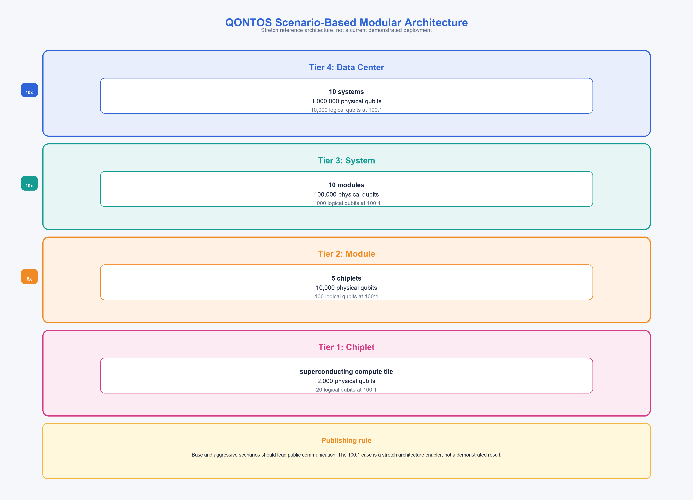
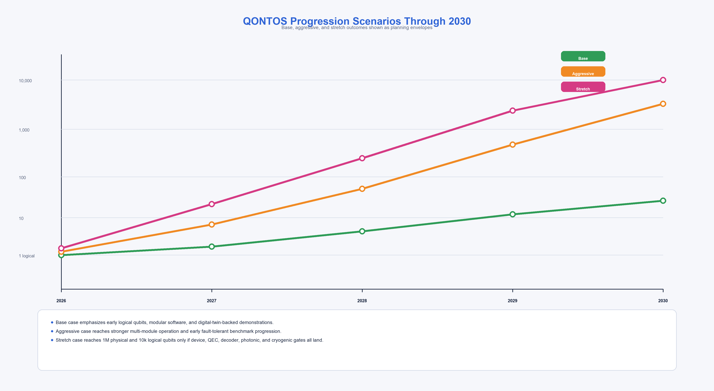

# QONTOS Scaled Quantum Architecture: A Scenario-Based Analysis of a Modular Path to 1 Million Physical Qubits

**Technical Research Paper v3.0 — FLAGSHIP ARCHITECTURE DOCUMENT**

**Author:** QONTOS Research Wing, Zhyra Quantum Research Institute (ZQRI), Abu Dhabi, UAE

**Correspondence:** research@zhyra.xyz | qontos@zhyra.xyz

**Document Date:** March 2026

**Document Classification:** Technical Architecture Paper — Scenario-Based Analysis

---

## Abstract

We analyze a stretch-case target for the QONTOS hybrid superconducting-photonic modular
quantum computing architecture, examining the technical conditions under which a four-tier
hierarchy of superconducting chiplets, cryogenic modules, photonically-interconnected systems,
and data centers could scale to **1,000,000 physical qubits** supporting up to
**10,000 logical qubits**. The architecture employs a canonical composition: chiplet (2,000
physical qubits) to module (5 chiplets, 10,000 qubits) to system (10 photonically-interconnected
modules, 100,000 qubits) to data center (10 systems, 1,000,000 qubits). Achieving the full stretch target
requires simultaneous advances in qubit coherence to the millisecond regime [1], two-qubit
gate fidelities approaching 99.99% or better [2], error-correction overhead reduction toward
an effective 100:1 physical-to-logical ratio [3,4], high-rate photonic interconnects between
cryogenic modules [5], and scalable classical decoding within microsecond-class latency
budgets [6]. We present base, aggressive, and stretch scenarios with explicit validation
gates, no-go conditions, dependencies, and failure modes. All architectural figures in this
paper represent planning targets; none have been experimentally demonstrated at scale.

**Claim status:** Architecture target and stretch scenario, informed by published literature
and QONTOS internal planning. No experimental demonstrations of the full architecture are
claimed.

**Keywords:** quantum computing, modular architecture, fault-tolerant quantum computing,
surface codes, quantum LDPC codes, distributed quantum systems, scenario planning,
superconducting qubits, photonic interconnects, hybrid superconducting-photonic architecture

---

## Table of Contents

1. Introduction
   - 1.1 Motivation: Why Modular Scale Matters
   - 1.2 Architectural Thesis
   - 1.3 Scope and Claim Status
   - 1.4 Relationship to Other QONTOS Papers
2. Background and Literature Context
   - 2.1 Superconducting Qubit State of the Art
   - 2.2 Error Correction: Surface Codes and Beyond
   - 2.3 Modular and Distributed Quantum Architectures
   - 2.4 Classical Control and Decoding
3. Canonical Architecture Constants
   - 3.1 Four-Tier Hierarchy Definition
   - 3.2 Tier 1: QPU Chiplet
   - 3.3 Tier 2: Quantum Module
   - 3.4 Tier 3: Quantum System
   - 3.5 Tier 4: Quantum Data Center
   - 3.6 Architecture Arithmetic Verification
4. Error-Correction Envelope
   - 4.1 Overhead Regimes and Their Implications
   - 4.2 Surface Codes vs. Quantum LDPC Codes
   - 4.3 Base / Aggressive / Stretch Scenarios
   - 4.4 Coupled Assumptions
5. Scenario Framework
   - 5.1 Three-Scenario Model
   - 5.2 Scenario-Based Performance Table
   - 5.3 Validation Gates
   - 5.4 No-Go Conditions
6. Dependencies and Assumptions
   - 6.1 Technology Dependencies
   - 6.2 Supply Chain and Fabrication Assumptions
   - 6.3 Cryogenic and Facility Assumptions
7. Risks and Failure Modes
   - 7.1 Technical Risks
   - 7.2 Integration Risks
   - 7.3 Programmatic Risks
   - 7.4 Mitigation Strategies
8. Roadmap Phases
   - 8.1 Five Program Phases
   - 8.2 Phase-Gate Criteria
9. Competitive and Strategic Context
   - 9.1 Monolithic vs. Modular Approaches
   - 9.2 Industry Landscape
   - 9.3 Strategic Implications for QONTOS
10. Conclusion
11. References

---

## 1. Introduction

### 1.1 Motivation: Why Modular Scale Matters

The path to large-scale, fault-tolerant quantum computation is constrained by at least
five concurrent engineering challenges:

1. **Chip yield and frequency crowding.** Superconducting qubit processors face declining
   yield as qubit count grows on a monolithic die, driven by fabrication defects and
   frequency collision probability [7].

2. **Thermal load and wiring density.** Each qubit requires multiple microwave control
   lines and readout channels routed through a dilution refrigerator. At the scale of
   thousands of qubits, the thermal budget at the mixing chamber stage (typically 10--20 mK)
   becomes a binding constraint [8].

3. **Error-correction overhead.** Current surface code implementations require on the order
   of 1,000 physical qubits per logical qubit at experimentally demonstrated error rates [6].
   Reducing this overhead to practical levels requires simultaneous improvements in physical
   error rates and code efficiency.

4. **Inter-module communication fidelity.** Any modular architecture must solve the problem
   of high-fidelity entanglement distribution between physically separated cryogenic modules.
   Microwave-to-optical transduction efficiencies remain below 10% in most reported
   experiments [Derived from literature].

5. **Classical decoder and control latency.** Real-time syndrome decoding must keep pace
   with the quantum error correction cycle. For superconducting qubits with microsecond-scale
   gate times, decoder latency budgets are on the order of 1 microsecond or less [9].

Monolithic architectures face increasing stress on all five fronts as qubit count rises.
QONTOS therefore treats modularity as a first-class design principle rather than a
late-stage packaging decision. The modular approach draws on the conceptual framework of
Monroe et al. [5], who proposed large-scale modular architectures for trapped-ion systems,
adapted here to a hybrid superconducting-photonic architecture where superconducting qubit
modules are interconnected via photonic links.

### 1.2 Architectural Thesis

QONTOS proposes that a hybrid superconducting-photonic modular architecture --- superconducting
chiplets integrated into cryogenic modules, modules interconnected via photonic links into
systems, and systems aggregated into data-center-scale deployments --- can relax the individual
scaling bottlenecks described above, provided that qubit quality, error correction, photonic
interconnect performance, and cryogenic infrastructure all improve on coordinated timelines.

This thesis is not a prediction. It is a structured engineering target against which
progress can be measured and scenarios can be evaluated.

### 1.3 Scope and Claim Status

This paper uses the following claim labels throughout. Every quantitative assertion
in this document carries one of these labels.

| Label | Definition | Example |
|---|---|---|
| **Demonstrated** | Measured in QONTOS systems or directly supported by published experimental results with citations | T1 > 300 us in tantalum transmons [1] |
| **Simulated** | Supported by QONTOS digital-twin or simulator modeling with stated assumptions | Module-level crosstalk projections |
| **Derived from literature** | Based on published external results or conservative extrapolation thereof | Surface code thresholds [6] |
| **QONTOS target** | Internal engineering objective not yet demonstrated | 300:1 effective overhead |
| **Stretch target** | Requires multiple major assumptions landing together; aspirational | 100:1 overhead, 1M qubits |

**Overarching claim status for this paper:** The four-tier architecture and its million-qubit
endpoint are **stretch targets**. The base and aggressive scenarios represent nearer-term
planning configurations. No experimental demonstration of the full architecture is claimed.

**Architecture Claim Summary:**

| Claim | Status |
|---|---|
| QONTOS uses a four-tier modular hierarchy | QONTOS target |
| 2,000 physical qubits per chiplet | Stretch target |
| 10,000 physical qubits per module (5 chiplets) | Stretch target |
| 100,000 physical qubits per system (10 modules) | Stretch target |
| 1,000,000 physical qubits per data center (10 systems) | Stretch target |
| 10,000 logical qubits at 100:1 overhead | Stretch target |
| 100:1 effective physical-to-logical overhead | Stretch target |

### 1.4 Relationship to Other QONTOS Papers

This architecture paper serves as the canonical reference for system composition numbers.
Other papers in the QONTOS research series address specific subsystems:

- Paper 02: Tantalum-on-silicon qubit platform and coherence targets
- Paper 03: Error correction and the path to 100:1 overhead
- Paper 04: Photonic interconnects and modular entanglement distribution
- Paper 05: AI-assisted decoding and classical control
- Paper 06: Software stack and orchestration layer
- Paper 07: Cryogenic infrastructure at scale
- Paper 08: Quantum algorithms and applications
- Paper 09: Benchmarking methodology
- Paper 10: Integrated roadmap to 2030

All subsystem papers inherit the architecture constants defined in Section 3.

---

## 2. Background and Literature Context

### 2.1 Superconducting Qubit State of the Art

The transmon qubit, introduced by Koch et al. [7], remains the dominant superconducting
qubit modality for scalable quantum computing. Its charge-insensitive design, derived from
the Cooper pair box, provides a favorable balance between coherence, controllability, and
fabrication reproducibility.

Recent advances in materials science have pushed coherence times into the millisecond
regime. Bland et al. [1] reported T1 relaxation times up to 1.68 milliseconds in
tantalum-on-silicon transmon qubits, representing an order-of-magnitude improvement over
the typical 50--200 microsecond T1 times achieved with conventional niobium-based
fabrication on silicon or sapphire substrates. This result establishes that millisecond-class
coherence is physically achievable in individual devices, though maintaining such
performance at scale (hundreds or thousands of qubits on a single die with dense wiring)
remains an open challenge.

Two-qubit gate fidelities have also improved substantially. Google Quantum AI (Acharya
et al. [2]) demonstrated surface code operation with physical error rates below the
threshold required for exponential suppression of logical errors with increasing code
distance, representing a landmark result for the field. Their work showed that increasing
the code distance from 3 to 5 to 7 yields the expected exponential improvement in logical
error rate, confirming below-threshold operation. IBM's quantum-centric supercomputing
roadmap [8, 10] projects systems with modular architectures combining classical and quantum
processing, targeting utility-scale workloads.

These results establish that the individual qubit-level building blocks for large-scale
fault-tolerant systems are approaching the required quality, though significant gaps
remain in scaling these results to thousands of qubits on a single die and in maintaining
performance under the wiring and thermal constraints of large integrated systems.

### 2.2 Error Correction: Surface Codes and Beyond

The surface code, analyzed comprehensively by Fowler et al. [6], is the most mature
approach to fault-tolerant quantum computation with superconducting qubits. It offers a
relatively high error threshold (approximately 1%) and requires only nearest-neighbor
connectivity on a 2D lattice, making it naturally compatible with planar superconducting
qubit layouts.

However, surface codes carry substantial overhead. At physical error rates of approximately
10^-3, achieving a logical error rate suitable for useful computation (e.g., 10^-10 for
applications such as quantum chemistry or Shor's algorithm) requires code distances on the
order of d = 17--25. This corresponds to roughly 600--1,250 physical qubits per logical
qubit for the data block alone, plus ancilla overhead for syndrome extraction. When
accounting for magic state distillation (required for universal computation), lattice surgery
routing, and other operational overheads, effective ratios of 1,000:1 or higher are typical
in current analyses [6, 11].

Recent theoretical advances in quantum low-density parity-check (qLDPC) codes offer the
possibility of asymptotically better overhead scaling. Panteleev and Kalachev [12]
demonstrated the existence of asymptotically good quantum LDPC codes --- codes with constant
rate and linear distance --- resolving a long-standing open question in quantum coding
theory. Bravyi et al. [3] demonstrated high-threshold, low-overhead quantum memory using
a specific qLDPC construction, achieving a storage threshold of approximately 0.7% with
overhead substantially below surface code levels. However, translating these theoretical
results to a full fault-tolerant computation (including magic state injection and logical
gate operations) on physical hardware remains an open research problem.

Experimentally, Krinner et al. [9] demonstrated repeated quantum error correction in a
distance-three surface code on a superconducting processor, establishing experimental
precedent for real-time QEC cycles. Acharya et al. [2] subsequently demonstrated that
increasing the code distance from 3 to 5 to 7 reduces logical error rates exponentially,
confirming below-threshold operation in a superconducting platform. These results validate
the surface code approach but also underscore the scale of overhead involved at current
error rates.

The QONTOS architecture assumes that the effective physical-to-logical overhead will
decrease over the program lifetime as physical error rates improve and as more efficient
codes (potentially qLDPC) become practically implementable on hardware.

### 2.3 Modular and Distributed Quantum Architectures

Monroe et al. [5] articulated the foundational case for modular quantum computer
architectures, arguing that photonic interconnects between small quantum processor nodes
could circumvent the scaling limitations of monolithic designs. While their analysis
focused on trapped-ion systems, the modular principle translates to superconducting
platforms with appropriate modifications to the interconnect technology.

For superconducting qubits, modularity introduces the challenge of microwave-to-optical
transduction. Efficient, low-noise conversion between microwave photons (typically 5--8 GHz,
the natural operating frequency of transmon qubits) and optical photons (suitable for
low-loss fiber transmission and room-temperature routing) remains an active area of
research. Current state-of-the-art transduction efficiencies are typically below 10%
for end-to-end processes, though individual conversion steps have demonstrated higher
performance in isolated experiments [Derived from literature].

Chamberland et al. [11] analyzed the full system-level requirements for building a
fault-tolerant quantum computer using concatenated codes, including the interplay between
physical error rates, code distances, magic state distillation overhead, and decoder
throughput. Their analysis provides a useful framework for understanding the gap between
current capabilities and fault-tolerant operation at the scale required for useful
applications.

### 2.4 Classical Control and Decoding

Real-time decoding of error correction syndromes is a computationally demanding task that
must be completed within the error correction cycle time. For superconducting qubits with
gate times on the order of 20--100 nanoseconds and measurement times on the order of
0.5--1 microsecond, the decoder must process syndrome data and determine corrections
within a budget of roughly 1 microsecond. Exceeding this budget causes a syndrome backlog
that degrades the effective logical error rate [Derived from literature].

Approaches to high-speed decoding include lookup-table decoders (fast but memory-limited
at large code distances), union-find decoders (efficient average-case complexity), and
machine-learning-assisted decoders (potentially faster inference at the cost of training
complexity). The QONTOS approach to AI-assisted decoding is detailed in Paper 05 of this
series.

---

## 3. Canonical Architecture Constants

This section is the **canonical source** for architecture composition numbers across
the entire QONTOS research paper set. All other papers inherit these definitions.

### 3.1 Four-Tier Hierarchy Definition

The QONTOS stretch architecture defines a four-tier modular hierarchy:

| Layer | Unit Composition | Physical Qubits | Logical Qubits (at 100:1) | Claim Status |
|---|---|---:|---:|---|
| **Chiplet** | 1 superconducting die | 2,000 | 20 | Stretch target |
| **Module** | 5 chiplets | 10,000 | 100 | Stretch target |
| **System** | 10 modules | 100,000 | 1,000 | Stretch target |
| **Data Center** | 10 systems | 1,000,000 | 10,000 | Stretch target |

**Arithmetic verification:**

- 2,000 x 5 = 10,000 (chiplet to module)
- 10,000 x 10 = 100,000 (module to system)
- 100,000 x 10 = 1,000,000 (system to data center)
- The data center comprises **10 systems**, not 100.
- At 100:1 overhead: 1,000,000 / 100 = 10,000 logical qubits.

### 3.2 Tier 1: QPU Chiplet

The chiplet is the fundamental fabricated superconducting qubit die.

| Parameter | Stretch Value | Claim Status | Notes |
|---|---|---|---|
| Physical qubits | 2,000 | Stretch target | Requires high-yield fabrication at scale |
| Logical qubits (at 100:1) | 20 | Stretch target | Conditional on stretch QEC assumptions |
| Die size | 15--20 mm per side | QONTOS target | Placeholder; not validated by fabrication |
| Qubit modality | Transmon (tantalum-on-silicon) | QONTOS target | Design per Koch et al. [7]; materials per Bland et al. [1] |
| Topology | Heavy-hex or equivalent | QONTOS target | Must support surface code or qLDPC layout |
| T1 coherence | > 1 ms | Stretch target | T1 up to 1.68 ms demonstrated on isolated devices [1] |
| T2 coherence | > 500 us | Stretch target | Requires echo techniques at scale |
| Single-qubit gate fidelity | > 99.99% | QONTOS target | Demonstrated on isolated devices [Derived from literature] |
| Two-qubit gate fidelity | > 99.9% | QONTOS target | Demonstrated at moderate scale [2]; 99.99% is stretch |
| Readout fidelity | > 99.5% | QONTOS target | Must be achieved in multiplexed configuration |
| Control lines per qubit | ~2.5 (drive + flux + shared readout) | Derived from literature | Wiring density constraint |

**Key risks at Tier 1:** Frequency crowding at 2,000-qubit density; yield degradation
on larger die; coherence reduction from increased wiring and crosstalk.

### 3.3 Tier 2: Quantum Module

The module is the cryogenic integration unit housing multiple chiplets within a single
dilution refrigerator or cryogenic stage.

| Parameter | Stretch Value | Claim Status | Notes |
|---|---|---|---|
| Chiplets per module | 5 | Stretch target | Canonical architecture constant |
| Physical qubits | 10,000 | Stretch target | 5 x 2,000 |
| Logical qubits (at 100:1) | 100 | Stretch target | Conditional on QEC assumptions |
| Inter-chiplet coupling | Microwave or short-range galvanic | QONTOS target | Must maintain > 99.5% fidelity across chiplet boundary |
| Cryogenic environment | Single dilution refrigerator, 10--20 mK | QONTOS target | Cooling power must support 5 chiplets + wiring load |
| Classical control | Dedicated room-temp and cryo electronics | QONTOS target | Multiplexed readout across chiplets |
| Module form factor | Cryogenic package with integrated signal routing | QONTOS target | Packaging not yet demonstrated at this density |

**Key risks at Tier 2:** Inter-chiplet coupling fidelity; thermal load from 5 chiplets
exceeding dilution refrigerator capacity; signal integrity degradation in dense
multi-chiplet packaging.

### 3.4 Tier 3: Quantum System

The system is the first tier employing photonic interconnects to link physically
separated cryogenic modules, realizing the hybrid superconducting-photonic architecture
that is central to the QONTOS scaling strategy.

| Parameter | Stretch Value | Claim Status | Notes |
|---|---|---|---|
| Modules per system | 10 | Stretch target | Canonical architecture constant |
| Physical qubits | 100,000 | Stretch target | 10 x 10,000 |
| Logical qubits (at 100:1) | 1,000 | Stretch target | Conditional on QEC and interconnect performance |
| Inter-module link | Optical/photonic backbone | Stretch target | Requires microwave-to-optical transduction |
| Transduction efficiency | > 10% (aggressive), > 20% (stretch) | Stretch target | Current literature reports < 10% end-to-end |
| Entanglement generation rate | > 10 kHz per link | Stretch target | Required for distributed error correction |
| Classical backbone | High-bandwidth, low-latency network | QONTOS target | Syndrome data and control signaling |
| System controller | Centralized scheduling and compilation | QONTOS target | Distributed scheduling for cross-module circuits |

**Key risks at Tier 3:** Transduction efficiency insufficient for distributed QEC;
entanglement rate too low for practical cross-module operations; classical control
latency across modules exceeds decoder budget.

### 3.5 Tier 4: Quantum Data Center

The data center is the facility-scale stretch endpoint.

| Parameter | Stretch Value | Claim Status | Notes |
|---|---|---|---|
| Systems per data center | 10 | Stretch target | Canonical constant; yields 1M qubits total |
| Physical qubits | 1,000,000 | Stretch target | 10 x 100,000 |
| Logical qubits (at 100:1) | 10,000 | Stretch target | Full stretch scenario |
| Power consumption | ~1 MW | QONTOS target | Planning estimate; not validated by facility design |
| Facility footprint | ~100--200 m^2 | QONTOS target | Planning estimate; includes cryogenics + classical compute |
| Cooling infrastructure | Multiple large dilution refrigerators | QONTOS target | Novel cryogenic engineering required at this scale |
| Classical HPC co-processor | Integrated classical supercomputer | QONTOS target | For hybrid quantum-classical workloads |
| Network | Intra-facility photonic mesh | Stretch target | Photonic backbone for inter-system entanglement distribution |

**Key risks at Tier 4:** Facility power and cooling costs; manufacturing and integration
complexity at scale; operational reliability across 10 concurrent systems.

### 3.6 Architecture Arithmetic Verification

The following table provides an explicit arithmetic check for the canonical hierarchy
across all three scenarios.

| Calculation | Base | Aggressive | Stretch |
|---|---:|---:|---:|
| Qubits per chiplet | 500 | 1,000 | 2,000 |
| Chiplets per module | 5 | 5 | 5 |
| Qubits per module | 2,500 | 5,000 | 10,000 |
| Modules per system | 4 | 10 | 10 |
| Qubits per system | 10,000 | 50,000 | 100,000 |
| Systems per data center | 2 | 10 | 10 |
| **Qubits per data center** | **20,000** | **500,000** | **1,000,000** |
| Overhead ratio | 1,000:1 | 300:1 | 100:1 |
| **Logical qubits** | **20** | **~1,667** | **10,000** |

---

## 4. Error-Correction Envelope

### 4.1 Overhead Regimes and Their Implications

The effective physical-to-logical qubit ratio is the single most consequential parameter
for the architecture. It determines how many logical qubits --- the units of useful
computation --- can be extracted from a given number of physical qubits.

| Overhead Regime | Phys. Qubits per Logical | Claim Status | Context |
|---|---:|---|---|
| 1,000:1 | 1,000 | Derived from literature | Conservative baseline for near-term surface codes at ~10^-3 error rates [6, 11] |
| 300:1 | 300 | QONTOS target | Aggressive target assuming ~10^-4 error rates and optimized surface codes |
| 100:1 | 100 | Stretch target | Requires low error rates, efficient codes (potentially qLDPC), optimized decoders |

**System-level implications for 1,000,000 physical qubits:**

| Overhead | Logical Qubits from 1M Physical | Application Class |
|---:|---:|---|
| 1,000:1 | 1,000 | Early fault-tolerant demonstrations; small quantum chemistry |
| 300:1 | ~3,333 | Intermediate chemistry; optimization; quantum simulation |
| 100:1 | 10,000 | Cryptography-relevant; large-scale quantum simulation |

### 4.2 Surface Codes vs. Quantum LDPC Codes

The path from 1,000:1 to 100:1 overhead likely requires a transition from standard
surface codes to more efficient code families.

| Code Family | Overhead (~10^-3 error) | Overhead (~10^-4 error) | Status |
|---|---|---|---|
| Surface code (standard) | ~1,000:1 to 1,500:1 | ~300:1 to 500:1 | Derived from literature [6] |
| Surface code (optimized lattice surgery) | ~800:1 to 1,000:1 | ~200:1 to 400:1 | Derived from literature [11] |
| qLDPC codes (theoretical bounds) | ~200:1 to 500:1 | ~50:1 to 150:1 | Derived from literature [3, 12] |
| qLDPC codes (practical, QONTOS target) | ~300:1 to 500:1 | ~100:1 to 200:1 | Stretch target |

**Important caveat:** The qLDPC overhead figures are based on theoretical constructions
and limited numerical studies. Practical implementation of qLDPC codes on superconducting
hardware introduces non-local connectivity requirements that may conflict with planar chip
topologies. The figures above should be treated as indicative, not predictive.

### 4.3 Base / Aggressive / Stretch Scenarios

| Parameter | Base | Aggressive | Stretch |
|---|---:|---:|---:|
| Physical error rate (2Q gate) | 10^-3 | 5 x 10^-4 | 10^-4 |
| Code family | Surface code | Optimized surface code | Surface + qLDPC |
| Effective overhead | 1,000:1 | 300:1 | 100:1 |
| Physical qubits (data center) | 20,000 | 500,000 | 1,000,000 |
| Logical qubits achieved | ~20 | ~1,667 | 10,000 |
| Target logical error rate | 10^-6 | 10^-8 | 10^-10 |
| Decoder latency requirement | 10 us | 1 us | < 1 us |
| Claim status | Derived from literature | QONTOS target | Stretch target |

**Interpretation:** The base scenario achieves a small number of logical qubits
sufficient for early demonstrations and algorithm development. The aggressive scenario
delivers thousands of logical qubits, enough for meaningful quantum advantage experiments
in chemistry and optimization. The stretch scenario achieves the full 10,000-logical-qubit
target required for cryptographically relevant computations.

### 4.4 Coupled Assumptions

The 100:1 overhead target is not an independent parameter. It is coupled to a set of
subsystem requirements that must all be met simultaneously:

| Coupled Requirement | Threshold | Dependency |
|---|---|---|
| Physical error rate (2Q) | < 10^-4 | Qubit quality, calibration, and crosstalk management |
| T1 coherence at scale | > 1 ms | Materials, fabrication, and packaging |
| Code efficiency | > surface code | Requires practical qLDPC or equivalent |
| Decoder throughput | < 1 us per round | Specialized hardware (FPGA/ASIC) or ML decoders |
| Measurement fidelity | > 99.5% | Multiplexed readout chain performance |

If any one of these requirements fails to improve sufficiently, the effective overhead
rises, and the architecture delivers fewer logical qubits from the same physical qubit
count. This is why the million-qubit architecture and the 100:1 assumption must always
be presented as a **coupled stretch scenario**.

---

## 5. Scenario Framework

### 5.1 Three-Scenario Model

| Metric | Base | Aggressive | Stretch | Claim Status |
|---|---:|---:|---:|---|
| Physical qubits per chiplet | 500 | 1,000 | 2,000 | Base: target; Stretch: stretch |
| Chiplets per module | 5 | 5 | 5 | Architecture constant |
| Physical qubits per module | 2,500 | 5,000 | 10,000 | Derived |
| Modules per system | 4 | 10 | 10 | Base: target; Aggressive+: stretch |
| Physical qubits per system | 10,000 | 50,000 | 100,000 | Derived |
| Systems per data center | 2 | 10 | 10 | Base: target; Aggressive+: stretch |
| Physical qubits per data center | 20,000 | 500,000 | 1,000,000 | Derived |
| Effective overhead | 1,000:1 | 300:1 | 100:1 | See Section 4.3 |
| Logical qubits | ~20 | ~1,667 | 10,000 | Derived |
| T1 coherence (at scale) | 200 us | 500 us | > 1 ms | Literature to stretch |
| 2Q gate fidelity | 99.9% | 99.95% | 99.99% | Literature to stretch |
| Transduction efficiency | N/A (intra-fridge) | 5--10% | > 20% | Literature to stretch |
| Decoder latency | 10 us | 1 us | < 1 us | Target to stretch |

### 5.2 Scenario-Based Performance Table

| Performance Metric | Base | Aggressive | Stretch | Notes |
|---|---|---|---|---|
| Quantum volume (est.) | 2^10 -- 2^15 | 2^20 -- 2^30 | 2^40+ | Order-of-magnitude estimates |
| Circuit depth (logical) | ~10^2 | ~10^4 | ~10^6 | Before decoherence limits bind |
| Logical clock rate (ops/s) | ~10^3 | ~10^4 | ~10^5 | Determined by QEC cycle time |
| Application class | Small variational / demos | Intermediate chemistry | Cryptography-relevant | Illustrative; not guaranteed |
| Estimated power (data center) | ~100 kW | ~500 kW | ~1 MW | Facility planning estimates |
| Estimated footprint | ~20 m^2 | ~50 m^2 | ~100--200 m^2 | Facility planning estimates |

### 5.3 Validation Gates

Each gate represents a decision point at which the program trajectory is evaluated
against experimental evidence. Failure to pass a gate triggers formal re-evaluation
of scenario assumptions.

| Gate | Criterion | Why It Matters | Evaluation Method |
|---|---|---|---|
| **G1: Device Metrics** | T1 > 500 us and 2Q fidelity > 99.9% on QONTOS-fabricated devices | Architecture cannot scale without qubit quality; these thresholds are necessary (not sufficient) for the aggressive scenario | Experimental measurement on test devices; statistical significance over multiple cooldowns |
| **G2: Logical Qubit on Module** | First logical qubit demonstrated on a multi-chiplet module with lifetime exceeding any constituent physical qubit | Roadmap cannot rely only on raw physical qubits; modular integration must be validated end-to-end | Logical qubit lifetime measurement on module hardware |
| **G3: Inter-Module Entanglement** | Bell state fidelity > 90% across photonic link between two separate cryogenic modules | Architecture fails if modular links underperform; distributed QEC requires high-fidelity inter-module entanglement | Bell state tomography across modules |
| **G4: Digital Twin Calibration** | QONTOS simulator predictions match experimental noise and performance metrics within 20% | Roadmap planning becomes guesswork without validated simulation and modeling tools | Systematic comparison of simulator output to hardware benchmarks |
| **G5: Economic Viability** | Total system cost per logical qubit consistent with target application value; facility cost model validated | Million-qubit narrative fails if system costs render target applications uneconomical | Cost model validated against fabrication, integration, and operational data |

### 5.4 No-Go Conditions

The stretch scenario should be formally downgraded if any of the following conditions
persist beyond the PIONEER phase (2027--2028):

1. **Overhead stagnation:** Effective overhead remains closer to 1,000:1 than to 300:1
   despite best efforts on physical error rates and code optimization.
2. **Transduction failure:** Microwave-to-optical transduction efficiency remains in
   low-single-digit percentages, precluding practical inter-module entanglement at
   rates required for distributed error correction.
3. **Packaging limits:** Multi-chiplet integration at 10,000 qubits per module proves
   unmanageable due to yield, crosstalk, or thermal constraints.
4. **Cryogenic scaling failure:** Cooling power and control wiring cannot support the
   thermal load of multi-module systems at the 10-module scale.
5. **Decoder latency wall:** Classical decoding cannot keep pace with the QEC cycle
   time even with dedicated hardware acceleration (FPGA, ASIC, or ML approaches).

---

## 6. Dependencies and Assumptions

### 6.1 Technology Dependencies

| Dependency | Base Req. | Aggressive Req. | Stretch Req. | Current Status (2026) |
|---|---|---|---|---|
| Qubit coherence (T1) | > 200 us at scale | > 500 us at scale | > 1 ms at scale | > 2 ms on isolated devices [1]; at-scale performance unknown |
| 2Q gate fidelity | > 99.9% | > 99.95% | > 99.99% | > 99.9% demonstrated at moderate scale [2]; 99.99% not yet at scale |
| Chiplet qubit count | 500 | 1,000 | 2,000 | Largest reported: ~1,000+ qubits (industry); 2,000 not demonstrated |
| Multi-chiplet integration | 2--3 chiplets/module | 5 chiplets/module | 5 chiplets/module | Multi-chip demonstrated at small scale [10] |
| MW-to-optical transduction | Not required | 5--10% efficiency | > 20% efficiency | < 10% reported [Derived from literature] |
| qLDPC implementation | Not required | Not required | On hardware | Theoretical proofs [3, 12]; no full hardware demo |
| Real-time decoding | 10 us latency | 1 us latency | < 1 us latency | ~1 us for small codes [Derived from literature] |
| Cryogenic scale | 1 large DR | 2--4 networked DRs | 10+ networked DRs | Single large DRs operational; networking not demonstrated |

### 6.2 Supply Chain and Fabrication Assumptions

| Assumption | Description | Risk Level |
|---|---|---|
| Tantalum supply | Sufficient high-purity tantalum for qubit fabrication at scale | Low |
| Foundry access | Fabrication facilities capable of producing 2,000-qubit chiplets | Medium |
| Packaging technology | Multi-chiplet cryogenic packaging with adequate signal integrity | High |
| Cryogenic hardware | Dilution refrigerators with sufficient cooling power for 10,000-qubit modules | Medium |
| Control electronics | Scalable room-temperature and cryogenic control systems | Medium |
| Optical components | Low-loss fiber, transducers, and photon detectors for inter-module links | High |

### 6.3 Cryogenic and Facility Assumptions

| Parameter | Assumption | Claim Status |
|---|---|---|
| Mixing chamber temperature | 10--20 mK | Demonstrated (standard DR operation) |
| Cooling power at base temperature | > 20 uW per module | QONTOS target |
| Heat load per qubit (steady-state) | < 1 nW | Derived from literature |
| Room-temperature electronics power | ~100 W per 1,000 qubits | QONTOS target |
| Total facility power (stretch) | ~1 MW for 1M qubits | QONTOS target (order-of-magnitude estimate) |
| Facility availability target | > 95% uptime | QONTOS target |
| Helium-3 supply | Sufficient for multiple large DRs | Medium risk (He-3 supply is limited globally) |

---

## 7. Risks and Failure Modes

### 7.1 Technical Risks

| Risk | Likelihood | Impact | Mitigation |
|---|---|---|---|
| Coherence does not scale from isolated devices to dense chiplets | Medium | High | Materials R&D; process control; test at intermediate qubit densities |
| 2Q fidelity saturates below 99.99% at scale | Medium | High | Multiple gate implementations; automated calibration pipelines |
| qLDPC codes impractical on planar superconducting hardware | Medium | Medium | Surface code fallback; explore 3D integration for non-planar connectivity |
| Transduction efficiency insufficient for distributed QEC | High | High | Multiple transduction modalities; all-microwave inter-module fallback |
| Decoder latency exceeds budget at large code distances | Medium | Medium | Specialized decoder hardware (FPGA/ASIC); AI-assisted decoding [Paper 05] |
| Frequency crowding limits chiplet qubit count | Medium | High | Improved fabrication uniformity; frequency-tunable qubit designs |

### 7.2 Integration Risks

| Risk | Likelihood | Impact | Mitigation |
|---|---|---|---|
| Multi-chiplet packaging yield too low for production | Medium | High | Chiplet-level testing; known-good-die screening protocols |
| Crosstalk between chiplets degrades fidelity | Medium | High | EM shielding and isolation; digital-twin-based crosstalk prediction |
| Classical control cannot scale to 100,000+ qubits | Medium | Medium | Hierarchical control architecture; HPC vendor partnerships |
| Cryogenic wiring density exceeds physical limits | Medium | High | Cryogenic multiplexing; integrated cryo-CMOS control electronics |

### 7.3 Programmatic Risks

| Risk | Likelihood | Impact | Mitigation |
|---|---|---|---|
| Timeline slippage beyond 2030 for stretch targets | High | Medium | Scenario framework provides base and aggressive fallbacks |
| Competitor achieves fault-tolerant advantage first | Medium | Medium | Maintain differentiated software and orchestration capabilities |
| Funding insufficient for data-center-scale deployment | Medium | High | Phased investment; demonstrate value at base/aggressive scale first |
| Key personnel or partnership dependencies | Medium | Medium | Institutional knowledge building; diversified partnerships |

### 7.4 Mitigation Strategies

The three-scenario framework is itself the primary risk mitigation strategy. By defining
base, aggressive, and stretch targets with explicit validation gates, the program can
adapt its trajectory without narrative collapse:

1. **If the stretch scenario fails**, the aggressive scenario still delivers a
   commercially relevant system with hundreds to thousands of logical qubits.
2. **If the aggressive scenario underperforms**, the base scenario still supports
   meaningful quantum computing demonstrations and a credible software platform.
3. **Validation gates (Section 5.3) provide early warning** of trajectory deviations,
   enabling course corrections before large-scale capital commitments.
4. **The modular architecture itself is a hedge**: individual modules can be improved
   and swapped without redesigning the entire system.

---

## 8. Roadmap Phases

### 8.1 Five Program Phases

| Phase | Years | Base Outcome | Aggressive Outcome | Stretch Outcome |
|---|---|---|---|---|
| **FOUNDATION** | 2025--2026 | Improved software platform; digital twin; early device characterization | First hardware validation on QONTOS-fabricated devices | Evidence toward ms-class coherence on Ta transmons |
| **SPUTNIK** | 2026--2027 | Small modular hardware (2--5 chiplets); benchmarking suite | Scaled cryo module with 5,000+ qubits; first QEC demos | 10,000 physical qubits/module; early logical milestones |
| **PIONEER** | 2027--2028 | Multi-module simulation maturity; software integration | Multi-module system with photonic links; distributed runtime | 100,000 physical qubits; 1,000 logical qubits |
| **HORIZON** | 2028--2029 | Robust modular control; partner-ready platform | Meaningful FTQC demonstrations; application prototypes | 500,000 physical qubits; 5,000 logical qubits |
| **SUMMIT** | 2029--2030 | Commercially useful sub-stretch system; software ecosystem | Large-scale logical platform; quantum advantage demos | 1,000,000 physical qubits; 10,000 logical qubits |

### 8.2 Phase-Gate Criteria

Each phase transition requires passing the relevant validation gates from Section 5.3:

| Transition | Required Gate(s) | Go/No-Go Decision |
|---|---|---|
| FOUNDATION to SPUTNIK | G1 (device metrics) | Proceed if qubit quality supports modular integration path |
| SPUTNIK to PIONEER | G2 (logical qubits on module) | Proceed if logical qubit demonstrations succeed on module hardware |
| PIONEER to HORIZON | G3 (inter-module entanglement) | Proceed if photonic links meet fidelity thresholds for distributed QEC |
| HORIZON to SUMMIT | G4 (digital twin) + G5 (economics) | Proceed if trajectory projections and cost models support data center scale |

---

## 9. Competitive and Strategic Context

### 9.1 Monolithic vs. Modular Approaches

The quantum computing industry includes both monolithic and modular architectural
strategies:

| Approach | Advantages | Challenges | Examples |
|---|---|---|---|
| Monolithic | Simpler interconnect; lower latency between qubits; proven at current scale | Yield limits; thermal constraints; wiring density; frequency crowding at scale | Google (superconducting); some trapped-ion approaches |
| Modular | Relaxes per-chip scaling limits; enables incremental upgrades; supports distributed architectures | Inter-module link fidelity; transduction overhead; distributed control complexity | IBM (modular superconducting roadmap [10]); Monroe et al. concept [5]; QONTOS |

QONTOS's modular thesis is predicated on the argument that inter-module link challenges
are more tractable in the long run than the combined monolithic scaling challenges at
the 100,000+ qubit level. This argument is informed by published literature and
engineering analysis, but it is not experimentally proven at the target scale.

### 9.2 Industry Landscape

The quantum computing field as of 2026 includes multiple hardware modalities and
architectural philosophies. Rather than making specific performance comparisons
(which would require detailed benchmarking under controlled conditions; see Paper 09),
we note the following landscape features relevant to the QONTOS architecture:

- **Superconducting platforms** (Google, IBM, others) have demonstrated the most advanced
  error correction results to date [2, 4, 9].
- **Trapped-ion platforms** offer high gate fidelities and all-to-all connectivity but
  face different scaling challenges related to trap complexity and ion transport.
- **Neutral-atom platforms** have demonstrated rapid scaling of qubit count with
  reconfigurable connectivity.
- **Photonic platforms** offer room-temperature operation but face challenges in
  deterministic entanglement generation.

The modular superconducting approach pursued by QONTOS is most directly comparable to
IBM's quantum-centric supercomputing roadmap [8, 10], though the specific architectural
choices (chiplet size, module composition, interconnect technology) differ.

### 9.3 Strategic Implications for QONTOS

| Scenario Achieved | Strategic Position |
|---|---|
| **Stretch** | Full-stack modular quantum systems company with data-center-scale deployment |
| **Aggressive** | Leading modular quantum platform with thousands of logical qubits; strong application partnerships |
| **Base** | Credible quantum computing company with differentiated software, digital-twin tooling, and benchmarking; hardware integration at moderate scale |

The scenario framework ensures that QONTOS maintains a defensible strategic position
across all three outcomes. The software-first foundation (orchestration, digital twin,
benchmarking) retains value independent of the hardware scaling trajectory.

---

## 10. Conclusion

This paper has defined the QONTOS modular quantum architecture as a structured
engineering target with explicit assumptions, scenarios, validation criteria,
dependencies, and risk factors. The principal conclusions are:

1. **The four-tier modular hierarchy** (chiplet / module / system / data center) provides
   a coherent composition framework with canonical constants of 2,000 / 10,000 / 100,000 /
   1,000,000 physical qubits at the stretch level.

2. **The million-qubit, 10,000-logical-qubit endpoint is a stretch target** requiring
   simultaneous advances in qubit coherence [1], gate fidelity [2], error-correction
   overhead [3, 6, 12], photonic interconnects [5], and classical decoding [9]. It should
   be understood as an aspirational planning target contingent on multiple linked
   subsystem breakthroughs.

3. **The three-scenario framework** (base / aggressive / stretch) provides resilience
   against technology shortfalls. Each scenario delivers a commercially meaningful
   outcome, and validation gates enable evidence-based trajectory adjustments.

4. **Identified dependencies and risks** (Sections 6--7) span qubit physics, integration
   engineering, cryogenics, and program execution. The modular architecture mitigates
   some risks (e.g., incremental scaling) while introducing others (e.g., inter-module
   link fidelity).

5. **The data center arithmetic is explicit and verified**: 10 systems of 100,000 qubits
   each yield 1,000,000 physical qubits. At 100:1 stretch overhead, this supports 10,000
   logical qubits. At more conservative overhead ratios, fewer logical qubits are
   available, and the architecture delivers proportionally reduced computational capability.

The value of this paper is not that it predicts or guarantees million-qubit delivery by
2030. Its value is that it defines a technically grounded target architecture, a canonical
system ladder, a set of validation gates, and a comprehensive risk framework against which
progress can be measured with intellectual honesty and engineering rigor.

---

## References

[1] S. Bland et al., "Millisecond lifetimes and coherence times in 2D transmon qubits,"
*Nature* **647**, 343--348 (Nov. 2025).

[2] R. Acharya et al. (Google Quantum AI), "Quantum error correction below the surface
code threshold," *Nature* **634**, 834--840 (2024).

[3] S. Bravyi et al., "High-threshold and low-overhead fault-tolerant quantum memory,"
*Nature* **627**, 778--782 (2024).

[4] Google Quantum AI, "Suppressing quantum errors by scaling a surface code logical
qubit," *Nature* **614**, 676--681 (2023).

[5] C. Monroe, R. Raussendorf, A. Ruthven, K. R. Brown, P. Maunz, L.-M. Duan, and
J. Kim, "Large-scale modular quantum-computer architecture with atomic memory and photonic
interconnects," *Physical Review A* **89**, 022317 (2014).

[6] A. G. Fowler, M. Mariantoni, J. M. Martinis, and A. N. Cleland, "Surface codes:
Towards practical large-scale quantum computation," *Physical Review A* **86**, 032324
(2012).

[7] J. Koch, T. M. Yu, J. Gambetta, A. A. Houck, D. I. Schuster, J. Majer, A. Blais,
M. H. Devoret, S. M. Girvin, and R. J. Schoelkopf, "Charge-insensitive qubit design
derived from the Cooper pair box," *Physical Review A* **76**, 042319 (2007).

[8] IBM, "IBM Quantum Development and Innovation Roadmap," publicly available technical
documentation (2024).

[9] S. Krinner et al., "Realizing repeated quantum error correction in a distance-three
surface code," *Nature* **605**, 669--674 (2022).

[10] IBM Research, "Quantum-centric supercomputing: The next wave of computing," IBM
Research technical documentation (2024).

[11] C. Chamberland, K. Noh, P. Arrangoiz-Arriola, E. T. Campbell, C. T. Hann, J. Iverson,
H. Putterman, T. C. Bohdanowicz, S. T. Flammia, A. Keller, G. Refael, J. Preskill,
L. Jiang, A. H. Safavi-Naeini, O. Painter, and F. G. S. L. Brandao, "Building a
fault-tolerant quantum computer using concatenated cat codes," *PRX Quantum* **3**, 010329
(2022).

[12] P. Panteleev and G. Kalachev, "Asymptotically good quantum and locally testable
classical LDPC codes," in *Proceedings of the 54th Annual ACM Symposium on Theory of
Computing (STOC '22)*, pp. 375--388 (2022).

---

*Document Version: 3.0*
*Classification: Technical Research Paper — Flagship Architecture Document*
*Claim posture: Architecture target with base/aggressive/stretch scenarios*
*All stretch-level claims are explicitly labeled. No experimental demonstration of the full architecture is asserted.*

---

**Appendix A: Notation and Abbreviations**

| Abbreviation | Meaning |
|---|---|
| QEC | Quantum Error Correction |
| qLDPC | Quantum Low-Density Parity-Check (codes) |
| DR | Dilution Refrigerator |
| QPU | Quantum Processing Unit |
| FTQC | Fault-Tolerant Quantum Computing |
| T1 | Energy relaxation time |
| T2 | Dephasing time |
| 2Q | Two-qubit (gate) |
| HPC | High-Performance Computing |
| MW | Microwave |
| ASIC | Application-Specific Integrated Circuit |
| FPGA | Field-Programmable Gate Array |
| EM | Electromagnetic |

**Appendix B: Claim Status Index**

Every major quantitative claim in this paper is indexed below with its status label.

| Section | Claim | Status |
|---|---|---|
| 3.1 | 2,000 qubits per chiplet | Stretch target |
| 3.1 | 10,000 qubits per module (5 chiplets) | Stretch target |
| 3.1 | 100,000 qubits per system (10 modules) | Stretch target |
| 3.1 | 1,000,000 qubits per data center (10 systems) | Stretch target |
| 3.1 | 10,000 logical qubits at 100:1 overhead | Stretch target |
| 3.2 | T1 > 2 ms on isolated tantalum transmons | Demonstrated [1] |
| 3.2 | T1 > 1 ms at scale (dense chiplet) | Stretch target |
| 3.2 | 2Q gate fidelity > 99.9% | QONTOS target |
| 3.2 | 2Q gate fidelity > 99.99% | Stretch target |
| 4.1 | 1,000:1 overhead (baseline) | Derived from literature [6, 11] |
| 4.1 | 300:1 overhead (aggressive) | QONTOS target |
| 4.1 | 100:1 overhead (stretch) | Stretch target |
| 4.2 | qLDPC codes offer lower overhead than surface codes | Derived from literature [3, 12] |
| 5.1 | Base: 20,000 physical qubits | QONTOS target |
| 5.1 | Aggressive: 500,000 physical qubits | QONTOS target |
| 5.1 | Stretch: 1,000,000 physical qubits | Stretch target |
| 6.3 | ~1 MW facility power (stretch) | QONTOS target |
| 6.3 | 100--200 m^2 facility footprint (stretch) | QONTOS target |
| 2.1 | Below-threshold surface code operation demonstrated | Demonstrated [2] |
| 2.2 | Repeated QEC in distance-3 surface code | Demonstrated [9] |
