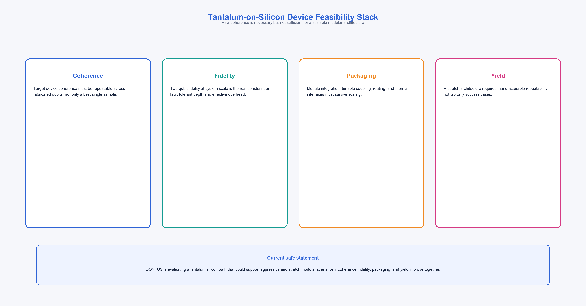
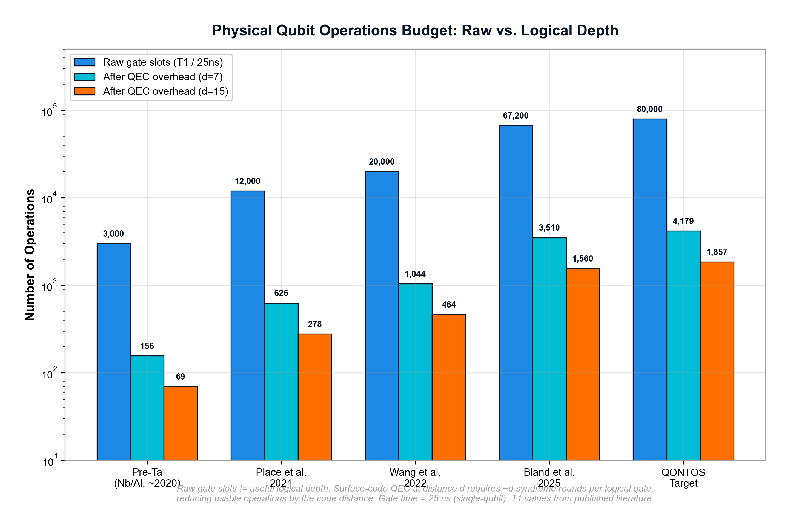

# Tantalum-on-Silicon Superconducting Qubits: Materials and Device Feasibility for the QONTOS Hybrid Superconducting-Photonic Modular Architecture

**Technical Research Paper v3.0**

**Author:** QONTOS Research Wing, Zhyra Quantum Research Institute (ZQRI), Abu Dhabi, UAE

**Correspondence:** research@zhyra.xyz

**Date:** March 2026

---

## Abstract

This paper presents a materials and device feasibility analysis for the tantalum-on-silicon
superconducting qubit platform as the candidate device layer for the QONTOS hybrid
superconducting-photonic modular architecture. We evaluate coherence requirements, gate
fidelity targets, fabrication yield constraints, chiplet packaging risks, control-line
scaling limits, and calibration cadence demands across three architecture scenarios (base,
aggressive, stretch). We analyze the relationship between coherence time and achievable
logical depth, showing that T1 approaching 1.7 ms with 25 ns gate times yields approximately
80,000 raw gate slots and that quantum error correction overhead reduces effective logical
depth by one to two additional orders of magnitude. Literature-reported coherence advances
[1, 2, 3] provide a credible starting point, but converting isolated device metrics into
module-scale performance requires solving packaging, yield, calibration, and thermal integration
problems that remain largely open. This paper maps those gaps honestly and defines the
validation gates that must be cleared before stretch-scenario claims become defensible.

**Claim status:** Literature-informed device feasibility analysis with aggressive and stretch
targets. This is a materials and device feasibility paper, not a performance demonstration.

**Keywords:** superconducting qubits, transmon, tantalum, coherence, two-level systems,
chiplet fabrication, device feasibility, quantum error correction overhead, hybrid
superconducting-photonic architecture, photonic interconnects

---

## 1. Introduction

### 1.1 Scope and Purpose

The QONTOS hybrid superconducting-photonic modular architecture requires a superconducting
qubit platform that simultaneously supports high coherence, high gate fidelity, scalable
fabrication, modular packaging, and practical calibration and control. As the device layer
for photonically-interconnected superconducting modules, the qubit platform must deliver
performance that remains robust through integration into multi-chiplet cryogenic modules
linked by photonic interconnects. Tantalum-on-silicon has emerged as an attractive candidate because
recent literature reports demonstrate significant coherence improvements over earlier niobium-
and aluminum-based material stacks [1, 2, 3].

However, raw coherence values alone do not establish a viable path to fault-tolerant
computation. This paper therefore focuses on what device-level performance would actually
be needed for the QONTOS modular architecture to remain credible, and -- equally important --
which practical engineering barriers stand between reported single-device metrics and a
functioning modular machine.

**[CLAIM-SCOPE]** This paper is a materials and device feasibility analysis. It does not
report experimental results from QONTOS fabrication runs. All device metrics beyond
published literature values are targets or assumptions, labeled as such throughout.

### 1.2 Why Tantalum-on-Silicon

The transmon qubit design [4] has become the dominant superconducting qubit modality because
of its relative insensitivity to charge noise and its compatibility with standard lithographic
fabrication. The key limitation of transmon qubits has historically been energy relaxation
(T1), which is dominated by dielectric losses at material interfaces -- particularly at the
metal-substrate and metal-oxide boundaries where two-level system (TLS) defects reside [8].

Tantalum offers specific materials advantages over niobium for superconducting qubit
fabrication:

- Tantalum's native oxide (Ta2O5) appears to host fewer lossy TLS defects than niobium's
  native oxide (Nb2O5), as evidenced by the coherence improvements reported in [1, 2, 3].
- Epitaxial tantalum films can be grown on silicon substrates with well-controlled crystal
  orientation, reducing grain-boundary losses.
- The tantalum-on-silicon material stack is compatible with standard semiconductor foundry
  processes, which is important for fabrication scaling.

**[CLAIM-LIT]** These advantages are supported by published literature but have been
demonstrated primarily on isolated single-qubit or few-qubit devices. Performance at
chiplet and module scale remains undemonstrated.

### 1.3 Claim Status Summary

| Claim | Label | Status |
|---|---|---|
| T1 exceeding 0.3 ms demonstrated in tantalum transmons | CLAIM-LIT | Published, Place et al. 2021 [1] |
| T1 approaching 0.5 ms demonstrated | CLAIM-LIT | Published, Wang et al. 2022 [2] |
| T1 reaching ~1.7 ms demonstrated on isolated devices | CLAIM-LIT | Published, Bland et al. 2025 [3] |
| QONTOS stretch architecture assumes 2 ms T1 at scale | CLAIM-TARGET | Undemonstrated architecture target |
| 99.999% two-qubit gate fidelity at scale | CLAIM-STRETCH | Undemonstrated stretch target |
| Chiplet yield sufficient for 10,000-qubit modules | CLAIM-STRETCH | Undemonstrated stretch target |
| Fabrication scalable to million-qubit regime | CLAIM-STRETCH | Speculative long-term target |

---

## 2. Device Performance Requirements

### 2.1 Scenario-Based Targets

The QONTOS architecture defines three device performance scenarios. Each represents a
different level of ambition and a different burden of proof.

| Metric | Base | Aggressive | Stretch | Label |
|---|---:|---:|---:|---|
| T1 | 300 us | 1 ms | 2 ms | Target |
| T2 | 300 us | 1 ms | 1.5 - 2 ms | Target |
| 1Q gate fidelity | 99.9% | 99.99% | 99.999% | Target |
| 2Q gate fidelity | 99.9% | 99.99% | 99.999% | Target |
| 2Q gate time | 50 ns | 35 ns | 25 ns | Target |
| Readout fidelity | 99.5% | 99.9% | 99.99% | Target |
| Readout time | 500 ns | 300 ns | 200 ns | Target |

**[CLAIM-TARGET]** The base scenario is consistent with current state-of-the-art
demonstrations on small devices. The aggressive scenario requires meaningful advances in
gate calibration and packaging. The stretch scenario has not been demonstrated on any
platform at multi-qubit scale.

### 2.2 Literature Baseline



The current literature establishes the following trajectory for tantalum transmon coherence:

| Reference | Year | Reported T1 | Platform | Scale |
|---|---:|---:|---|---|
| Place et al. [1] | 2021 | 0.3 ms | Ta on sapphire | Single qubit |
| Wang et al. [2] | 2022 | 0.5 ms | Ta transmon | Single qubit |
| Bland et al. [3] | 2025 | 1.68 ms | Ta on silicon | Single qubit |

**[CLAIM-LIT]** These results establish that millisecond-class T1 is physically achievable
in tantalum transmon devices. They do not establish that this coherence survives integration
into multi-qubit chiplets, packaging assemblies, or operating modules with active control
electronics. The gap between isolated-device coherence and system-level coherence is
historically large in superconducting qubit platforms [6].

### 2.3 The TLS Loss Budget

Coherence in superconducting transmons is limited by energy relaxation into TLS defects
at material interfaces [8]. The total loss rate can be decomposed as:

```
1/T1_total = 1/T1_bulk + 1/T1_surface + 1/T1_interface + 1/T1_radiation + 1/T1_other
```

For tantalum-on-silicon devices, the dominant terms are:

- **Surface and interface losses:** TLS defects at the tantalum-oxide and substrate
  interfaces. Tantalum's advantage lies primarily in reducing these terms.
- **Radiation losses:** Coupling to spurious electromagnetic modes in the package or
  chip environment. These losses are independent of materials quality and become
  dominant once surface losses are suppressed.
- **Bulk losses:** Typically negligible for high-purity tantalum on high-resistivity silicon.

**[CLAIM-ANALYSIS]** Reaching the stretch T1 target of 2 ms at scale requires suppressing
all loss channels simultaneously. Materials improvement alone (reducing surface TLS) is
necessary but not sufficient. Packaging-induced radiation losses and thermally activated
TLS contributions under operating conditions must also be controlled.

---

## 3. Coherence, Gate Time, and Logical Depth



### 3.1 Operations-Count Analysis

A common approach in quantum computing roadmap documents is to equate raw coherence time
with computational capacity by dividing T1 by gate time and presenting the result as
the number of available operations. This calculation requires careful analysis.

**The raw arithmetic:**

```
Raw physical gate slots = T1 / gate_time

For stretch targets: T1 = 2 ms, 2Q gate time = 25 ns
Raw gate slots = 2,000,000 ns / 25 ns = 80,000
```

**[CLAIM-ANALYSIS]** The result is 80,000 raw physical gate slots. It is important
to distinguish this figure from the effective logical depth available after accounting
for error correction overhead, as detailed below.

### 3.2 From Raw Gate Slots to Effective Logical Depth

Even 80,000 raw gate slots substantially overstates the useful computational depth
available for a fault-tolerant algorithm. The following overhead factors must be applied:

| Overhead source | Typical reduction factor | Remaining depth |
|---|---:|---:|
| Raw physical gate slots (T1/t_gate) | -- | 80,000 |
| QEC syndrome extraction cycles (~1 us each) | x50-100 per logical gate | 800 - 1,600 logical gates |
| Decoder latency and feedback | 1.2x - 2x additional | 400 - 1,300 logical gates |
| Idling errors during syndrome extraction | Variable | Further reduced |
| State preparation and measurement overhead | Fixed per computation | Further reduced |
| Calibration drift over computation time | Variable | Further reduced |

**[CLAIM-ANALYSIS]** Under realistic assumptions for surface-code QEC with code
distance d = 15-21, the effective logical circuit depth available from a 2 ms T1
device with 25 ns gates is on the order of several hundred to low thousands of
logical operations. This depth is meaningful and potentially sufficient for certain
classes of algorithms, and it is important to characterize it accurately for
architecture planning purposes.

The QEC refresh cycle is the critical bottleneck. In the surface code, syndrome
extraction requires measuring all stabilizer operators, which takes approximately
d rounds of measurements at roughly 1 us per round for code distance d [5]. During
this time, the physical qubits are accumulating errors. Every logical gate thus
consumes on the order of d to several-d microseconds of physical coherence time.

For the stretch scenario with d = 17:

```
Syndrome extraction time per QEC round: ~1 us
Rounds per logical gate: ~17 (one per code distance)
Physical time per logical gate: ~17 us
Available logical gates from T1 = 2 ms: ~2000 us / 17 us = ~120 logical gates
```

**[CLAIM-ANALYSIS]** This is a conservative lower bound; pipelining and code
optimizations can improve this by factors of 2-5x depending on the algorithm
structure. But the fundamental point stands: the useful logical depth from
millisecond-class coherence is measured in hundreds to low thousands, not in
millions or billions.

### 3.3 Why This Still Matters

Despite the dramatic reduction from raw gate slots to effective logical depth,
millisecond-class coherence is genuinely valuable for three reasons:

1. **Reduced code distance:** Higher T1 means lower physical error rates, which
   reduces the code distance required for a given logical error rate. Reducing d
   from 21 to 15 approximately halves the physical qubit overhead per logical qubit.
2. **Wider error budget:** More coherence time provides margin for other error
   sources (leakage, cross-talk, calibration drift) without exceeding the QEC
   threshold.
3. **Longer syndrome extraction windows:** More time per QEC cycle allows slower,
   more reliable measurement without coherence-induced failures.

**[CLAIM-ANALYSIS]** The honest value proposition of 2 ms T1 is not "enormous
computational depth" but rather "reduced overhead and wider engineering margins
for fault tolerance." This framing is less dramatic but more defensible.

### 3.4 Workload-Oriented Device Requirements

| Workload class | Approximate logical depth needed | Device regime required |
|---|---:|---|
| Early logical-qubit demonstrations | 10 - 100 logical gates | Base to aggressive |
| Quantum advantage benchmarks | 100 - 1,000 logical gates | Aggressive |
| Modular fault-tolerance demonstrations | 1,000 - 10,000 logical gates | Aggressive to stretch |
| FeMoco-class flagship workloads | 10,000+ logical gates | Stretch plus interconnect, plus decoder advances |

**[CLAIM-TARGET]** The FeMoco workload class requires stretch device performance AND
significant advances in QEC, decoding, and modular interconnects. No single improvement
in device coherence is sufficient.

---

## 4. Device Architecture and Control

### 4.1 Transmon-Coupler Topology

The QONTOS architecture assumes a tunable-coupler transmon topology for two-qubit
interactions. The tunable coupler mediates interactions between fixed-frequency
transmon qubits, enabling fast controlled-Z (CZ) or cross-resonance (CR) gates [5]
while suppressing residual ZZ coupling during idle periods.

| Parameter | Aggressive | Stretch | Label |
|---|---:|---:|---|
| Tunable coupling range | +/- 50 MHz | +/- 50 MHz | CLAIM-TARGET |
| CZ gate fidelity | 99.99% | 99.999% | CLAIM-TARGET |
| CZ gate time | 35 ns | 25 ns | CLAIM-TARGET |
| ZZ suppression (idle) | < 1 kHz | < 0.1 kHz | CLAIM-TARGET |
| Frequency targeting accuracy | +/- 20 MHz | +/- 10 MHz | CLAIM-TARGET |

### 4.2 Frequency Crowding and Collision Avoidance

As qubit count per chiplet increases, frequency allocation becomes a combinatorial
constraint. Each transmon must operate at a frequency that avoids collisions with
neighboring qubits' fundamental and higher-level transitions. The standard transmon
has an anharmonicity of approximately -200 to -300 MHz [4], creating exclusion zones
around each qubit frequency.

**[CLAIM-ANALYSIS]** For a 2,000-qubit chiplet with nearest-neighbor connectivity,
frequency allocation requires careful layout optimization. The probability of at least
one frequency collision scales unfavorably with qubit count unless frequency targeting
accuracy improves to better than +/- 15 MHz. Laser-annealing-based frequency trimming
may mitigate this, but adds process complexity.

### 4.3 Packaging and Yield Risks

This section addresses risks that are absent from most coherence-focused literature but
are critical for the QONTOS modular architecture.

#### 4.3.1 Wafer-Level Yield Assumptions

**[CLAIM-TARGET]** The stretch architecture assumes 2,000 functional qubits per chiplet.
The yield implications are severe:

| Yield scenario | Defective qubits per 2,000 | Chiplet pass rate (zero-defect) | Label |
|---|---:|---:|---|
| 99.9% qubit yield | 2 | ~13% | CLAIM-ANALYSIS |
| 99.95% qubit yield | 1 | ~37% | CLAIM-ANALYSIS |
| 99.99% qubit yield | 0.2 | ~82% | CLAIM-ANALYSIS |

These estimates assume independent, identically distributed defect probabilities --
an optimistic assumption, since defects tend to cluster spatially on wafers.

**[CLAIM-ANALYSIS]** At 99.9% per-qubit yield, only about 1 in 8 chiplets would be
defect-free. The architecture must either achieve 99.99%+ qubit yield (unprecedented
for superconducting qubit fabrication) or incorporate defect-tolerant design features
such as spare qubits, reroutable couplers, or post-fabrication frequency trimming.

#### 4.3.2 Chiplet Packaging Limits

The chiplet-to-module packaging step introduces several risk factors:

- **Bump-bond yield:** Each chiplet requires hundreds of superconducting bump bonds
  for inter-chiplet coupling and signal routing. Even 99.9% bump-bond yield becomes
  problematic at 500+ bonds per chiplet.
- **Thermal cycling degradation:** Repeated cool-down and warm-up cycles stress
  mechanical interfaces and can degrade bump-bond integrity over the module lifetime.
- **Coherence degradation from packaging:** Published single-device T1 values are
  measured in optimized test fixtures. Packaging into multi-chiplet modules introduces
  additional loss channels (spurious modes, radiation from wirebonds or bump bonds,
  substrate coupling) that typically reduce T1 by 2x-5x [6].

**[CLAIM-RISK]** The gap between test-fixture coherence and packaged-module coherence
is the single largest risk to the stretch architecture's device assumptions. A 2 ms
test-fixture T1 may yield only 0.4 - 1.0 ms in a packaged module, which changes the
feasibility analysis substantially.

#### 4.3.3 Defect Tolerance Strategy

For the stretch architecture to survive realistic yield, the following defect tolerance
mechanisms should be evaluated:

1. **Spare qubit rows/columns:** Allocating 5-10% additional qubits per chiplet as
   spares, with reroutable coupling.
2. **Post-fabrication screening:** Testing each chiplet at cryogenic temperatures
   before module assembly, discarding defective units.
3. **Frequency trimming:** Laser annealing or other post-fabrication tuning to
   correct frequency collisions without redesign.

**[CLAIM-TARGET]** None of these mechanisms have been demonstrated at the 2,000-qubit
chiplet scale. Each adds fabrication complexity and cost.

---

## 5. Fabrication and Packaging Strategy

### 5.1 Chiplet Architecture Assumptions

The QONTOS stretch architecture assumes:

| Parameter | Value | Label |
|---|---:|---|
| Physical qubits per chiplet | 2,000 | CLAIM-TARGET |
| Chiplets per module | 5 | CLAIM-TARGET |
| Physical qubits per module | 10,000 | CLAIM-TARGET |
| Inter-chiplet coupling channels | 50 - 100 per edge | CLAIM-TARGET |
| Chiplet die size | ~20 mm x 20 mm | CLAIM-TARGET |

**[CLAIM-TARGET]** These are architecture constants derived from system-level modeling,
not demonstrated manufacturing outputs. The largest demonstrated superconducting qubit
chiplets as of 2025 contain on the order of 100-200 qubits.

### 5.2 Control and Calibration Implications

#### 5.2.1 Control Line Scaling

Each transmon qubit requires at minimum:

- 1 XY drive line (microwave, ~5 GHz)
- 1 flux bias line (DC or low-frequency, for tunable couplers)
- 1 readout resonator coupling (shared multiplexed line, typically 4-8 qubits per line)

For a 2,000-qubit chiplet, the control line count is approximately:

```
XY drive lines: 2,000
Flux lines (for couplers): ~1,000 - 2,000
Readout lines (multiplexed): ~250 - 500
Total control lines per chiplet: ~3,250 - 4,500
```

**[CLAIM-ANALYSIS]** Routing 3,000+ control lines to a 20 mm x 20 mm chiplet at
millikelvin temperatures is an unsolved packaging problem. Current cryogenic wiring
technology [7] supports on the order of 200-400 coaxial lines per dilution refrigerator.
Frequency-multiplexed and cryogenic-CMOS control approaches are under development but
remain immature.

#### 5.2.2 Calibration Cadence and Drift

Transmon qubits require periodic recalibration of:

- Qubit frequencies (drift due to TLS fluctuations)
- Gate pulse parameters (amplitude, frequency, phase, DRAG corrections)
- Readout discriminator thresholds
- Coupler bias points

**[CLAIM-ANALYSIS]** Current calibration cadence for state-of-the-art devices is
approximately every 1-4 hours for single-qubit gate parameters and every 15-60
minutes for two-qubit gate parameters. For a 2,000-qubit chiplet, sequential
calibration of all gates would require:

```
2,000 single-qubit gates x ~30 s each = ~17 hours (sequential)
~3,000 two-qubit gates x ~60 s each = ~50 hours (sequential)
```

This is obviously infeasible sequentially. Parallel calibration protocols are required,
but these introduce cross-talk artifacts that must themselves be characterized and
corrected [5].

**[CLAIM-RISK]** Calibration automation at the 2,000-qubit scale is an unsolved
engineering problem. The stretch architecture implicitly assumes that calibration can
be fully automated and parallelized with sub-hour turnaround times. This assumption
should be treated as a first-order risk.

#### 5.2.3 Control Electronics Scaling

The control electronics stack for a 10,000-qubit module (5 chiplets) requires:

| Component | Count per module | Current state of the art |
|---|---:|---|
| Microwave signal generators | ~10,000 channels | ~100-200 per rack |
| Arbitrary waveform generators | ~10,000 channels | ~100-200 per rack |
| DC bias sources | ~5,000 - 10,000 | ~500 per rack |
| Digitizers (readout) | ~1,250 - 2,500 | ~100 per rack |

**[CLAIM-ANALYSIS]** The electronics footprint for a single stretch module would
occupy approximately 50-100 equipment racks with current commercial hardware. Room-
temperature-to-cryostat wiring would require hundreds of coaxial cables per module [7].
Cryogenic control integration (CMOS or SFQ logic at the 4K or mK stage) could reduce
this dramatically but remains at the research prototype stage.

### 5.3 Fabrication Partner Strategy

**[CLAIM-TARGET]** QONTOS is exploring a multi-partner fabrication strategy to reduce
supply-chain concentration and improve scale flexibility. Specific partner details are
not disclosed in this feasibility paper.

The relevant fabrication questions are:

| Question | Why it matters | Label |
|---|---|---|
| Can wafer-level yield exceed 99.95% per qubit? | Chiplet economics require it | CLAIM-RISK |
| Can packaging preserve >80% of bare-die T1? | Module coherence depends on it | CLAIM-RISK |
| Can frequency targeting achieve +/- 10 MHz? | Collision avoidance requires it | CLAIM-RISK |
| Can foundry processes maintain tantalum film quality? | Coherence derives from it | CLAIM-RISK |

---

## 6. Thermal and Integration Constraints

### 6.1 Module Thermal Envelope

The millikelvin stage of a dilution refrigerator provides a limited cooling power
budget, typically 10-25 uW at 20 mK for standard commercial units, scaling to
~25 mW at the mixing chamber plate (which operates at ~20-50 mK) [7]. The module
thermal budget must account for:

| Heat source | Estimated load per module | Label |
|---|---:|---|
| Coaxial signal lines (passive) | ~20 mW at mixing chamber | CLAIM-ESTIMATE |
| Optical fiber terminations | ~0.01 mW | CLAIM-ESTIMATE |
| DC bias lines | ~0.5 mW | CLAIM-ESTIMATE |
| Chip dissipation (gates + readout) | ~0.1 mW | CLAIM-ESTIMATE |
| Total estimated load | ~21 mW | CLAIM-ESTIMATE |
| Available thermal budget | ~25 mW | CLAIM-ESTIMATE |

**[CLAIM-RISK]** The thermal margin is approximately 4 mW, or about 19% of the total
budget. This provides minimal contingency for packaging heat leaks, wiring thermal
anchoring imperfections, or control electronics heat dissipation if any cryogenic
control is integrated at the mixing chamber stage. The thermal envelope is one of
the hardest constraints on module scale.

### 6.2 Validation Gates

The materials and device feasibility claims in this paper require the following
validation milestones before the stretch architecture can be considered credible:

#### Gate V1: Packaged Coherence Validation

**Requirement:** Demonstrate T1 > 1 ms and T2 > 0.8 ms in a multi-qubit device
(>= 10 qubits) after full chiplet packaging (bump bonds, interposer, enclosure).

**Rationale:** This validates that packaging does not destroy the coherence advantage
of tantalum. Current literature reports are exclusively on isolated test devices.

**Status:** Not demonstrated. **[CLAIM-GATE]**

#### Gate V2: Chiplet Yield Demonstration

**Requirement:** Fabricate and test >= 10 chiplets of >= 100 qubits each with
per-qubit yield exceeding 99.5% and median T1 exceeding 500 us.

**Rationale:** This validates fabrication consistency and provides the first
statistical basis for yield projections at the 2,000-qubit scale.

**Status:** Not demonstrated. **[CLAIM-GATE]**

#### Gate V3: Calibration Automation at Scale

**Requirement:** Demonstrate automated calibration of a >= 50-qubit device with
all single-qubit and two-qubit gates achieving target fidelity within 1 hour,
with calibration remaining valid for >= 4 hours.

**Rationale:** This validates that calibration can keep pace with device scale.

**Status:** Not demonstrated. **[CLAIM-GATE]**

#### Gate V4: Thermal Budget Validation

**Requirement:** Operate a multi-chiplet assembly (>= 2 chiplets, >= 200 qubits)
within the thermal budget of a single dilution refrigerator mixing chamber stage,
with base temperature remaining below 25 mK.

**Rationale:** This validates that module-scale integration is thermally feasible.

**Status:** Not demonstrated. **[CLAIM-GATE]**

#### Gate V5: System-Level Coherence Under Load

**Requirement:** Demonstrate that T1 degradation under simultaneous operation of
all qubits in a chiplet (gates + readout + idle) does not exceed 30% relative
to single-qubit isolated measurements.

**Rationale:** Crosstalk, heating, and control interference typically degrade
coherence under realistic operating conditions. The architecture assumptions
require bounded degradation.

**Status:** Not demonstrated. **[CLAIM-GATE]**

---

## 7. Device Roadmap by Scenario

### 7.1 Timeline Mapping

| Phase | Base | Aggressive | Stretch |
|---|---|---|---|
| 2025-2026 | Literature benchmarking; design studies; calibration tooling development | Small-scale internal device validation (5-20 qubits) | First evidence supporting T1 > 1 ms in packaged multi-qubit devices |
| 2026-2027 | Device-package integration studies; yield characterization | Module-scale integration targets (100+ qubits) | Gate V1 and V2 milestones attempted |
| 2027-2028 | Robust modular hardware with base-level specs | High-fidelity chiplet fleet (500+ qubits) | Gate V3, V4, V5 milestones; 2,000-qubit chiplet prototypes |
| 2028-2029 | Production-quality base modules | Multi-module demonstrations | Architecture-scale stretch device envelope tested |
| 2029-2030 | Strong device basis for modular products | Large-scale modular fault-tolerance path | Full stretch device assumptions validated or revised |

**[CLAIM-TARGET]** This roadmap assumes sustained funding, successful partner engagement,
and no fundamental materials or engineering barriers beyond those identified in this paper.
Each transition between phases is contingent on clearing the relevant validation gates.

### 7.2 Risk-Adjusted Expectations

| Scenario | Probability of meeting device targets by 2030 | Primary risk |
|---|---:|---|
| Base | High (>70%) | Execution and funding continuity |
| Aggressive | Moderate (30-50%) | Packaging-induced coherence loss; calibration scaling |
| Stretch | Low (10-25%) | Yield, packaging, control density, calibration -- all simultaneously |

**[CLAIM-ANALYSIS]** The stretch scenario requires simultaneous success across multiple
independent engineering dimensions. The probability of achieving all stretch targets on
schedule is the product of individual success probabilities, which compounds unfavorably.
This does not mean the stretch scenario is impossible, but it should be planned as a
best-case outcome, not an expected one.

---

## 8. Open Questions and Research Priorities

### 8.1 Materials Science

1. What is the intrinsic TLS loss limit of the tantalum-silicon interface under
   optimal growth conditions?
2. Can tantalum film quality be maintained in foundry-scale deposition tools, or
   does it require specialized research-grade equipment?
3. How do tantalum oxide properties change with aging, thermal cycling, and
   exposure to fabrication chemicals?

### 8.2 Device Engineering

4. What is the achievable frequency targeting accuracy for tantalum transmons
   using current lithographic processes?
5. Can tunable-coupler architectures achieve < 0.1 kHz residual ZZ at the
   stretch gate speeds (25 ns CZ)?
6. What is the T1 degradation budget from packaging, and can it be held below 2x?

### 8.3 Systems Integration

7. What is the minimum control line count per qubit achievable with frequency
   multiplexing and cryogenic demultiplexing?
8. Can calibration automation achieve < 1 hour full-device recalibration for
   a 2,000-qubit chiplet?
9. What thermal margin exists for cryogenic control electronics integration?

**[CLAIM-ANALYSIS]** These questions define the research agenda that must be pursued
in parallel with device development. The stretch architecture is not viable unless
satisfactory answers are found for most of them.

---

## 9. Conclusion

Tantalum-on-silicon is a credible and well-motivated candidate device platform for the QONTOS
hybrid superconducting-photonic modular architecture, supported by a clear literature trajectory from 0.3 ms [1] through
0.5 ms [2] to 1.68 ms [3] single-device T1 coherence. This materials advance is genuine
and significant.

However, this paper has identified multiple gaps between isolated device performance and
module-scale feasibility:

1. **Logical depth is far less than raw gate counts suggest.** With T1 = 2 ms and 25 ns
   gate times, the raw gate slot count is 80,000. After QEC overhead, the effective
   logical depth is on the order of hundreds to low thousands of gates. This depth is
   meaningful for specific algorithm classes but must be characterized accurately.

2. **Packaging threatens to erase the coherence advantage.** The historical gap between
   test-fixture and packaged-device coherence is 2-5x. If this ratio holds, the
   stretch scenario's effective T1 may be 0.4-1.0 ms in practice.

3. **Yield, calibration, and control scaling are unsolved at the target scale.** Each
   of these presents an independent engineering challenge that must be solved for the
   stretch architecture to function.

4. **The stretch scenario requires simultaneous success across all dimensions.** This
   makes it a low-probability (10-25%) outcome on the current timeline, suitable for
   planning as a best case but not as a baseline expectation.

The technically defensible posture is:

- **Literature results make tantalum-on-silicon worth pursuing** as a primary device
  platform. **[CLAIM-LIT]**
- **Aggressive modular hardware scenarios may be achievable** if packaging-induced
  coherence loss is bounded and calibration automation matures. **[CLAIM-TARGET]**
- **The full stretch architecture requires substantial additional validation** beyond
  any current demonstration, and its success probability should be assessed soberly.
  **[CLAIM-STRETCH]**

The validation gates defined in Section 6.2 provide concrete, measurable milestones
that will progressively retire risk as the program advances.

---

## References

[1] Place, A. P. M. et al. "New material platform for superconducting transmon qubits
with coherence times exceeding 0.3 milliseconds." *Nature Communications* **12**, 1779
(2021).

[2] Wang, C. et al. "Towards practical quantum computers: transmon qubit with a lifetime
approaching 0.5 milliseconds." *npj Quantum Information* **8**, 3 (2022).

[3] Bland, S. et al. "Millisecond lifetimes and coherence times in 2D transmon qubits."
*Nature* **647**, 343-348 (Nov. 2025).

[4] Koch, J. et al. "Charge-insensitive qubit design derived from the Cooper pair box."
*Physical Review A* **76**, 042319 (2007).

[5] Sheldon, S. et al. "Procedure for systematically tuning up cross-talk in the
cross-resonance gate." *Physical Review A* **93**, 060302(R) (2016).

[6] Kjaergaard, M. et al. "Superconducting Qubits: Current State of Play." *Annual
Review of Condensed Matter Physics* **11** (2020).

[7] Krinner, S. et al. "Engineering cryogenic setups for 100-qubit scale superconducting
circuit systems." *EPJ Quantum Technology* **6** (2019).

[8] Mueller, C., Cole, J. H., and Lisenfeld, J. "Towards understanding two-level-systems
in amorphous solids: insights from quantum circuits." *Reports on Progress in Physics*
**82** (2019).

---

*Document Version: 3.0*
*Classification: Materials and Device Feasibility Paper*
*Claim posture: Literature-informed feasibility analysis with labeled targets, stretch
assumptions, and explicit validation gates. Not a performance demonstration.*
