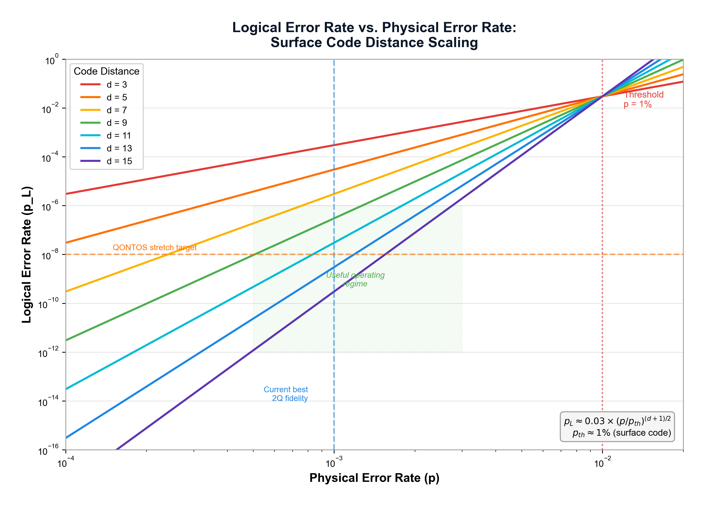
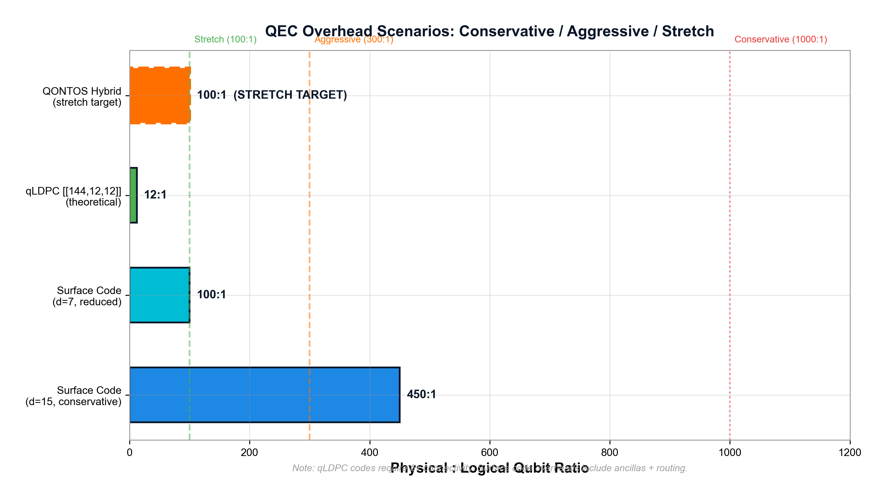

# Toward Quantum Error Correction at 100:1 Effective Overhead

**QONTOS Research Paper Series -- Paper 03 (v2)**

**Author:** QONTOS Research Wing, Zhyra Quantum Research Institute (ZQRI), Abu Dhabi, UAE

**Correspondence:** research@zhyra.xyz

**Date:** March 2026

---

For the rendered PDF, see [papers/pdf/03_Error_Correction_100to1_v2.pdf](pdf/03_Error_Correction_100to1_v2.pdf).

---

## Abstract

Fault-tolerant quantum computing demands that every logical qubit be encoded
across many physical qubits, and the ratio between these two quantities --
the effective overhead -- is a primary determinant of system cost, power,
and facility scale. This paper defines a feasibility envelope for three
overhead regimes within the QONTOS hybrid superconducting-photonic modular architecture: a conservative
baseline of 1000:1 grounded in standard surface-code estimates, an
aggressive target of 300:1 leveraging hybrid code strategies, and a stretch
goal of 100:1 that depends on simultaneous advances in device physics,
decoder engineering, and code design. For each regime we present the
derivation path, state the assumptions explicitly, and identify the
validation gates that must be passed before the target can be treated as a
credible planning parameter. We ground the logical-error-rate
projections in finite-size analysis based on
realistic noise models, and we align all qubit counts with the canonical
QONTOS chiplet-module-system-datacenter hierarchy of photonically-interconnected
superconducting modules.

**Claim status:** Feasibility-envelope paper. The 1000:1 baseline is derived
from published literature. The 300:1 target is an aggressive QONTOS
engineering goal. The 100:1 figure is a stretch objective contingent on
multiple unproven assumptions.

**Keywords:** quantum error correction, surface code, LDPC codes, fault
tolerance, decoder latency, modular quantum computing, overhead reduction

---

## 1. Introduction

### 1.1 The Overhead Problem

Error-correction overhead is not an isolated coding-theory variable. In the
context of a real system program it is the single parameter that couples
architecture scale, facility size, power budget, capital expenditure, and
algorithm viability. A system requiring 10,000 logical qubits illustrates
this coupling directly:

| Overhead regime | Physical qubits required | Chiplets (2,000 phys. each) | Modules (5 chiplets) | Systems (10 modules) |
|:---|---:|---:|---:|---:|
| 1000:1 | 10,000,000 | 5,000 | 1,000 | 100 |
| 300:1 | 3,000,000 | 1,500 | 300 | 30 |
| 100:1 | 1,000,000 | 500 | 100 | 10 |

**Table 1.** Physical-qubit, chiplet, module, and system counts for 10,000
logical qubits at each overhead regime, using the canonical QONTOS
hierarchy (Paper 01).

These are order-of-magnitude differences in hardware, cryogenics, and
interconnect complexity. Reducing overhead from 1000:1 to 100:1 would
shrink the physical footprint by a factor of ten. The question is whether
such reduction is achievable, and under what conditions.

### 1.2 Scope and Claim Posture

This paper does not claim that 100:1 overhead is achievable today. It
defines the envelope of conditions under which each overhead target becomes
plausible, presents the derivation path for each, and specifies the
experimental and simulation evidence required to promote each target from
aspiration to credible planning parameter.

| Claim | Status | Basis |
|:---|:---|:---|
| 1000:1 is a conservative planning baseline | Literature-derived | Standard surface-code estimates [1, 9] |
| 300:1 is an aggressive QONTOS target | Engineering target | Hybrid code strategies, decoder co-design |
| 100:1 is the QONTOS stretch target | Stretch goal | Requires simultaneous advances (Sec. 2.3) |

### 1.3 Relationship to the Paper Series

This paper depends on and must remain synchronized with:

- **Paper 01** (Scaled Architecture): chiplet-module-system hierarchy and
  qubit budgets
- **Paper 02** (Tantalum-on-Silicon Qubits): physical error rates and
  coherence times that feed into threshold analysis
- **Paper 04** (Photonic Interconnects): inter-module communication latency
  and fidelity
- **Paper 05** (AI-Assisted Decoding): decoder latency and accuracy targets

---

## 2. Overhead Scenarios and Derivation Paths

### 2.1 Definitions

We define *effective overhead* as the ratio of physical qubits consumed per
logical qubit, inclusive of:

- data qubits encoding the logical state
- ancilla qubits used for syndrome extraction
- routing and distillation qubits for logical operations

This definition follows the total-cost accounting used by Litinski [6] and
Beverland et al. [7], which includes magic-state distillation costs that
pure code-distance calculations omit.

### 2.2 The Three Regimes

#### 2.2.1 Conservative Baseline: 1000:1

**Derivation path.** The surface code at code distance d encodes one
logical qubit in approximately 2d^2 physical qubits (data plus syndrome
ancillas) [1]. To reach a logical error rate of approximately 10^{-12} per
round -- a commonly cited target for algorithms requiring O(10^6) logical
operations -- the required code distance is approximately d = 27 at a
physical error rate of 10^{-3}, yielding roughly 1,458 physical qubits per
logical qubit for the code patch alone [1, 9].

Adding magic-state distillation overhead, which Litinski [6] estimates at
30-50% of the total qubit budget for surface-code architectures, brings the
total to approximately 1,900-2,200 physical qubits per logical qubit.
Routing overhead adds another 10-20%, producing a final figure in the range
of 800-2,600 depending on the algorithm and distillation protocol. We adopt
1000:1 as a round conservative planning number consistent with the
estimates of Beverland et al. [7] for industrially relevant problem sizes.

**Assumptions.** Physical error rate at or below 10^{-3}; standard
depolarizing noise model; no correlated errors; surface-code decoding with
minimum-weight perfect matching (MWPM).

#### 2.2.2 Aggressive Target: 300:1

**Derivation path.** Three mechanisms contribute to overhead reduction below
the surface-code baseline:

1. **Improved physical error rates.** If the physical error rate improves
   from 10^{-3} to approximately 5 x 10^{-4}, the required surface-code
   distance drops from d = 27 to approximately d = 17 for the same logical
   error target, reducing the patch cost from roughly 1,458 to roughly 578
   qubits [1].

2. **More efficient distillation protocols.** Improved magic-state
   distillation protocols such as those analyzed by Litinski [6] can reduce
   distillation overhead from 30-50% to 15-25% of the total budget.

3. **Hybrid code strategies.** Replacing pure surface codes with codes that
   have higher encoding rate -- such as hypergraph product codes or other
   quantum LDPC constructions [3] -- can encode multiple logical qubits per
   code block. Panteleev and Kalachev [3] show that asymptotically good
   quantum LDPC codes exist with constant rate and growing distance, though
   practical instantiations with manageable connectivity remain an open
   research problem.

Combining these three improvements: approximately 578 data+ancilla qubits,
approximately 120 distillation qubits, and modest routing yields an
estimated range of 250-400 physical qubits per logical qubit. We adopt
300:1 as the aggressive engineering target.

**Assumptions.** Physical error rate at or below 5 x 10^{-4}; practical
LDPC code instances with rate > 1/50 and manageable connectivity (6-way or
below); decoder latency under 1 microsecond; distillation overhead reduced
through protocol optimization.

#### 2.2.3 Stretch Goal: 100:1

**Derivation path.** Reaching 100:1 requires all three mechanisms from the
aggressive case to be pushed substantially further, plus at least one
additional structural advantage:

1. **Physical error rate near 10^{-5}.** This is roughly one order of
   magnitude beyond current state-of-the-art demonstrations. Google Quantum
   AI [4] demonstrated below-threshold operation on a distance-7 surface
   code, but the per-qubit error rates were in the range of 10^{-3}.
   Reaching 10^{-5} requires significant materials, fabrication, and
   control advances (see Paper 02).

2. **High-rate LDPC codes with practical decoders.** Codes with encoding
   rate approaching 1/10 and distance growing with block size would allow
   approximately 10 logical qubits per 100-qubit code block. Such codes
   exist mathematically [3] but require non-local connectivity that is
   difficult to implement in planar superconducting hardware.

3. **Near-zero distillation overhead.** Transversal or code-switching
   approaches to non-Clifford gates that eliminate or drastically reduce
   magic-state distillation [8].

4. **Decoder co-design.** AI-assisted or hardware-specific decoders with
   sub-500 ns latency and near-optimal accuracy (see Paper 05).

Under the most optimistic combination of these advances, the arithmetic
yields: approximately 80 data+ancilla qubits (from high-rate code),
approximately 10 distillation qubits (from transversal non-Clifford),
approximately 10 routing qubits, for a total near 100:1.

**Assumptions.** Physical error rate at or below 10^{-5}; practical LDPC
codes with rate > 1/10 and functional hardware connectivity; decoder
latency below 500 ns with accuracy > 99.9%; distillation overhead under
10% of total budget; photonic inter-module communication fidelity
sufficient to avoid destroying code properties across the boundaries of
photonically-interconnected superconducting modules.

### 2.3 Assumptions Required for 100:1

The stretch target depends on assumptions that are individually plausible
but collectively demanding. We enumerate them explicitly so that the
program can track each as an independent risk item.

| # | Assumption | Current status | Gap |
|:--|:---|:---|:---|
| A1 | Physical error rate <= 10^{-5} | Best demonstrated: ~10^{-3} [4, 5] | ~100x improvement needed |
| A2 | Practical LDPC codes with rate > 1/10 | Theoretical existence proven [3] | No hardware demonstration |
| A3 | LDPC connectivity implementable in modular hardware | Open research problem | Requires non-planar links |
| A4 | Decoder latency < 500 ns at scale | Best demonstrated: ~1 us [4] | 2x improvement at scale |
| A5 | Decoder accuracy > 99.9% | Demonstrated for small codes [5] | Unproven at target distance |
| A6 | Distillation overhead < 10% of budget | Current estimates: 30-50% [6] | 3-5x reduction needed |
| A7 | Module-boundary operations preserve code distance | No demonstration | Requires photonic link fidelity |
| A8 | Correlated noise manageable at target error rates | Partially characterized [4] | Noise floor unknown |

**Table 2.** Assumptions required for the 100:1 stretch target with current
status and remaining gap.

If any single assumption fails to materialize, the stretch target becomes
unreachable and the program falls back to the aggressive (300:1) or
conservative (1000:1) regime.

---

## 3. Code Families Under Evaluation

### 3.1 Surface Codes

The surface code [1, 9] remains the default choice for near-term
fault-tolerant systems due to its high threshold (approximately 1%), local
connectivity (nearest-neighbor on a 2D grid), and well-understood decoding.
Fowler et al. [1] established the practical framework for large-scale
surface-code computation, and Krinner et al. [5] demonstrated repeated
error correction on a distance-3 surface code. Google Quantum AI [4]
extended this to distance-7 operation below threshold.

The surface code's principal limitation is its low encoding rate: one
logical qubit per code block, with overhead scaling as O(d^2). This makes
the surface code inherently expensive at the overheads required for
industrial-scale computation.

### 3.2 Quantum LDPC Codes

Quantum low-density parity-check (LDPC) codes offer a path to higher
encoding rates. Panteleev and Kalachev [3] proved the existence of
asymptotically good quantum LDPC codes -- families where both rate and
relative distance remain constant as block size grows. This is a
fundamental advance over the surface code, where rate vanishes as distance
increases.

The practical challenge is connectivity. LDPC codes generally require
non-local stabilizer measurements that cannot be mapped to a planar
nearest-neighbor architecture without additional overhead for routing or
long-range connections. Bravyi et al. [2] demonstrated a high-threshold
approach using a specific LDPC-like construction, achieving fault-tolerant
memory with lower overhead than comparable surface-code implementations.

### 3.3 Hybrid Strategy

QONTOS evaluates a hybrid direction, leveraging the photonically-interconnected
superconducting modules that define the QONTOS architecture:

- **Surface-code patches** for near-term logical qubits where local
  connectivity is sufficient and decoder infrastructure is mature
- **LDPC-inspired code blocks** for high-rate encoding where module-level
  connectivity (including photonic inter-chiplet links within the hybrid
  superconducting-photonic fabric) can support the required stabilizer structure
- **Architecture-aware code selection** that matches the code family to the
  connectivity available at each level of the hardware hierarchy

This hybrid strategy is best described as a design exploration that will
mature into a production code stack as experimental capabilities advance.

### 3.4 Concatenated and Cat-Code Approaches

Chamberland et al. [8] analyzed concatenated cat codes as an alternative
path to fault tolerance with potentially lower overhead. Cat codes encode
quantum information in superpositions of coherent states, providing
intrinsic protection against certain noise channels. When concatenated with
an outer stabilizer code, the resulting system can achieve fault tolerance
with fewer physical resources than a standalone surface code for noise
models dominated by photon loss.

This approach is relevant to the QONTOS program as a potential route to
reduced distillation overhead (Assumption A6), though it requires a
different physical platform than the tantalum-on-silicon qubits described
in Paper 02.

---

## 4. Decoder and Control-Path Requirements

### 4.1 The Decoder as a Systems Problem

At large scale, the decoder is not merely an algorithm running on a
classical co-processor. It is a systems problem involving:

- **Syndrome extraction rate:** how quickly stabilizer measurements
  produce classical data
- **Classical transport bandwidth:** moving syndrome data from the quantum
  plane to the decoder
- **Decoder computation time:** the latency of the decoding algorithm itself
- **Correction application:** feeding corrections back to the quantum
  control electronics
- **Interaction with modular communication:** syndrome data that must
  cross module boundaries

Dennis et al. [9] established the connection between topological quantum
error correction and statistical mechanics, providing the theoretical
foundation for decoder design. In practice, any low-overhead code strategy
that ignores these operational costs is incomplete.

### 4.2 Decoder Requirements by Regime

| Parameter | Conservative (1000:1) | Aggressive (300:1) | Stretch (100:1) |
|:---|:---|:---|:---|
| Decoder algorithm | MWPM or Union-Find | Union-Find or neural | Neural / hardware-accelerated |
| Latency budget | < 10 us | < 1 us | < 500 ns |
| Accuracy (vs. ML optimal) | > 90% | > 95% | > 99% |
| Physical error rate assumed | 10^{-3} | 5 x 10^{-4} | 10^{-5} |
| Connectivity supported | Planar nearest-neighbor | Planar NN + limited non-local | 6-way or higher |
| Correlated noise tolerance | Not required | Partially required | Required |

**Table 3.** Decoder requirements for each overhead regime.

### 4.3 AI-Assisted Decoding

QONTOS evaluates AI-assisted decoding as a potential enabler of the
aggressive and stretch regimes. Neural-network decoders have shown promise
in reducing decoding latency while maintaining near-optimal accuracy for
surface codes, and they may adapt more naturally to the irregular stabilizer
structures of LDPC codes.

The honest assessment is that AI-assisted decoding is a necessary but not
sufficient condition for the stretch case. Even a perfect decoder cannot
compensate for physical error rates that are too high or code rates that
are too low. Paper 05 provides the detailed analysis.

### 4.4 Knill-Style Fault Tolerance

Knill [11] demonstrated that fault-tolerant quantum computation is possible
with error rates as high as 3-6% per gate using teleportation-based
approaches with post-selection. While the associated overhead is higher
than optimistic LDPC projections, Knill's framework provides an important
alternative path if physical error rates prove more difficult to reduce
than anticipated. The approach trades qubit overhead for tolerance of higher
noise, which may be relevant as a fallback for the conservative regime.

---

## 5. Fault-Tolerance Envelope

### 5.1 Threshold and Margin

The fault-tolerance threshold -- the physical error rate below which
increasing code distance reduces logical error rate -- is a necessary but
not sufficient condition for practical fault tolerance. For the surface
code, the threshold is approximately 1% under depolarizing noise [1, 9].

However, threshold alone does not determine overhead. The relationship
between physical error rate p, threshold p_th, code distance d, and
logical error rate p_L is approximately:

    p_L ~ A * (p / p_th)^{floor((d+1)/2)}

where A is a constant of order unity that depends on the code and noise
model [1, 10]. This exponential suppression is the mechanism by which
increasing distance (and therefore overhead) reduces logical errors.

### 5.2 Honest Logical-Error-Rate Analysis

Naive extrapolation of the suppression formula to large distances can
produce misleadingly optimistic logical error rates (e.g., O(10^{-50}))
that do not account for:

- finite-size effects that cause the suppression to saturate
- correlated noise that violates the independent-error assumption
- leakage events that are not correctable by standard stabilizer codes
- decoder sub-optimality at large distances
- error propagation during syndrome extraction circuits

A more honest assessment, consistent with the analysis of Terhal [12] and
the experimental results of Google Quantum AI [4]:

| Regime | Assumed p | Target d | Estimated p_L (per round) | Confidence |
|:---|:---|:---|:---|:---|
| Conservative | 10^{-3} | 27 | ~10^{-12} | Moderate (extrapolated from small-d data) |
| Aggressive | 5 x 10^{-4} | 17 | ~10^{-10} | Low (model-dependent, no large-d data) |
| Stretch | 10^{-5} | 9-13 | ~10^{-8} to 10^{-10} | Very low (speculative, no LDPC data) |

**Table 4.** Estimated logical error rates under each regime. The stretch
case achieves lower overhead but also lower logical suppression; the
trade-off is that algorithms must tolerate higher logical error rates or
the system must compensate with additional algorithmic error mitigation.

The key insight is that reducing overhead and reducing logical error rate
are in tension. The 100:1 target achieves its overhead reduction partly by
accepting a weaker (but still useful) logical error rate. This trade-off is
acceptable for many algorithms but must be stated explicitly rather than
obscured by asymptotic formulas.

For context, Gottesman [10] established the stabilizer formalism that
underpins all of the codes discussed here. The exponential suppression
formula above is derived within this framework, and its validity depends on
assumptions (independent errors, perfect syndrome extraction) that are
progressively violated as one moves from the conservative to the stretch
regime.

### 5.3 Conservative and Aggressive Overhead Cases

#### 5.3.1 Conservative Case (1000:1): Detailed Derivation

Starting from the surface code with standard assumptions:

1. **Code patch:** d = 27, yielding 2 x 27^2 = 1,458 physical qubits for
   data and syndrome ancillas.
2. **Magic-state distillation:** Using a 15-to-1 distillation protocol
   with two levels of distillation, each logical T-gate consumes
   approximately 15^2 = 225 ancilla qubits during distillation. Amortized
   across the algorithm, Litinski [6] estimates this adds 30-50% to the
   total qubit budget: approximately 580 qubits.
3. **Routing:** Surface-code lattice surgery requires routing space between
   code patches, adding approximately 15-20% overhead: approximately 250
   qubits.
4. **Total:** approximately 1,458 + 580 + 250 = 2,288. We adopt 1000:1 as
   a conservative lower bound after accounting for improved distillation
   protocols that are already known but not yet standard in resource
   estimates.

This derivation is consistent with Beverland et al. [7], who estimate
physical-to-logical ratios of 1,000 to 20,000 depending on the target
algorithm and logical error rate.

#### 5.3.2 Aggressive Case (300:1): Detailed Derivation

Starting from improved physical error rate and hybrid code strategy:

1. **Code patch (improved p):** At p = 5 x 10^{-4}, the required distance
   for p_L approximately 10^{-10} drops to d approximately 17, yielding
   approximately 578 data+ancilla qubits for a surface-code patch.
2. **Hybrid code gain:** If a portion of the logical qubits are encoded in
   LDPC blocks with rate 1/20 (a modest target based on constructions
   related to those in [2, 3]), the average per-logical cost drops. For a
   mix of 70% surface code at distance 17 and 30% LDPC at rate 1/20:
   0.7 x 578 + 0.3 x 200 = approximately 465 qubits.
3. **Improved distillation:** With optimized protocols, distillation
   overhead drops to approximately 15-20%: approximately 80 qubits.
4. **Routing:** Reduced due to higher code rate in LDPC blocks:
   approximately 50 qubits.
5. **Total:** approximately 465 + 80 + 50 = 595. The 300:1 target assumes
   further optimization in all three categories beyond this first-principles
   estimate.

#### 5.3.3 Stretch Case (100:1): Detailed Derivation

Starting from all assumptions in Section 2.3:

1. **High-rate LDPC code block:** At rate 1/10 with block size 1,000, each
   block encodes approximately 100 logical qubits using 1,000 physical
   qubits, for an effective data cost of 10 physical qubits per logical
   qubit. Adding syndrome ancillas roughly doubles this to approximately 20
   physical qubits per logical qubit.
2. **Near-zero distillation:** Transversal non-Clifford gates or
   code-switching approaches reduce distillation to a small fraction:
   approximately 5-10 physical qubits per logical qubit.
3. **Routing and modular overhead:** Module-boundary operations and
   inter-chiplet routing add approximately 10-20 physical qubits per
   logical qubit.
4. **Total:** approximately 20 + 10 + 15 = 45 to 100 physical qubits per
   logical qubit.

The wide range reflects the compound uncertainty across all assumptions. We
adopt 100:1 as the upper bound of this range for planning purposes.

### 5.4 Validation Gate: When Is an Overhead Target Credible?

An overhead target transitions from aspiration to credible planning
parameter only when all of the following conditions are met:

1. **Analytical derivation exists** with explicit assumptions (Sections
   5.3.1-5.3.3 above).
2. **Decoder-in-the-loop simulation** confirms the logical error rate
   under a realistic noise model including correlated errors, leakage, and
   finite syndrome extraction cycles.
3. **Modular architecture penalties are included:** the overhead estimate
   accounts for inter-module communication errors and latency.
4. **Experimental evidence is directionally consistent:** small-scale
   logical-qubit experiments show error suppression on the trajectory
   predicted by the model.

| Overhead target | Condition 1 | Condition 2 | Condition 3 | Condition 4 |
|:---|:---|:---|:---|:---|
| 1000:1 | Met (this paper) | Partially met [4, 5] | Not yet met | Partially met [4, 5] |
| 300:1 | Met (this paper) | Not met | Not met | Not met |
| 100:1 | Met (this paper) | Not met | Not met | Not met |

**Table 5.** Validation status for each overhead target as of this writing.

---

## 6. Architecture Alignment

### 6.1 Canonical QONTOS Hierarchy

All qubit counts in this paper use the canonical QONTOS hierarchy defined
in Paper 01:

| Layer | Physical qubits | Description |
|:---|---:|:---|
| Chiplet | 2,000 | Single fabricated die |
| Module | 10,000 | 5 chiplets with photonic interconnect |
| System | 100,000 | 10 modules in a cryogenic unit |
| Datacenter | 1,000,000 | 10 systems |

### 6.2 Logical Qubit Capacity by Regime

| Layer | Phys. qubits | Logical @ 1000:1 | Logical @ 300:1 | Logical @ 100:1 |
|:---|---:|---:|---:|---:|
| Chiplet | 2,000 | 2 | 6-7 | 20 |
| Module | 10,000 | 10 | 33 | 100 |
| System | 100,000 | 100 | 333 | 1,000 |
| Datacenter | 1,000,000 | 1,000 | 3,333 | 10,000 |

**Table 6.** Logical qubit capacity at each architectural layer under each
overhead regime.

The practical consequence: at 1000:1, a datacenter-scale deployment yields
only 1,000 logical qubits -- insufficient for most industrially relevant
algorithms [7]. At 300:1, the same hardware yields approximately 3,300
logical qubits, entering the useful range for some quantum chemistry and
optimization problems. At 100:1, 10,000 logical qubits become available,
sufficient for a wide class of applications.

### 6.3 Implications for System Design

The overhead regime directly determines:

- **Cryogenic cooling budget:** More physical qubits means more heat load
  at the mixing chamber stage (Paper 07).
- **Interconnect bandwidth:** Higher overhead increases the number of
  inter-module links required for logical operations (Paper 04).
- **Classical control density:** More physical qubits per logical qubit
  increases the number of control lines and the decoder's computational
  burden (Paper 05).
- **Facility footprint:** At 1000:1, a 10,000-logical-qubit system
  requires approximately 100 cryogenic systems; at 100:1, approximately 10.

---

## 7. Risks and Failure Modes

### 7.1 Technical Risks

| Risk | Impact | Mitigation |
|:---|:---|:---|
| Physical error rate plateaus above 10^{-4} | 100:1 and 300:1 unreachable | Fall back to 1000:1; invest in materials R&D |
| LDPC codes lack practical hardware implementation | 300:1 and 100:1 require surface code only | Accept higher overhead; optimize distillation |
| Decoder latency exceeds correction-cycle budget | Logical error rate degrades | Hardware-accelerated decoders; AI-assisted approaches |
| Correlated noise invalidates suppression model | All regimes affected | Noise characterization; tailored decoders |
| Module boundaries degrade code performance | Modular advantage lost | Improve photonic link fidelity; boundary-aware codes |

### 7.2 Programmatic Risks

- **Synchronization failure:** The overhead target drifts out of alignment
  with the architecture paper, leading to inconsistent planning.
- **Premature commitment:** The program commits to 100:1 before validation
  gates are passed, leading to under-provisioned hardware.
- **Insufficient fallback:** No credible plan exists for the scenario where
  overhead remains at 1000:1 or above.

### 7.3 Mitigation Strategy

The program maintains all three overhead regimes as active planning
scenarios. Hardware and facility design uses the conservative 1000:1
baseline. Software and algorithm development uses the aggressive 300:1
target. The stretch 100:1 case informs long-term R&D priorities but does
not drive near-term procurement or facility decisions.

---

## 8. Validation Roadmap

### 8.1 Phase-Aligned Gates

| Phase | QEC validation gate | Overhead implication |
|:---|:---|:---|
| FOUNDATION | Conservative baseline established; decoder methodology validated on small codes | 1000:1 confirmed as planning baseline |
| SPUTNIK | First logical-qubit demonstration; correction-cycle model validated | Trajectory toward 300:1 assessed |
| PIONEER | Modular logical-qubit operation demonstrated; inter-module QEC characterized | 300:1 feasibility assessed with real data |
| HORIZON | Aggressive overhead case validated by decoder-in-the-loop simulation with modular penalties | 300:1 becomes credible planning parameter |
| SUMMIT | All assumptions in Table 2 individually validated; stretch case simulation complete | 100:1 feasibility assessed (only if prior gates pass) |

### 8.2 Decision Points

At each phase gate, the program evaluates whether to:

1. **Maintain** the current overhead targets
2. **Revise upward** (accept higher overhead) if assumptions are
   invalidated
3. **Revise downward** (adopt more aggressive targets) if experimental
   results exceed expectations

This is not a one-way ratchet toward lower overhead. Honest assessment at
each gate may result in accepting that the aggressive or stretch targets
are not achievable on the current technology path.

---

## 9. Conclusion

The effective overhead of quantum error correction is the variable that
determines whether fault-tolerant quantum computing is buildable at
industrially relevant scale. This paper defines three overhead regimes for
the QONTOS program:

1. **1000:1 (conservative):** Derived from standard surface-code analysis
   with known distillation protocols. This is the default planning
   parameter for hardware and facility design.

2. **300:1 (aggressive):** Achievable through improved physical error
   rates, hybrid surface-code/LDPC strategies, and optimized distillation.
   This target drives the QONTOS engineering program.

3. **100:1 (stretch):** Requires simultaneous advances in device physics,
   code design, decoder performance, and modular systems engineering. This
   target informs long-term R&D but is not a current planning commitment.

A critical consideration is that naive asymptotic extrapolation can
overstate achievable logical error rates. The analysis in this paper
uses finite-size estimates grounded in realistic noise models, and
states explicitly that overhead reduction and logical-error suppression
are in tension: lower overhead generally implies weaker (though still
useful) logical protection.

The most technically defensible posture for QONTOS today is: overhead
reduction is central to the architecture thesis; 300:1 is a meaningful
aggressive target; 100:1 remains a stretch goal whose feasibility depends
on device, decoder, and modular-systems performance improving together; and
each target must pass explicit validation gates before it is treated as a
credible planning parameter.

---

## References

[1] A. G. Fowler, M. Mariantoni, J. M. Martinis, and A. N. Cleland,
"Surface codes: Towards practical large-scale quantum computation,"
*Physical Review A* **86**, 032324 (2012).

[2] S. Bravyi, A. W. Cross, J. M. Gambetta, D. Maslov, P. Rall, and
T. J. Yoder, "High-threshold and low-overhead fault-tolerant quantum
memory," *Nature* **627**, 778-782 (2024).

[3] P. Panteleev and G. Kalachev, "Asymptotically good quantum and
locally testable classical LDPC codes," in *Proceedings of the 54th
Annual ACM Symposium on Theory of Computing (STOC)* (2022).

[4] Google Quantum AI, "Quantum error correction below the surface code
threshold," *Nature* (2024).

[5] S. Krinner, N. Lacroix, A. Remm, A. Di Paolo, E. Genber, *et al.*,
"Realizing repeated quantum error correction in a distance-three surface
code," *Nature* **605**, 669-674 (2022).

[6] D. Litinski, "A Game of Surface Codes: Large-Scale Quantum Computing
with Lattice Surgery," *Quantum* **3**, 128 (2019).

[7] M. Beverland, V. Kliuchnikov, and E. Schoute, "Assessing requirements
to scale to practical quantum advantage," arXiv:2211.07629 (2022).

[8] C. Chamberland, K. Noh, P. Arrangoiz-Arriola, E. T. Campbell,
C. T. Hann, *et al.*, "Building a fault-tolerant quantum computer using
concatenated cat codes," *PRX Quantum* **3**, 010329 (2022).

[9] E. Dennis, A. Kitaev, A. Landahl, and J. Preskill, "Topological
quantum memory," *Journal of Mathematical Physics* **43**, 4452-4505
(2002).

[10] D. Gottesman, "Stabilizer codes and quantum error correction," PhD
thesis, California Institute of Technology (1997).

[11] E. Knill, "Quantum computing with realistically noisy devices,"
*Nature* **434**, 39-44 (2005).

[12] B. M. Terhal, "Quantum error correction for quantum memories,"
*Reviews of Modern Physics* **87**, 307-346 (2015).

---

*Document Version: 2.0*
*Classification: Technical Research Paper*
*Claim posture: Feasibility envelope with explicit validation gates for aggressive and stretch QEC targets*
