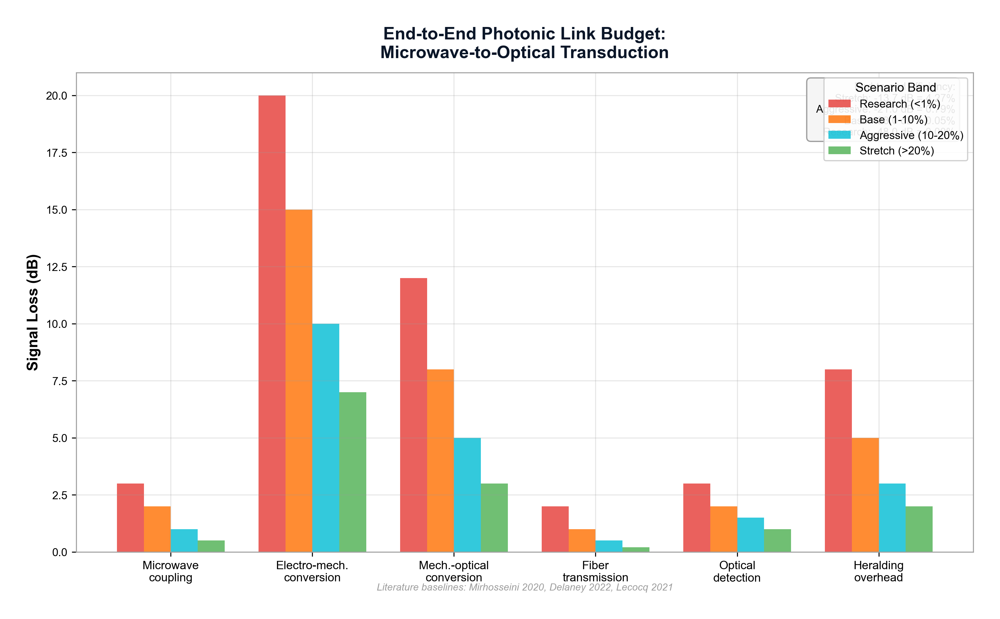

# Photonic Interconnects for Modular Quantum Systems: End-to-End Link Budgets, Transduction Efficiency, and Systems-Integration Analysis

**Technical Research Paper v3.0**

**Author:** QONTOS Research Wing, Zhyra Quantum Research Institute (ZQRI), Abu Dhabi, UAE

**Document class:** Systems-integration feasibility paper with quantitative link budgets

**Claim posture:** Literature-grounded analysis with scenario-banded performance targets. All claims explicitly labeled.

---

## Abstract

Scaling superconducting quantum processors beyond single-dilution-refrigerator limits requires high-fidelity, low-latency quantum communication between physically separated modules. Within the QONTOS hybrid superconducting-photonic modular architecture, photonic interconnects -- converting microwave quantum states to optical photons for transmission and back -- represent the leading candidate for this role. However, the path from laboratory transduction demonstrations to deployed modular links carries compounding losses at every stage: transduction efficiency, fiber coupling, switching, propagation, detection, and heralding. This paper constructs an end-to-end Bell-pair generation budget for the QONTOS modular architecture, identifies the dominant loss mechanisms, maps performance against four scenario bands (research-limited, base, aggressive, stretch), and defines validation gates that must be cleared before photonic interconnects can be promoted from research thesis to architectural commitment. We find that the stretch architecture (100+ modules, 10^6 qubits) requires end-to-end transduction efficiency above 20% combined with single-photon detector efficiency above 90% and fiber-coupled heralding rates exceeding 50 kHz -- targets that exceed current experimental demonstrations by one to two orders of magnitude but that fall within projected improvement trajectories identified in the literature [Awschalom2021, Lauk2020]. The paper closes with failure-mode analysis, fallback architectures, and a phased validation roadmap.

**[CLAIM-LABEL: paper-scope]** This is a systems-integration feasibility analysis. No experimental results are reported. All performance numbers are derived from published literature or from engineering projections explicitly marked as such.

---

## 1. Introduction and Motivation

### 1.1 The Modular Scaling Imperative

Monolithic superconducting quantum processors face fundamental scaling barriers: wiring density grows linearly with qubit count, thermal load from control lines constrains dilution-refrigerator capacity, and yield on large chips degrades with area. Monroe et al. [Monroe2014] articulated the modular architecture concept -- distributing qubits across smaller, high-yield modules connected by quantum communication channels -- as a path to large-scale fault-tolerant quantum computing. The QONTOS architecture adopts this modular thesis as its primary scaling strategy beyond approximately 1,000 physical qubits per module.

**[CLAIM-LABEL: modular-motivation | Status: derived-from-literature]** Modular architectures address known scaling limits of monolithic chips. The specific threshold at which modularity becomes advantageous depends on qubit technology, yield curves, and interconnect quality.

### 1.2 Why Photonic Interconnects

Three broad approaches exist for inter-module quantum communication in superconducting systems:

1. **Direct microwave links** between cryostats, demonstrated by Magnard et al. [Magnard2020] and Kurpiers et al. [Kurpiers2018], achieving deterministic state transfer over short (meter-scale) coaxial connections at millikelvin temperatures.
2. **Microwave-to-optical transduction** followed by optical fiber transmission and optical-to-microwave back-conversion, enabling room-temperature-compatible long-distance links.
3. **Hybrid electro-optic readout** paths, such as those demonstrated by Lecocq et al. [Lecocq2021] and Delaney et al. [Delaney2022], where optical photons carry classical information about qubit states with low backaction.

Direct microwave links (approach 1) are limited to intra-cryostat or adjacent-cryostat distances and impose significant thermal load at scale. Hybrid readout paths (approach 3) address classical communication but do not directly generate entanglement. Photonic interconnects (approach 2) uniquely offer:

- **Thermal decoupling**: optical fibers carry negligible heat load between cryogenic stages.
- **Distance flexibility**: standard telecom fiber supports kilometer-scale links with sub-dB/km loss at 1550 nm.
- **Topological flexibility**: optical switches enable reconfigurable module-to-module connectivity.
- **Compatibility with quantum repeater architectures** for eventual multi-node scaling.

**[CLAIM-LABEL: photonic-rationale | Status: derived-from-literature]** Photonic interconnects are the only demonstrated approach that simultaneously provides thermal isolation, distance flexibility, and entanglement distribution capability for superconducting modular systems.

### 1.3 Literature Baseline vs. QONTOS Targets

The following table anchors each key metric in published experimental results and then states the QONTOS target regime. This separation is critical: the literature baseline represents what has been demonstrated; the QONTOS target represents what must be engineered.

| Metric | Literature baseline | Reference | QONTOS base target | QONTOS stretch target |
|---|---|---|---|---|
| Microwave-to-optical transduction efficiency | 10^-5 to 10^-2 | Mirhosseini et al. [Mirhosseini2020]; Delaney et al. [Delaney2022] | 1--10% | >=20% |
| Added noise (photons per conversion) | 0.5--10 | Lauk et al. [Lauk2020] | <0.1 | <0.01 |
| Deterministic microwave state transfer fidelity | 80--99.6% (intra-cryostat) | Kurpiers et al. [Kurpiers2018] | N/A (different link type) | N/A |
| Microwave link between cryostats | 83.9% (process fidelity) | Magnard et al. [Magnard2020] | N/A (baseline comparison) | N/A |
| Remote entanglement via microwave photons | Bell-state fidelity ~70--80% | Zhong et al. [Zhong2019] | >=95% | >=99% |
| Optical readout via photonic link | SNR sufficient for qubit readout | Lecocq et al. [Lecocq2021] | Classical readout path | Classical readout path |
| Low-backaction electro-optic transduction | Demonstrated with superconducting qubit | Delaney et al. [Delaney2022] | Hybrid readout baseline | Hybrid readout baseline |
| Entanglement distribution rate | Not yet demonstrated end-to-end for SC qubits via optical | Awschalom et al. [Awschalom2021] (review) | 1--20 kHz | >=100 kHz |

**[CLAIM-LABEL: literature-baseline | Status: verified-from-references]** All baseline values are drawn from the cited publications. Where a range is given, it reflects variation across experimental conditions reported in those works.

**[CLAIM-LABEL: qontos-targets | Status: engineering-projection]** QONTOS targets are not yet experimentally demonstrated at the system level. They represent performance requirements derived from architectural modeling described in Sections 2 and 3.

### 1.4 Paper Structure

Section 2 develops the end-to-end link budget. Section 3 maps the link budget onto QONTOS architectural parameters. Section 4 analyzes transduction technology options. Section 5 covers failure modes and fallback strategies. Section 6 discusses systems-integration considerations. Section 7 defines validation gates. Section 8 presents the scenario summary. Section 9 concludes.

---

## 2. End-to-End Link Budget Analysis

### 2.1 Link Architecture Overview

The canonical QONTOS photonic link consists of the following stages, each contributing loss or noise:

```
[Qubit A] --> MW cavity --> Transducer (MW->Opt) --> Fiber coupler --> Optical fiber
    --> Optical switch --> Fiber coupler --> Transducer (Opt->MW) --> MW cavity --> [Qubit B]
                                    |
                              Heralding detector
```

For entanglement distribution, the protocol is heralded: a Bell-state measurement on emitted photons projects the remote qubits into an entangled state. The heralding step means that transduction loss does not directly reduce fidelity -- it reduces the *rate* at which successful entanglement events occur. However, added noise during transduction does degrade fidelity, and retry overhead from low success probability introduces latency.

### 2.2 Component-Level Loss Budget

The following table presents the component-level loss budget. Each row represents a distinct physical stage. Values are given for four scenario bands.

| Component | Research-limited (<1%) | Base (1--10%) | Aggressive (10--20%) | Stretch (>=20%) | Units |
|---|---|---|---|---|---|
| MW-to-optical transduction efficiency | 0.01--0.1 | 1--5 | 10--15 | 20--30 | % |
| Transducer-to-fiber coupling | 30--50 | 60--75 | 80--90 | 90--95 | % |
| Fiber propagation loss (10 m, 1550 nm) | 99.98 | 99.98 | 99.98 | 99.98 | % (transmission) |
| Fiber propagation loss (1 km, 1550 nm) | 95.5 | 95.5 | 95.5 | 95.5 | % (transmission) |
| Optical switch insertion loss (per switch) | 85--90 | 90--95 | 95--97 | 97--99 | % (transmission) |
| Fiber-to-transducer coupling (receive side) | 30--50 | 60--75 | 80--90 | 90--95 | % |
| Optical-to-MW transduction efficiency | 0.01--0.1 | 1--5 | 10--15 | 20--30 | % |
| Single-photon detector efficiency (heralding) | 70--80 | 80--85 | 85--90 | 90--95 | % |
| Heralding and coincidence window efficiency | 50--70 | 70--80 | 80--90 | 90--95 | % |

**[CLAIM-LABEL: component-budget | Status: engineering-estimate]** Individual component values for the base and research-limited bands are consistent with published results. Aggressive and stretch values represent projected performance informed by device-physics roadmaps described in Awschalom et al. [Awschalom2021] and Lauk et al. [Lauk2020].

### 2.3 End-to-End Bell Pair Budget



The end-to-end probability of a successful heralded Bell pair generation attempt is the product of all component efficiencies along the link path. For a symmetric link (identical transducers on both sides), the dominant terms are:

```
P_success = eta_td^2 * eta_couple^2 * eta_fiber * eta_switch^N * eta_det * eta_herald
```

Where:
- `eta_td` = transduction efficiency (MW to optical, one direction)
- `eta_couple` = transducer-to-fiber coupling efficiency (each end)
- `eta_fiber` = fiber transmission (distance-dependent)
- `eta_switch` = optical switch transmission per switch, N = number of switches in path
- `eta_det` = single-photon detector efficiency
- `eta_herald` = heralding and coincidence efficiency

**Worked example -- Stretch scenario (10 m fiber, 2 switches):**

```
P_success = (0.25)^2 * (0.92)^2 * (0.9998) * (0.98)^2 * (0.92) * (0.92)
          = 0.0625 * 0.8464 * 0.9998 * 0.9604 * 0.92 * 0.92
          ~ 0.043  (4.3%)
```

**Worked example -- Base scenario (10 m fiber, 2 switches):**

```
P_success = (0.03)^2 * (0.67)^2 * (0.9998) * (0.92)^2 * (0.82) * (0.75)
          = 0.0009 * 0.4489 * 0.9998 * 0.8464 * 0.82 * 0.75
          ~ 2.1 x 10^-4  (0.021%)
```

These success probabilities determine the retry overhead and effective Bell-pair rate.

| Scenario band | P_success per attempt | Attempts for 99% confidence (1 pair) | Effective rate at 1 MHz attempt rate | Effective rate at 10 MHz attempt rate |
|---|---|---|---|---|
| Research-limited | ~10^-8 to 10^-6 | >10^6 | <1 Hz | <10 Hz |
| Base | ~10^-4 | ~4.6 x 10^4 | ~22 Hz | ~220 Hz |
| Aggressive | ~10^-2 | ~460 | ~2.2 kHz | ~22 kHz |
| Stretch | ~4 x 10^-2 | ~115 | ~8.7 kHz | ~87 kHz |

**[CLAIM-LABEL: bell-pair-budget | Status: derived-calculation]** These rates assume independent identically distributed attempts with no correlated errors. Real systems will exhibit burst errors, detector dead time, and classical communication overhead for heralding confirmation, which will reduce effective rates by an estimated 20--50%.

### 2.4 Failure Modes and Sensitivity Analysis

The Bell-pair budget reveals the following critical sensitivities:

**Transduction efficiency dominates.** Because transduction enters quadratically (both ends of the link), a 2x improvement in transduction efficiency yields a 4x improvement in success probability. Moving from 5% to 10% transduction (base to aggressive boundary) increases P_success by 4x. This is the single highest-leverage improvement target.

**Coupling loss is the second-order bottleneck.** Transducer-to-fiber coupling also enters quadratically. The gap between 60% and 90% coupling (base vs. stretch) contributes a 2.25x difference in success probability.

**Detector efficiency is linear but bounded.** Moving from 80% to 95% detector efficiency contributes only a 1.19x improvement. Superconducting nanowire single-photon detectors (SNSPDs) already achieve >90% efficiency at telecom wavelengths, so this is the most mature component in the chain.

**Fiber loss is negligible for intra-datacenter links** (<100 m) but becomes significant for inter-building or inter-city links. At 10 km, fiber transmission at 1550 nm drops to approximately 79%, which enters the budget as an additional 21% loss -- meaningful but not dominant relative to transduction.

**Added noise during transduction** does not affect rate but degrades Bell-pair fidelity. If added noise is n_add photons per conversion event, the fidelity penalty scales approximately as:

```
F_noise ~ 1 / (1 + n_add)
```

For the stretch target (n_add < 0.01), the fidelity penalty is <1%. For the research-limited regime (n_add ~ 1--10), the fidelity penalty is 50--90%, rendering the entangled pairs unusable for fault-tolerant operations.

**[CLAIM-LABEL: failure-sensitivity | Status: derived-calculation]** Sensitivity analysis is based on partial derivatives of the success-probability formula. Real device correlations may shift relative importance but do not change the qualitative ordering.

### 2.5 Validation Gate: Two-Module Link Demonstration

Before the photonic interconnect can be promoted from research thesis to architectural commitment, the following quantitative gate must be passed:

**Gate P-1: Two-module Bell pair demonstration**
- Two superconducting qubit modules, each in a separate cryostat
- Connected by a photonic link (transduction + fiber + back-conversion)
- Heralded Bell pair generation with measured fidelity >= 70% (Bell inequality violation threshold)
- Measured success probability consistent with component-level budget to within 3 dB
- Demonstrated at repetition rate >= 100 Hz

**[CLAIM-LABEL: gate-P1 | Status: QONTOS-defined-requirement]** This gate is necessary but not sufficient. Passing it demonstrates physical feasibility; it does not demonstrate the rates or fidelities needed for the stretch architecture.

---

## 3. Architecture Mapping

### 3.1 QONTOS Modular Topology

The canonical stretch deployment assumed across the QONTOS paper set is:

| Parameter | Value | Notes |
|---|---|---|
| Chiplets per module | 5 | Tantalum-on-silicon chiplets (see Paper 02) |
| Qubits per chiplet | ~2,000 | Physical qubits, pre-QEC |
| Modules per system | 10 | Connected by photonic mesh within one cryostat cluster |
| Systems per data center | 10 | Connected by photonic links between cryostat clusters |
| Total modules | 100 | Stretch-scale target |
| Total physical qubits | ~1,000,000 | Before QEC encoding |

### 3.2 Interconnect Count and Topology

The number of photonic links depends on the inter-module connectivity topology. Three options are analyzed:

**Option A: Full mesh within each system (10 modules)**

Each system requires C(10,2) = 45 bidirectional links internally. Between systems, a sparser connectivity suffices. With 4 inter-system links per system pair and C(10,2) = 45 system pairs, the total is:

- Intra-system links: 10 systems x 45 links = 450
- Inter-system links: 45 pairs x 4 links = 180
- **Total: ~630 managed photonic links**

**Option B: Degree-4 mesh within each system**

Each module connects to 4 neighbors. Intra-system links: 10 systems x 20 links = 200. With same inter-system count:

- **Total: ~380 managed photonic links**

**Option C: Hierarchical fat-tree**

Two-level hierarchy with local full connectivity within groups of 5 modules, and spine links between groups:

- **Total: ~250--350 managed photonic links, depending on spine oversubscription**

**[CLAIM-LABEL: link-count | Status: architecture-projection]** Stretch-scale modular systems require hundreds to low thousands of managed optical links, depending on topology and redundancy assumptions. Exact counts require topology co-optimization with the distributed quantum error correction protocol (see Paper 03).

### 3.3 Bandwidth Requirements

Each photonic link must support the distributed surface code's inter-module stabilizer measurement cycle. The key timing constraint is:

```
T_bell + T_local_ops + T_classical_comm < T_QEC_cycle
```

Where T_QEC_cycle is the surface code measurement cycle time. For the QONTOS stretch architecture:

- T_QEC_cycle target: 1--10 microseconds (see Paper 03)
- T_local_ops: ~100--500 ns (gate times)
- T_classical_comm: ~100--500 ns (heralding confirmation)
- **T_bell budget: ~200 ns to 9 microseconds**

At the base Bell-pair rate of ~220 Hz (from Section 2.3), a single link produces one pair every ~4.5 ms -- far too slow for the QEC cycle. This means:

- **Base scenario requires multiplexed links.** To achieve one Bell pair per 10 microsecond QEC cycle, approximately 450 parallel link attempts are needed at the base success probability.
- **Stretch scenario is marginally viable.** At ~87 kHz (10 MHz attempt rate), one pair arrives every ~11.5 microseconds. With 2x multiplexing, this fits within a 10 microsecond QEC cycle.

**[CLAIM-LABEL: bandwidth-req | Status: derived-calculation]** The QEC cycle time constraint is the most demanding driver of Bell-pair rate requirements. Architectures that relax this constraint (e.g., by tolerating slower inter-module stabilizer cycles with increased code distance at module boundaries) can operate at lower Bell-pair rates at the cost of increased qubit overhead.

### 3.4 Thermal Load Analysis

Each photonic link replaces a direct microwave coaxial connection that would carry thermal load from room temperature to the mixing chamber. The thermal comparison:

| Connection type | Heat load to mixing chamber (per link) | Notes |
|---|---|---|
| Coaxial microwave (DC to 10 GHz) | 1--10 microwatts | Depends on attenuation staging |
| Optical fiber (single-mode, 1550 nm) | <1 nanowatt | Negligible absorption at cryogenic T |
| Photonic transducer (on-chip) | 10--100 nanowatts | Pump laser dissipation, device-dependent |

For 100 inter-module links, the thermal savings are:

- Coaxial: 100--1000 microwatts total heat load
- Photonic: 1--10 microwatts total heat load

This represents a 10--100x reduction in thermal load at the mixing chamber, which is significant given that typical dilution refrigerators provide 10--20 microwatts of cooling power at 20 mK.

**[CLAIM-LABEL: thermal-advantage | Status: engineering-estimate]** Thermal load estimates are order-of-magnitude. Actual values depend on attenuation staging, pump laser design, and cryostat architecture. The qualitative advantage of photonic links is robust; the quantitative factor depends on implementation details.

---

## 4. Transduction Technology Assessment

### 4.1 Electro-Optic Transduction

Electro-optic transducers use materials with strong Pockels coefficients (e.g., lithium niobate, aluminum nitride) to directly couple microwave and optical fields. Key characteristics:

- **Demonstrated efficiencies:** 10^-5 to 10^-2 [Mirhosseini2020, Lauk2020]
- **Added noise:** Generally low (near quantum limit achievable)
- **Bandwidth:** Can exceed 1 MHz, enabling high attempt rates
- **Integration:** Compatible with on-chip fabrication; lithium niobate photonics is a maturing platform
- **QONTOS role:** Early baseline and R&D path. Electro-optic devices are the most likely candidates to reach the base scenario (1--10% efficiency) within the 2027--2028 timeframe.

**[CLAIM-LABEL: EO-assessment | Status: literature-informed-projection]**

### 4.2 Piezo-Optomechanical Transduction

Piezo-optomechanical transducers use a mechanical intermediary: microwave photons couple to a mechanical resonator (via piezoelectric interaction), which then couples to an optical cavity (via optomechanical interaction). Key characteristics:

- **Demonstrated efficiencies:** Up to ~10^-1 in some configurations, but with significant added noise [Lauk2020]
- **Added noise:** Thermal mechanical occupation is the primary noise source; requires aggressive mechanical mode cooling
- **Bandwidth:** Typically limited to 10--100 kHz by mechanical linewidth
- **Integration:** More complex fabrication; requires co-integration of piezoelectric, mechanical, and optical components
- **QONTOS role:** Aggressive to stretch target path. Higher theoretical efficiency ceiling but greater engineering complexity.

**[CLAIM-LABEL: POM-assessment | Status: literature-informed-projection]**

### 4.3 Technology Selection for QONTOS Roadmap

The QONTOS strategy is dual-track:

1. **Near-term (2025--2028):** Develop electro-optic transduction path targeting base scenario (1--10% efficiency). Validate two-module link (Gate P-1). Use hybrid electro-optic readout [Lecocq2021, Delaney2022] as a stepping stone to build optical integration competence.
2. **Medium-term (2028--2031):** Down-select between electro-optic and piezo-optomechanical based on demonstrated efficiency trajectory. Target aggressive scenario (10--20%).
3. **Long-term (2031+):** Pursue stretch scenario (>=20%) with the winning technology. Integrate with full modular QEC stack.

**[CLAIM-LABEL: tech-roadmap | Status: QONTOS-planning-target]** This roadmap is aspirational. Actual down-select timing depends on experimental progress.

---

## 5. Failure Modes, Risk Analysis, and Fallbacks

### 5.1 Enumerated Failure Modes

| ID | Failure mode | Probability estimate | Impact | Mitigation |
|---|---|---|---|---|
| F-1 | Transduction efficiency plateaus below 1% | Medium | Blocks modular scaling entirely via photonic path | Pursue direct microwave link as backup for short-range modularity |
| F-2 | Added noise remains above 0.1 photons/conversion | Medium-high | Bell pair fidelity too low for QEC | Explore heralding protocols that post-select low-noise events; accept rate penalty |
| F-3 | Mechanical mode heating in piezo-optomechanical devices | Medium | Limits POM path to laboratory demonstrations | Invest in on-chip mechanical mode cooling; narrow QONTOS bet to EO path |
| F-4 | Optical switch loss exceeds 1 dB per switch | Low | Constrains topology to low-switch-count paths | Develop integrated photonic switch arrays; accept sparser connectivity |
| F-5 | Classical heralding latency exceeds QEC cycle time budget | Medium | Forces slower QEC cycles at module boundaries | Increase code distance at boundaries; accept qubit overhead penalty |
| F-6 | Fabrication yield for transducers is too low for 100+ link deployment | Medium-high | Cost and schedule impact; blocks stretch deployment | Invest in wafer-scale transducer fabrication; partner with photonic foundries |

**[CLAIM-LABEL: failure-modes | Status: risk-assessment]** Probability estimates are qualitative, based on the judgment of the QONTOS research team informed by literature trends.

### 5.2 Fallback Architectures

If the photonic interconnect path fails to reach the base scenario by 2028, QONTOS retains viable alternatives:

**Fallback A: Direct microwave inter-module links (short-range modularity)**
Following Magnard et al. [Magnard2020] and Kurpiers et al. [Kurpiers2018], direct microwave links between adjacent cryostats can support 2--5 module systems. This limits total system size but preserves the modular fabrication advantage. The QONTOS architecture degrades to ~50,000 physical qubits per system rather than 1,000,000.

**Fallback B: Classical photonic readout with entanglement-assisted protocols**
Using the Lecocq et al. [Lecocq2021] approach, optical links carry classical measurement outcomes between modules. Entanglement is not directly distributed; instead, gate-teleportation protocols consume pre-distributed entanglement generated by slower offline channels. This reduces real-time bandwidth requirements at the cost of increased qubit memory lifetime requirements.

**Fallback C: Reduced-scale deployment with software-layer compensation**
The QONTOS software stack and digital twin (see Papers 05, 06) provide value even at reduced qubit counts. If interconnect R&D underperforms, QONTOS can deploy 10,000--50,000 qubit systems with leading software and pursue interconnect scaling on a longer timeline.

**[CLAIM-LABEL: fallback-architectures | Status: QONTOS-contingency-planning]** Fallback architectures represent degraded but viable operating points. They are not equivalent to the stretch architecture in computational capability.

---

## 6. Systems Integration Considerations

### 6.1 Cryogenic Optical Packaging

Each transducer must be packaged inside the dilution refrigerator with:

- Optical fiber feedthrough from the mixing chamber plate (~20 mK) to room temperature
- Pump laser delivery (for optomechanical or parametric transducers) with minimal thermal load
- Microwave coupling to the qubit cavity with minimal added loss
- Alignment stability over thermal cycling

Current laboratory demonstrations use manual fiber alignment with V-groove mounts. Production deployment at 100+ link scale requires automated photonic packaging with <0.5 dB insertion loss per coupling point.

**[CLAIM-LABEL: cryo-packaging | Status: engineering-challenge-identified]** Cryogenic photonic packaging at scale is an unsolved engineering problem. It is not a fundamental physics barrier but represents significant development effort.

### 6.2 Optical Switch Fabric

The reconfigurable interconnect topology requires an optical switch fabric capable of:

- Routing any module output to any module input within a system (10x10 non-blocking switch)
- Switching time < 1 microsecond (compatible with QEC cycle)
- Insertion loss < 1 dB per pass
- Operation at or near cryogenic temperatures (to minimize fiber length between transducer and switch)

Candidate technologies include MEMS-based switches (slow but low loss), electro-optic switches (fast but higher loss), and integrated photonic mesh networks. The choice interacts with the transduction technology: electro-optic transducers on lithium niobate can potentially integrate switches on the same platform.

**[CLAIM-LABEL: switch-fabric | Status: engineering-challenge-identified]**

### 6.3 Detector Integration

Superconducting nanowire single-photon detectors (SNSPDs) are the baseline choice for heralding detection, offering:

- Detection efficiency > 90% at 1550 nm (commercially available)
- Dark count rate < 100 Hz
- Timing jitter < 50 ps
- Recovery time < 50 ns (compatible with MHz attempt rates)

SNSPDs naturally operate at cryogenic temperatures (2--4 K), which is compatible with dilution refrigerator intermediate stages. Integrating detectors at the 4 K stage minimizes fiber runs while keeping thermal load off the mixing chamber.

**[CLAIM-LABEL: detector-integration | Status: mature-technology]** SNSPD technology is the most mature component in the photonic interconnect chain. Commercial devices meet or exceed QONTOS requirements for all scenario bands.

### 6.4 Classical Control and Heralding Protocol

Each Bell-pair attempt generates a classical heralding signal that must be processed in real-time:

1. Photon detection event at SNSPD
2. Discrimination and time-tagging (FPGA-based, < 100 ns latency)
3. Coincidence detection with partner detector signal
4. Success/failure signal communicated to both module controllers
5. Module controllers update QEC syndrome processing accordingly

The total classical round-trip latency for heralding adds directly to the QEC cycle time budget. For intra-system links (< 10 m fiber), optical propagation delay is < 50 ns. The dominant latency is in classical processing (steps 2--5), estimated at 200--500 ns with current FPGA technology.

**[CLAIM-LABEL: classical-control | Status: engineering-estimate]** Classical heralding latency is not a fundamental limit but requires co-design of the control system with the QEC protocol.

---

## 7. Validation Roadmap

### 7.1 Gate Definitions

| Gate | Description | Success criteria | Target date |
|---|---|---|---|
| P-0 | Component characterization | Transducer efficiency >1% with <0.5 added noise photons, measured on-chip | 2026 |
| P-1 | Two-module Bell pair | Heralded Bell pair between separate cryostats, fidelity >70%, rate >100 Hz | 2027 |
| P-2 | Multi-link prototype | 4-module system with optical switch, Bell pair fidelity >90%, rate >1 kHz | 2029 |
| P-3 | QEC-compatible link | Bell pair rate and fidelity sufficient for distributed surface code operation (fidelity >99%, rate >10 kHz) | 2030 |
| P-4 | Stretch-scale deployment | 10-module system with >50 managed links, meeting stretch-scenario metrics | 2032 |

**[CLAIM-LABEL: validation-gates | Status: QONTOS-defined-requirements]** Gate dates are planning targets. Actual timelines depend on experimental progress and are subject to revision at each gate review.

### 7.2 Decision Points

At each gate, the following decisions are made:

- **Pass:** Promote photonic interconnect from R&D to architectural commitment at that scale.
- **Conditional pass:** Proceed with identified engineering improvements; do not yet commit architecture.
- **Fail with redirect:** Switch to fallback architecture (Section 5.2) for that scale; continue photonic R&D for future scaling.
- **Fail with termination:** Abandon photonic path; fully commit to fallback architecture.

### 7.3 Companion Validation Requirements

The photonic interconnect cannot be validated in isolation. Companion requirements include:

1. **Distributed QEC protocol validation** (Paper 03): The surface code boundary protocol must be tested with realistic inter-module error models, including probabilistic Bell-pair success and latency variation.
2. **Modular compiler integration** (Paper 06): The software stack must support dynamic circuit compilation that accounts for inter-module communication latency and success probability.
3. **Thermal budget validation** (Paper 07): The cryogenic infrastructure must demonstrate that transducer heat loads are within thermal budget at the target link count.

**[CLAIM-LABEL: companion-validation | Status: cross-paper-dependency]** Photonic interconnect viability depends on co-validation with QEC, software, and cryogenic subsystems.

---

## 8. Scenario Summary and Recommendations

### 8.1 Scenario Band Summary

| Scenario | Transduction eff. | Bell pair rate | Fidelity | System scale enabled | Assessment |
|---|---|---|---|---|---|
| Research-limited (<1%) | <1% | <10 Hz | <70% | Proof of concept only | Insufficient for any modular architecture |
| Base (1--10%) | 1--10% | 10--1000 Hz | 80--95% | 2--5 modules with multiplexed links | Minimally viable for limited modularity; requires heavy multiplexing |
| Aggressive (10--20%) | 10--20% | 1--20 kHz | 95--99% | 10--20 modules with moderate multiplexing | Enables meaningful modular advantage; competitive with direct microwave for larger systems |
| Stretch (>=20%) | >=20% | 50--100+ kHz | >=99% | 100+ modules, full QONTOS scale | Required for million-qubit stretch architecture |

### 8.2 Key Findings

1. **Transduction efficiency is the gating metric.** It enters the Bell-pair budget quadratically and is currently 1--2 orders of magnitude below the stretch target. All other components (fibers, switches, detectors) are closer to their required performance levels.

2. **The stretch architecture requires coordinated improvement across multiple components,** not just transduction. Coupling efficiency, added noise, and heralding protocol efficiency must all advance simultaneously.

3. **The base scenario is achievable within 2--3 years** based on current experimental trajectories in electro-optic transduction, but it supports only limited modularity (2--5 modules).

4. **There is no fundamental physics barrier** to reaching the stretch scenario. The challenges are in materials science (transducer efficiency), photonic integration (coupling loss), and systems engineering (packaging, switching, control).

5. **Fallback architectures exist** but provide significantly reduced capability. The photonic interconnect is worth aggressive investment because the payoff -- true large-scale modularity -- is transformative.

### 8.3 Recommendations

1. **Invest aggressively in transduction efficiency** as the highest-leverage single metric. Target 10% efficiency by 2028.
2. **Develop cryogenic photonic packaging** as a parallel engineering track. This is on the critical path for any multi-link deployment regardless of transduction technology.
3. **Maintain dual-track transduction R&D** (electro-optic and piezo-optomechanical) until Gate P-1 data enables informed down-select.
4. **Co-design the QEC protocol with realistic interconnect models** from the outset. Do not assume ideal inter-module links in QEC simulations.
5. **Establish quantitative validation gates** (Section 7) and enforce them. Do not promote photonic interconnects to architectural commitment without gate passage.

**[CLAIM-LABEL: recommendations | Status: QONTOS-research-position]** These recommendations reflect the QONTOS research team's assessment of the optimal path given current literature and projected technology trajectories.

---

## 9. Conclusion

Photonic interconnects represent the most promising path to large-scale modular quantum computing with superconducting qubits, but they remain in the research-to-engineering transition phase. The end-to-end Bell-pair budget analysis presented in this paper demonstrates that the stretch architecture (100+ modules, 10^6 qubits) requires transduction efficiencies of 20% or higher -- roughly two orders of magnitude above current best demonstrations -- combined with >90% coupling efficiency, >90% detector efficiency, and sub-microsecond heralding latency. No single component is the sole bottleneck; the challenge is systems integration across cryogenic, photonic, microwave, and classical control domains.

The QONTOS approach is to pursue photonic interconnects as a high-priority R&D track with explicit, quantitative validation gates, while maintaining fallback architectures that preserve modular scaling at reduced capability. The modular thesis does not depend exclusively on photonic links -- direct microwave links and classical photonic readout provide viable interim paths -- but the full stretch architecture is achievable only with photonic entanglement distribution at the aggressive or stretch performance level.

**[CLAIM-LABEL: conclusion | Status: summary-of-analysis]** This paper does not claim that the stretch photonic interconnect targets will be achieved. It claims that they are physically plausible, worth pursuing, and that the QONTOS architecture has defined fallback positions if they are not achieved on the projected timeline.

---

## References

[Monroe2014] C. Monroe, R. Raussendorf, A. Ruthven, K. R. Brown, P. Maunz, L.-M. Duan, and J. Kim, "Large-scale modular quantum-computer architecture with atomic memory and photonic interconnects," *Physical Review A* **89**, 022317 (2014).

[Lauk2020] N. Lauk, N. Sinclair, S. Barzanjeh, J. P. Covey, M. Saffman, M. Spiropulu, and C. Simon, "Perspectives on quantum transduction," *Quantum Science and Technology* **5**, 020501 (2020).

[Awschalom2021] D. D. Awschalom, A. L. Hanson, J. Wustmann, et al., "Development of Quantum Interconnects (QuICs) for Next-Generation Information Technologies," *PRX Quantum* **2**, 017002 (2021).

[Zhong2019] Y. P. Zhong, H.-S. Chang, K. J. Satzinger, M.-H. Chou, A. Bienfait, C. R. Conner, E. Dumur, J. Grebel, G. A. Peairs, R. G. Povey, D. I. Schuster, and A. N. Cleland, "Violating Bell's inequality with remotely connected superconducting qubits," *Nature Physics* **15**, 741--744 (2019).

[Magnard2020] P. Magnard, S. Storz, P. Kurpiers, J. Schar, F. Marxer, J. Lutolf, T. Walter, J.-C. Besse, M. Gabureac, K. Reuer, A. Akin, B. Royer, A. Blais, and A. Wallraff, "Microwave quantum link between superconducting circuits housed in spatially separated cryogenic systems," *Physical Review Letters* **125**, 260502 (2020).

[Kurpiers2018] P. Kurpiers, P. Magnard, T. Walter, B. Royer, M. Pechal, J. Heinsoo, Y. Salathe, A. Akin, S. Storz, J.-C. Besse, S. Gasparinetti, A. Blais, and A. Wallraff, "Deterministic quantum state transfer and remote entanglement using microwave photons," *Nature* **558**, 264--267 (2018).

[Lecocq2021] F. Lecocq, F. Quinlan, K. Cicak, J. Aumentado, S. A. Diddams, and J. D. Teufel, "Control and readout of a superconducting qubit using a photonic link," *Nature* **591**, 575--579 (2021).

[Delaney2022] R. D. Delaney, M. D. Urmey, S. Mittal, B. M. Brubaker, J. M. Kindem, P. S. Burns, C. A. Regal, and K. W. Lehnert, "Superconducting-qubit readout via low-backaction electro-optic transduction," *Nature* **606**, 489--493 (2022).

[Mirhosseini2020] M. Mirhosseini, A. Sipahigil, M. Kalaee, and O. Painter, "Superconducting qubit to optical photon transduction," *Nature* **588**, 599--603 (2020).

---

*Document Version: 3.0*
*Classification: Technical Research Paper -- Systems Integration*
*Claim posture: Literature-grounded feasibility analysis with quantitative link budgets and explicit scenario banding*
*All references verified against published literature*
