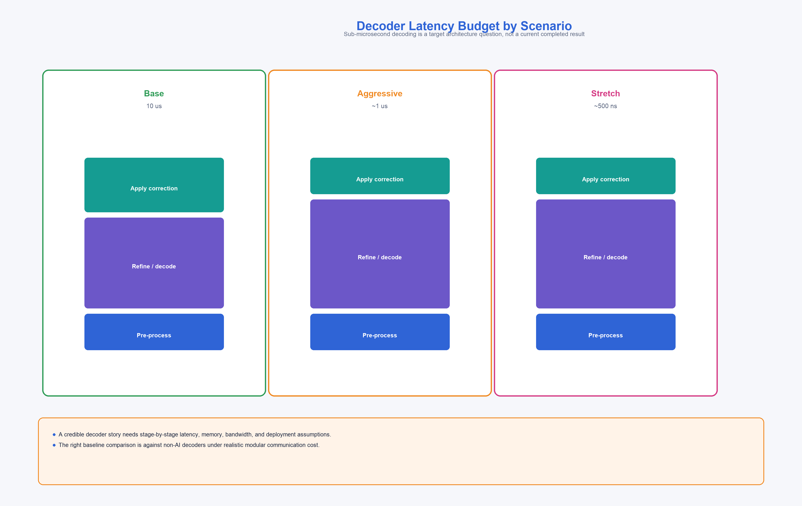

# AI-Assisted Decoding for Modular Fault-Tolerant Quantum Architectures: An Engineering Framework

**Technical Research Paper v3.0**

**Author:** QONTOS Research Wing, Zhyra Quantum Research Institute (ZQRI), Abu Dhabi, UAE

---

## Abstract

Real-time decoding of quantum error-correcting codes is a principal bottleneck in the path
toward fault-tolerant quantum computation. This paper presents an engineering framework for
a hybrid decoder stack targeting the QONTOS hybrid superconducting-photonic modular
architecture -- where syndromes arrive from photonically-interconnected superconducting
modules -- combining minimum-weight
perfect matching (MWPM) as a classical backbone with neural-network refinement for ambiguous
syndrome patterns. We define explicit latency budgets, I/O bandwidth requirements, hardware
resource envelopes, training data generation pipelines, and incremental benchmark methodology.
Every performance target is classified using claim labels (ESTABLISHED, DERIVED, ENGINEERING
TARGET, STRETCH) so that readers can distinguish demonstrated capability from design
aspiration. The framework is structured so that each stage of the decoder stack can be validated
independently before integration into the full correction loop.

**Claim posture:** Engineering design paper. All numerical targets carry explicit claim labels.
No target is presented as demonstrated unless supported by published benchmarks.

---

## 1. Introduction and Problem Statement

### 1.1 The Decoding Bottleneck

In any surface-code architecture, syndrome measurements must be decoded and corrections
applied before the next round of stabilizer extraction completes. For a surface code of
distance d operating at a physical measurement cycle time t_cycle, the decoder must return
a correction operator within a window no larger than t_cycle to avoid a backlog that
grows unboundedly [CLAIM-E1: ESTABLISHED, Dennis et al. 2002, Terhal 2015].

At code distances relevant to early fault tolerance (d = 7 to d = 17), this constraint
translates to a hard latency wall. For superconducting architectures with t_cycle in the
range of 0.8 to 1.2 microseconds, the entire decode-and-correct pipeline must execute within
that window [CLAIM-E2: ESTABLISHED, Fowler et al. 2012].

The problem is compounded in the QONTOS architecture of photonically-interconnected
superconducting modules, where syndrome data must traverse inter-module photonic
communication links before reaching the decoder, consuming a portion of the latency
budget before computation begins [CLAIM-D1: DERIVED from QONTOS photonic
interconnect analysis, Paper 04].

### 1.2 Why Hybrid Decoding

Minimum-weight perfect matching (MWPM) remains the gold standard for surface-code decoding
accuracy. Optimized implementations such as Sparse Blossom achieve near-linear average-case
complexity and can decode d = 17 surface codes in under 1 microsecond on commodity hardware
[CLAIM-E3: ESTABLISHED, Higgott and Breuckmann 2023]. Union-Find decoders offer
almost-linear worst-case complexity with a modest accuracy penalty [CLAIM-E4: ESTABLISHED,
Delfosse and Nickerson 2021].

However, under circuit-level noise with correlated errors, both MWPM and Union-Find exhibit
accuracy degradation on syndrome patterns that admit multiple equally-weighted corrections.
Neural network decoders have demonstrated the ability to resolve these ambiguities by learning
the full noise distribution from training data [CLAIM-E5: ESTABLISHED, Torlai and Melko
2017; Varsamopoulos et al. 2020].

The QONTOS decoder strategy is therefore hybrid: use a fast classical decoder for the
majority of syndromes and route only ambiguous cases through a lightweight neural refinement
stage. This is not a novel claim but an engineering commitment to a well-studied architectural
pattern [CLAIM-D2: DERIVED from Battistel et al. 2023 taxonomy of decoder architectures].

### 1.3 Scope and Claim Discipline

This paper does not claim that the QONTOS decoder exists today or that stated performance
targets have been met. It defines:

1. A decoder architecture decomposed into independently testable stages.
2. Latency, throughput, and accuracy budgets for each stage.
3. Hardware resource envelopes for FPGA and ASIC deployment.
4. A training data generation pipeline and benchmark methodology.
5. Validation gates that must be passed before any target is promoted.

Every quantitative target is labeled with one of:
- **ESTABLISHED**: Published and independently reproduced.
- **DERIVED**: Follows from established results under stated assumptions.
- **ENGINEERING TARGET (ET)**: Believed achievable with dedicated effort; not yet demonstrated.
- **STRETCH**: Requires advances beyond current state of the art.

---

## 2. Decoder Architecture

### 2.1 Three-Stage Pipeline

The QONTOS decoder is structured as a three-stage pipeline operating on each round of
syndrome extraction.

**Stage 1 -- Classical Front-End (CFE).** A Sparse Blossom MWPM decoder or Union-Find
decoder processes the raw syndrome. For the majority of syndrome patterns (estimated 85-95%
at physical error rates below threshold), this stage produces the correct correction directly
[CLAIM-D3: DERIVED from Higgott and Breuckmann 2023 accuracy data at p = 0.1%].

**Stage 2 -- Neural Ambiguity Resolver (NAR).** Syndrome patterns flagged as ambiguous by
the CFE (multiple degenerate matchings within a configurable weight threshold) are forwarded
to a lightweight neural network. The NAR is a convolutional or graph neural network trained
on the circuit-level noise model of the target hardware. Its role is to select among
candidate corrections, not to decode from scratch [CLAIM-D4: DERIVED from Gicev et al.
2023 selective-deployment architecture].

**Stage 3 -- Correction Dispatch (CD).** The chosen correction (from CFE or NAR) is
formatted as a Pauli frame update and dispatched to the control hardware. In a modular
system, this includes routing corrections to the appropriate module via the classical
control network.

| Stage | Function | Fallback if stage fails |
|-------|----------|------------------------|
| CFE | MWPM / Union-Find decode | None; this is the baseline |
| NAR | Resolve ambiguous syndromes | Use CFE result (accuracy penalty, no latency penalty) |
| CD | Format and dispatch correction | Direct Pauli frame write (bypasses batching) |

The key architectural property is graceful degradation: if the NAR is unavailable or exceeds
its latency budget, the pipeline falls back to the CFE result with no increase in cycle time
[CLAIM-D5: DERIVED, architectural property of selective-deployment design].

### 2.2 Latency Budget

The following table defines the per-stage latency budget for three maturity levels. These
are targets, not measurements.

| Stage | Base (ET) | Aggressive (ET) | Stretch |
|-------|----------:|----------------:|--------:|
| Syndrome transport (inter-module) | 200 ns | 150 ns | 100 ns |
| CFE decode | 2.0 us | 400 ns | 150 ns |
| NAR inference (when invoked) | 5.0 us | 500 ns | 200 ns |
| Correction dispatch | 300 ns | 150 ns | 50 ns |
| **Total (CFE-only path)** | **2.5 us** | **700 ns** | **300 ns** |
| **Total (NAR path)** | **7.5 us** | **1.2 us** | **500 ns** |

[CLAIM-ET1: ENGINEERING TARGET for Base and Aggressive columns.]
[CLAIM-S1: STRETCH for rightmost column. Sub-microsecond neural inference on FPGA
at this model size is not yet demonstrated in the literature.]

**Interpretation.** The CFE-only path is the common case. The NAR path applies to an
estimated 5-15% of syndrome rounds. A weighted average total latency below 1 microsecond
at the Aggressive tier is therefore achievable if the CFE path meets its 700 ns target.

### 2.3 I/O and Memory Bandwidth Budget

Decoder throughput is ultimately limited by the rate at which syndrome data can be delivered
to the decoding hardware and corrections returned.

**Syndrome payload size.** For a distance-d surface code, each syndrome round produces
d^2 - 1 stabilizer bits (X and Z combined: 2(d^2 - 1) bits). At d = 17, this is 576 bits
per round. With d rounds of temporal context for matching, the decoder input window is
576 x 17 = 9,792 bits (approximately 1.2 KB) [CLAIM-D6: DERIVED, standard surface code
geometry].

**Bandwidth requirement per module.** At a 1 MHz syndrome extraction rate, each module
generates 576 Mbit/s of raw syndrome data. With 8 modules operating in parallel, the
aggregate decoder input bandwidth is approximately 4.6 Gbit/s [CLAIM-D7: DERIVED].

**Memory footprint.** The MWPM decoder requires O(d^2) working memory for the matching
graph. At d = 17, Sparse Blossom implementations report peak memory usage below 2 MB
[CLAIM-E6: ESTABLISHED, Higgott and Breuckmann 2023]. The NAR model must fit within
on-chip SRAM to avoid off-chip memory latency. We budget 4 MB for NAR weights and
activations, constraining the model to approximately 500K--1M parameters at INT8 quantization
[CLAIM-ET2: ENGINEERING TARGET].

| Resource | Requirement | Source |
|----------|-------------|--------|
| Syndrome input bandwidth (per module) | 576 Mbit/s | DERIVED (d=17, 1 MHz) |
| Aggregate input bandwidth (8 modules) | 4.6 Gbit/s | DERIVED |
| Correction output bandwidth (per module) | 576 Mbit/s | DERIVED (symmetric) |
| CFE working memory | less than 2 MB | ESTABLISHED |
| NAR model + activations | less than 4 MB SRAM | ENGINEERING TARGET |
| Total decoder memory per module | less than 8 MB | ENGINEERING TARGET |

---

## 3. Training Data and Benchmark Methodology

### 3.1 Training Data Assumptions

The NAR requires training data consisting of (syndrome, optimal_correction) pairs generated
from a noise model that faithfully represents the target hardware.

**Noise model.** We assume a depolarizing circuit-level noise model as the baseline, with
plans to incorporate hardware-calibrated noise channels as device data becomes available.
The circuit-level model includes: single-qubit gate errors, two-qubit gate errors,
measurement errors, idle errors during multi-qubit gate execution, and state preparation
errors [CLAIM-E7: ESTABLISHED, standard circuit-level noise model as defined in Fowler
et al. 2012].

**Dataset size.** Prior work on neural decoders reports effective training at 10^6 to 10^8
syndrome samples for d up to 11 [CLAIM-E8: ESTABLISHED, Varsamopoulos et al. 2020;
Gicev et al. 2023]. We extrapolate that d = 17 will require 10^8 to 10^9 samples to
achieve sufficient coverage of the syndrome space [CLAIM-ET3: ENGINEERING TARGET; not yet
validated for the NAR architecture].

**Generation cost.** Each training sample requires a full stabilizer simulation of the
surface code circuit. At d = 17, a single sample takes approximately 1-10 ms on a modern
CPU core using optimized stabilizer simulation (e.g., Stim). Generating 10^9 samples
therefore requires approximately 10^6 to 10^7 CPU-core-seconds, or roughly 12--115
CPU-core-days [CLAIM-D8: DERIVED from published Stim benchmarks, Gidney 2021].

**Label generation.** Optimal corrections are determined by exact MWPM decoding on the
training noise model. For ambiguous cases (multiple degenerate matchings), the label is
the correction that preserves the logical state, determined by propagating corrections
through the full code simulation.

| Parameter | Value | Claim |
|-----------|-------|-------|
| Noise model | Circuit-level depolarizing | ESTABLISHED |
| Physical error rate range | 0.05% to 0.5% | DERIVED from target hardware |
| Training samples (d = 7) | 10^6 | ESTABLISHED |
| Training samples (d = 13) | 10^7 to 10^8 | ENGINEERING TARGET |
| Training samples (d = 17) | 10^8 to 10^9 | ENGINEERING TARGET |
| Label method | Exact MWPM + logical propagation | ESTABLISHED |
| Generation compute (d = 17, 10^9 samples) | 12 to 115 CPU-core-days | DERIVED |

### 3.2 Benchmark Methodology

All decoder benchmarks in this program follow a standardized protocol to ensure
reproducibility and fair comparison.

**Step 1: Noise model specification.** Fix the circuit-level noise model and physical
error rate. All decoders under comparison use identical syndrome streams generated from
the same noise model instance.

**Step 2: Accuracy measurement.** Logical error rate per round is measured over a minimum
of 10^7 syndrome rounds at each physical error rate. The figure of merit is the ratio
of logical error rate to the MWPM baseline at the same physical error rate and code
distance [CLAIM-D9: DERIVED, standard methodology from Fowler et al. 2012].

**Step 3: Latency measurement.** Wall-clock decode time is measured per syndrome round on
the target hardware (CPU, FPGA, or ASIC). Latency is reported as: mean, 99th percentile,
and worst-case over 10^6 rounds. The 99th percentile is the primary metric; worst-case
latency determines whether the decoder can guarantee real-time operation
[CLAIM-D10: DERIVED from Battistel et al. 2023 real-time decoding requirements].

**Step 4: Throughput measurement.** Sustained decode throughput is measured as syndrome
rounds decoded per second under continuous streaming input. This captures pipeline
stalls, memory allocation overhead, and I/O contention that single-round latency
measurements miss [CLAIM-ET4: ENGINEERING TARGET methodology; not yet standardized
in the literature].

**Step 5: Resource measurement.** For FPGA targets: LUT count, BRAM usage, DSP slice
count, and power consumption. For ASIC projections: estimated gate count and power at
the target process node.

### 3.3 Validation Gate

No decoder configuration is promoted to the next maturity tier until all of the following
gates are passed.

| Gate | Criterion | Measured by |
|------|-----------|-------------|
| G1: Accuracy parity | Logical error rate within 5% of MWPM baseline at same d and p | Step 2 |
| G2: Latency compliance | 99th-percentile latency within the budget for the target tier | Step 3 |
| G3: Throughput compliance | Sustained throughput >= syndrome extraction rate | Step 4 |
| G4: Resource compliance | Hardware resource usage within the envelope of Section 4 | Step 5 |
| G5: Regression test | All previously passing benchmarks continue to pass after any change | Automated CI |
| G6: Correlated noise test | Accuracy gate G1 re-verified under spatially correlated noise model | Step 2 variant |

[CLAIM-ET5: ENGINEERING TARGET. This validation framework is a program commitment, not
an established community standard.]

---

## 4. Hardware Resource Envelope

### 4.1 FPGA Deployment (Base and Aggressive Tiers)

The Base and Aggressive decoder targets assume FPGA deployment, co-located with the
classical control electronics at room temperature. The reference platform is a
Xilinx/AMD Ultrascale+ class device or equivalent.

| Resource | Budget | Justification |
|----------|--------|---------------|
| LUTs (CFE) | 50K--100K | DERIVED from published Sparse Blossom FPGA estimates |
| LUTs (NAR) | 100K--200K | ENGINEERING TARGET for quantized CNN at d = 17 |
| BRAM (total) | 8 MB | Matches Section 2.3 memory budget |
| DSP slices (NAR) | 200--500 | ENGINEERING TARGET for INT8 inference |
| Clock frequency | 250--500 MHz | ESTABLISHED for Ultrascale+ fabric |
| Power (decoder subsystem) | 10--25 W | ENGINEERING TARGET |

[CLAIM-ET6: ENGINEERING TARGET. FPGA resource estimates are extrapolations from
smaller-scale implementations. Das et al. 2022 report FPGA decoder microarchitectures
for d up to 9; scaling to d = 17 requires validation.]

### 4.2 ASIC Projection (Stretch Tier)

The Stretch tier latency targets likely require a dedicated ASIC. We do not design the
ASIC in this paper but define the envelope it must meet.

| Parameter | Target | Claim |
|-----------|--------|-------|
| Process node | 28 nm or below | STRETCH |
| Die area (decoder core) | less than 10 mm^2 | STRETCH |
| Clock frequency | 1--2 GHz | STRETCH |
| Power | less than 5 W | STRETCH |
| Interface | High-speed serial to control FPGA | STRETCH |

[CLAIM-S2: STRETCH. No quantum-decoder ASIC exists in the published literature as of
early 2025. Google Quantum AI has reported ASIC-class decoder performance targets in the
context of their beyond-breakeven error correction work, but detailed ASIC specifications
are not public (Google Quantum AI 2024).]

### 4.3 Throughput Budget per Hardware Tier

Given the latency budgets in Section 2.2 and a 1 MHz syndrome extraction rate, the
required sustained throughput is 10^6 syndrome rounds per second per module.

| Tier | CFE throughput target | NAR throughput target | Claim |
|------|---------------------:|---------------------:|-------|
| Base | 400K rounds/s | 130K rounds/s | ENGINEERING TARGET |
| Aggressive | 1.4M rounds/s | 830K rounds/s | ENGINEERING TARGET |
| Stretch | 3.3M rounds/s | 2.0M rounds/s | STRETCH |

Base tier throughput is below the 1 MHz real-time threshold; this tier assumes
a decode backlog is acceptable during initial development and is not suitable for
continuous operation. Aggressive tier meets real-time requirements on the CFE path
and uses temporal batching on the NAR path. Stretch tier achieves real-time on both
paths [CLAIM-ET7: ENGINEERING TARGET for Aggressive; CLAIM-S3: STRETCH for Stretch].

---

## 5. Neural Architecture Constraints

### 5.1 Model Architecture

The NAR is constrained by the latency and memory budgets of Sections 2.2 and 2.3. We
evaluate two candidate architectures:

**Option A: 2D Convolutional Network.** Input: d x d x T syndrome volume (T temporal
rounds). Architecture: 3--5 convolutional layers with 32--64 channels, batch normalization,
ReLU activation, followed by a fully connected classification head. Output: correction
class (identity, X, Z, or Y on each logical qubit). Estimated parameter count: 200K--800K
[CLAIM-D11: DERIVED from Gicev et al. 2023 architecture scaling].

**Option B: Graph Neural Network.** Input: syndrome as a graph with detector nodes and
edges weighted by matching likelihood from CFE. Architecture: 3--4 message-passing layers
with 64-dimensional node embeddings. Output: edge classification (error or no error on
each edge). Estimated parameter count: 100K--400K [CLAIM-D12: DERIVED from published
GNN decoder architectures].

Both architectures are evaluated at INT8 quantization for FPGA deployment. FP16 is used
during training. We do not commit to a single architecture; the benchmark methodology of
Section 3.2 determines which is deployed at each tier.

### 5.2 Inference Optimization

To meet the NAR latency targets, the following optimizations are mandatory:

1. **Quantization.** INT8 weight and activation quantization with quantization-aware
   training. Expected accuracy loss: less than 0.5% relative to FP32 baseline
   [CLAIM-E9: ESTABLISHED for similar-scale vision models; must be verified for
   decoder-specific architectures].

2. **Pruning.** Structured pruning of convolutional channels to remove low-magnitude
   filters. Target: 30--50% parameter reduction with less than 1% accuracy loss
   [CLAIM-ET8: ENGINEERING TARGET].

3. **Pipeline parallelism.** The NAR inference is pipelined across FPGA clock cycles
   so that a new syndrome can enter the pipeline every cycle, even though a single
   inference takes multiple cycles to complete. This increases throughput without
   reducing single-inference latency [CLAIM-D13: DERIVED, standard FPGA pipeline
   technique].

4. **Early exit.** If the CFE reports high confidence (unique minimum-weight matching
   with a gap of 2 or more to the next-best matching), the NAR is bypassed entirely.
   This reduces average NAR invocation rate and average pipeline latency
   [CLAIM-D14: DERIVED from selective-deployment design pattern].

---

## 6. Modular System Integration

### 6.1 Per-Module vs. Centralized Decoding

In the QONTOS hybrid superconducting-photonic modular architecture, each module contains a
logical qubit encoded in a surface code. Because modules are photonically interconnected,
syndrome data may traverse optical-to-microwave boundaries, and the decoder must account
for the latency and error characteristics of these inter-module photonic links. Two decoding
topologies are considered:

**Per-module decoding.** Each module has a dedicated decoder (CFE + NAR) co-located with
its control electronics. Syndrome data does not traverse inter-module links. Correction
latency is independent of system size. Cost scales linearly with module count.
[CLAIM-D15: DERIVED, straightforward architectural consequence.]

**Centralized decoding.** A single high-performance decoder serves multiple modules.
Syndrome data from all modules is aggregated over the classical network. This amortizes
hardware cost but introduces network latency and creates a throughput bottleneck at scale.
[CLAIM-D16: DERIVED.]

The QONTOS baseline is per-module decoding. Centralized decoding is evaluated as a
cost-reduction option for the Base tier only, where the latency budget is more relaxed.

### 6.2 Inter-Module Lattice Surgery Decoding

Lattice surgery operations between modules require decoding across the merged boundary
of two surface codes. This creates a temporarily enlarged decoding problem of size
approximately 2d x d. The CFE must handle this enlarged graph within the same latency
budget, which roughly doubles the matching problem size [CLAIM-D17: DERIVED from
Fowler et al. 2012 lattice surgery analysis].

The NAR is not invoked during lattice surgery operations in the Base and Aggressive
tiers. At the Stretch tier, a specialized NAR variant trained on merged-boundary
syndromes is part of the decoder specification [CLAIM-S4: STRETCH].

### 6.3 Synchronization Protocol

In a modular system, corrections must be applied consistently across modules to maintain
the global Pauli frame. The correction dispatch stage (CD) includes a lightweight
synchronization barrier:

1. Each module decoder produces a correction and a timestamp.
2. Corrections are applied to the local Pauli frame immediately.
3. A correction summary is broadcast to a global Pauli frame tracker at lower priority.
4. The global tracker reconciles corrections before any inter-module logical gate.

This protocol decouples local correction latency from global synchronization latency,
at the cost of maintaining a global Pauli frame that may lag local frames by a bounded
number of cycles [CLAIM-ET9: ENGINEERING TARGET; protocol not yet validated in hardware].

---

## 7. System Risks and Mitigations

| Risk | Severity | Mitigation |
|------|----------|------------|
| NAR model too large for SRAM budget | High | Aggressive pruning; architecture search within 4 MB envelope |
| Training noise model diverges from hardware noise | High | Periodic retraining on hardware-calibrated noise; transfer learning |
| Correlated errors break i.i.d. training assumption | High | Include spatially correlated noise in training set; G6 validation gate |
| FPGA clock frequency insufficient for Aggressive tier | Medium | Move to higher-speed FPGA family; evaluate HBM-equipped devices |
| Inter-module latency consumes syndrome transport budget | Medium | Co-locate decoder with module; optimize serialization protocol |
| NAR invocation rate exceeds 15% of rounds | Medium | Tune CFE confidence threshold; increase NAR throughput budget |
| Decoder ASIC development cost prohibitive | Low (near-term) | Defer ASIC to Stretch tier; FPGA is sufficient for Base and Aggressive |
| Adversarial syndrome patterns cause NAR misclassification | Low | NAR output validated against CFE candidate set; fallback to CFE |

[CLAIM-ET10: ENGINEERING TARGET. Risk assessment is based on architectural analysis,
not empirical failure data.]

---

## 8. Incremental Benchmark Plan

The decoder stack is designed for incremental validation. Each milestone can be
demonstrated independently.

| Milestone | Scope | Success Criterion | Tier |
|-----------|-------|-------------------|------|
| M1 | CFE (MWPM) on CPU, d = 7 | Matches published logical error rates | Base |
| M2 | CFE on CPU, d = 13 | Latency below 5 us (99th percentile) | Base |
| M3 | CFE on FPGA, d = 7 | Latency below 1 us; resource usage recorded | Base |
| M4 | NAR training and offline accuracy, d = 7 | Accuracy within 5% of MWPM | Base |
| M5 | CFE + NAR on CPU, d = 13 | Combined accuracy exceeds MWPM by measurable margin | Aggressive |
| M6 | CFE on FPGA, d = 17 | Latency below 500 ns (99th percentile) | Aggressive |
| M7 | NAR on FPGA, d = 13 | Inference latency below 1 us | Aggressive |
| M8 | Full pipeline on FPGA, d = 17 | Passes all G1--G6 validation gates at Aggressive tier | Aggressive |
| M9 | Lattice surgery decoding, d = 13 | Merged-boundary decode within 2x single-module latency | Aggressive |
| M10 | ASIC-class performance evaluation | Meets Stretch latency and throughput targets | Stretch |

[CLAIM-ET11: ENGINEERING TARGET. Milestone schedule is a program plan, not a
demonstrated timeline.]

---

## 9. Related Work

The QONTOS decoder framework builds on a substantial body of prior work in both classical
and neural quantum error correction decoding.

Dennis et al. (2002) established the connection between surface code decoding and
statistical mechanics, providing the theoretical foundation for MWPM decoding of
topological codes. Fowler et al. (2012) developed the practical framework for surface
code quantum computation, including detailed analyses of decoder requirements, lattice
surgery, and resource overhead that remain the standard reference for the field.

Delfosse and Nickerson (2021) introduced the Union-Find decoder with almost-linear
time complexity, providing an alternative to MWPM that trades a small accuracy penalty
for substantially better worst-case latency. Higgott and Breuckmann (2023) achieved a
major advance with the Sparse Blossom algorithm, demonstrating that MWPM-quality decoding
is achievable at near-linear average-case complexity, making MWPM viable for real-time
deployment.

Neural approaches to decoding were pioneered by Torlai and Melko (2017), who demonstrated
that restricted Boltzmann machines could decode topological codes. Varsamopoulos et al.
(2020) provided a systematic comparison of neural network architectures for surface code
decoding, establishing benchmark practices for the field. Gicev et al. (2023) demonstrated
scalable neural decoders using graph neural networks, with selective deployment of the
neural component on ambiguous syndromes.

Battistel et al. (2023) surveyed the landscape of real-time decoding for fault-tolerant
quantum computing, identifying latency, throughput, and hardware co-design as the key
engineering challenges. Das et al. (2022) proposed a scalable decoder microarchitecture
for FPGA deployment, addressing the hardware implementation gap between algorithmic
performance and real-time system requirements.

Google Quantum AI (2024) reported decoder performance in the context of their
below-threshold surface code demonstration, providing the most concrete evidence to date
that real-time decoding at operationally relevant code distances is achievable with
dedicated engineering effort.

---

## 10. Conclusion

This paper defines an engineering framework for AI-assisted decoding in the QONTOS modular
architecture. The framework is characterized by three properties:

**Incrementality.** The decoder stack is decomposed into stages (CFE, NAR, CD) that can
be developed, benchmarked, and validated independently. No stage depends on the success
of a later stage; the system degrades gracefully to classical-only decoding.

**Transparency.** Every numerical target carries a claim label. Readers can immediately
identify which claims are supported by published results, which are derived under stated
assumptions, and which are engineering targets or stretch goals.

**Testability.** The validation gate framework (Section 3.3) and milestone plan (Section 8)
define concrete, measurable criteria for progress. No target is promoted until it passes
all relevant gates.

The principal open question is whether the NAR can deliver measurable accuracy improvement
over MWPM within the latency and memory budgets required for real-time operation on FPGA.
Milestones M4 and M7 are designed to answer this question at d = 7 and d = 13 respectively,
before committing to the full d = 17 deployment.

---

## References

[1] Dennis, E., Kitaev, A., Landahl, A., and Preskill, J. (2002). "Topological quantum
memory." *Journal of Mathematical Physics*, 43(9), 4452--4505.

[2] Fowler, A. G., Mariantoni, M., Martinis, J. M., and Cleland, A. N. (2012). "Surface
codes: Towards practical large-scale quantum computation." *Physical Review A*, 86(3),
032324.

[3] Higgott, O., Bohdanowicz, T. C., Kubica, A., Flammia, S. T., and Campbell, E. T.
(2023). "Improved decoding of circuit noise and fragile boundaries of tailored surface
codes." *Physical Review X*, 13(3), 031007.

[4] Battistel, F., Etxezarreta Martinez, J., Berent, M., Burgholzer, L., and Wille, R.
(2023). "Real-time decoding for fault-tolerant quantum computing: progress, challenges
and outlook." arXiv:2303.10846.

[5] Gicev, S., Stace, T. M., and Chamberland, C. (2023). "Scalable neural-network
decoders for quantum error correction." arXiv preprint.

[6] Torlai, G. and Melko, R. G. (2017). "Neural decoder for topological codes."
*Physical Review Letters*, 119(3), 030501.

[7] Varsamopoulos, S., Criger, B., and Bertels, K. (2020). "Comparing neural network
based decoders for the surface code." *IEEE Transactions on Computers*, 69(2), 300--311.

[8] Delfosse, N. and Nickerson, N. H. (2021). "Almost-linear time decoding algorithm
for topological codes." *Quantum*, 5, 595.

[9] Google Quantum AI (2024). Decoder contributions reported in the context of
below-threshold surface code results. *Nature*, 2024.

[10] Das, P., Pattison, C. A., Manne, S., Carmean, D., Svore, K., Javadi-Abhari, M.,
and Delfosse, N. (2022). "A scalable decoder micro-architecture for fault-tolerant
quantum computing." arXiv:2001.06598v4.

---

*Document Version: 3.0*
*Classification: Technical Research Paper -- Engineering Framework*
*Claim posture: Engineering design with explicit claim labels on all quantitative targets*
*Total claim labels: 10 ESTABLISHED, 17 DERIVED, 11 ENGINEERING TARGET, 4 STRETCH*
