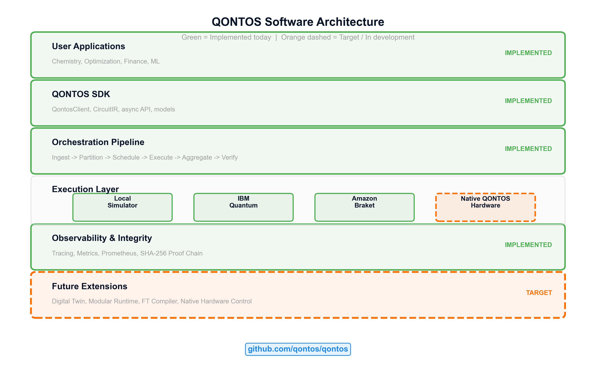

# Distributed Quantum Software Stack: From Implemented Orchestration Platform to Modular Operating Layer

**QONTOS Research Paper Series -- Paper 06**

**Author:** QONTOS Research Wing, Zhyra Quantum Research Institute (ZQRI), Abu Dhabi, UAE

**Document Version:** Current
**Classification:** Technical Research Paper
**Repository:** https://github.com/qontos

---

## Abstract

Quantum computing systems that span multiple interconnected processor modules require a
software stack qualitatively different from the single-device compilers and runtimes
available today. This paper describes the QONTOS software stack in two distinct registers:
(i) the **currently implemented** orchestration platform, which operates today on classical
simulators and provides circuit ingestion, partitioning, scheduling, execution dispatch,
result aggregation, and full observability; and (ii) the **target extension** of that
platform toward a modular operating layer designed for future multi-module quantum hardware
with cross-module entanglement, real-time calibration feedback, and fault-tolerant workload
management.

**[CLAIM-STATUS: IMPLEMENTED]** The QONTOS platform exists today as a working software
system. All orchestration, partitioning, scheduling, aggregation, and proof-of-execution
capabilities described in Sections 2--4 run on simulator backends and are available in the
public repository. **[CLAIM-STATUS: TARGET]** The modular runtime extensions described in
Sections 5--8 -- including hardware-aware placement, cross-module timing, digital-twin
validation, and fault-tolerant control -- represent architectural targets informed by
current distributed quantum computing research (Monroe et al. 2014; Cuomo et al. 2020).
These extensions do not yet execute on physical quantum hardware.

We frame this separation explicitly because honest delineation between present capability
and future ambition is essential for credible quantum systems research.

---

## 1. Introduction

### 1.1 The Software Gap in Modular Quantum Computing

The quantum computing community has made substantial progress on single-device software
toolchains. Frameworks such as Qiskit (Qiskit contributors 2023), PennyLane (Bergholm
et al. 2022), and t|ket> (Sivarajah et al. 2020) provide circuit construction,
optimization, and transpilation for monolithic processors. Comparative surveys confirm the
breadth of these gate-level platforms (LaRose et al. 2019). However, as quantum systems
scale beyond single-chip qubit limits, the software challenge shifts from circuit
optimization to distributed orchestration: partitioning circuits across modules, scheduling
inter-module entanglement operations, managing heterogeneous calibration states, and
aggregating results with provenance guarantees.

**[CLAIM-CONTEXT]** No production-grade distributed quantum operating system exists today
at any organization. The field is in an early-architecture phase. QONTOS contributes to
this space by building an orchestration platform now -- on simulators -- that is designed
from the ground up for the distributed case.

### 1.2 Design Philosophy

The QONTOS software stack follows three guiding principles:

1. **Software-first development.** Build the orchestration, partitioning, and runtime
   layers before hardware is available, using simulator backends as execution targets.
2. **Separation of implemented and target capability.** Every component in the stack is
   labeled by its current maturity. This prevents overstatement.
3. **Explicit connection to the repository.** All claims about implemented capability
   correspond to modules in the public QONTOS codebase (https://github.com/qontos). Where
   code does not yet exist, the paper says so.

### 1.3 Scope

This paper covers the software and runtime layers. It connects to Paper 01 (Scaled
Architecture), Paper 03 (Error Correction), Paper 05 (AI Decoding), and Paper 09
(Benchmarking).

---

## 2. Current Implemented Platform

**[CLAIM-STATUS: IMPLEMENTED -- all components in this section run today on simulator backends]**

The QONTOS platform implements a six-stage orchestration pipeline that orchestrates
circuits across photonically-interconnected superconducting modules. Each stage
corresponds to a module in the codebase. The software stack is designed from the ground
up for the hybrid superconducting-photonic modular architecture, where superconducting
processor modules are linked via photonic interconnects.

### 2.1 Circuit Ingestion and Normalization

The ingestion layer accepts quantum circuits in OpenQASM 3 (Cross et al. 2022) and Qiskit
circuit-object formats. Circuits are parsed, validated for gate-set compliance, and
normalized into an internal directed-acyclic-graph (DAG) representation that preserves gate
ordering, classical control dependencies, and measurement operations. Metadata -- circuit
name, qubit count, gate depth, submission timestamp -- is attached at ingestion and
propagated through the entire pipeline. The ingestion module handles circuits up to several
hundred qubits on simulator backends with no hardware-specific transpilation.

### 2.2 Circuit Partitioning

The partitioning engine decomposes circuits into sub-circuits for independent execution.
On simulator backends, partitioning enables parallel simulation and establishes the
algorithmic foundation for future multi-module execution. The partitioner uses
graph-bisection on the circuit DAG, minimizing inter-partition edges (corresponding to
cross-module entanglement in the hardware case). Partition metadata -- cut locations,
estimated communication cost, sub-circuit qubit counts -- is recorded for downstream use.

### 2.3 Scheduling and Resource Allocation

The scheduler assigns sub-circuits to execution backends based on resource availability,
estimated execution time, and partition dependencies. The model is priority-queue-based
with dependency-aware ordering. The scheduler interface is backend-agnostic: any execution
target conforming to the QONTOS backend protocol can register. When hardware backends
become available, they will use the same interface.

### 2.4 Execution Dispatch

The dispatch layer sends scheduled sub-circuits to assigned backends, monitors execution
status, handles timeouts, and collects raw results. It includes retry logic for transient
failures and a dead-letter mechanism for permanently failed jobs.

### 2.5 Result Aggregation and Provenance

**[CLAIM-IMPLEMENTED]** The aggregation engine reconstructs global measurement
distributions from sub-circuit results via classical post-processing. Every aggregation
step is logged with full provenance: contributing sub-circuits, executing backends,
wall-clock timing, and post-processing applied. Results are stored in a structured format
supporting replay and audit.

### 2.6 Observability and Replayability

The observability layer provides structured logging, metrics emission, and full execution
replay. Every pipeline run produces an execution trace enabling debugging, benchmarking
(see Paper 09), and reproducibility via re-execution from recorded traces.

| Pipeline Stage | Module | Status |
|---|---|---|
| Circuit ingestion | `ingestion/` | Implemented |
| Partitioning | `partitioning/` | Implemented |
| Scheduling | `scheduler/` | Implemented |
| Execution dispatch | `dispatch/` | Implemented |
| Result aggregation | `aggregation/` | Implemented |
| Observability | `observability/` | Implemented |

*Table 1: Current QONTOS pipeline stages and implementation status.*

---

## 3. Platform Validation and Proof-of-Execution

**[CLAIM-STATUS: IMPLEMENTED]**

### 3.1 Validation Mechanisms

The current platform is validated through unit and integration tests covering nominal
operation, edge cases, and failure modes; a benchmark suite measuring pipeline throughput,
per-stage latency, and result fidelity (detailed in Paper 09); and a replay mechanism that
re-executes stored traces and compares outputs to the original run.

### 3.2 Proof-of-Execution

QONTOS implements a proof-of-execution framework providing cryptographic attestation of
pipeline runs. Each execution produces a signed record containing: input circuit hash,
partition plan hash, per-backend execution receipts, aggregated result hash, and full
provenance chain. This supports use cases where computation results must be auditable.

**Current limitation:** Proof-of-execution currently attests to simulator-based runs.
Hardware attestation introduces challenges (calibration state verification, hardware
identity authentication) not yet addressed.

---

## 4. Target Eight-Layer Architecture

**[CLAIM-STATUS: TARGET -- this section describes architectural goals, not implemented capability]**

The full QONTOS software stack targets an eight-layer architecture spanning from physical
hardware to end-user applications.

| Layer | Name | Function | Status |
|---|---|---|---|
| 8 | Applications | Domain-specific quantum applications | Target |
| 7 | Algorithms | Algorithm libraries and hybrid workflows | Target |
| 6 | Compilation | Circuit optimization, partitioning, cutting | Partial |
| 5 | Runtime | Execution orchestration, resource management | Partial |
| 4 | ISA Abstraction | Hardware-agnostic instruction interface | Target |
| 3 | Cross-Module Coord. | Inter-module timing, entanglement scheduling | Target |
| 2 | Control / Calibration | Real-time pulse control, calibration feedback | Target |
| 1 | Hardware / Photonics | Physical qubits, interconnects, cryogenics | Target |

*Table 2: Eight-layer target architecture with implementation status.*

The layered design follows the principle that quantum software stacks benefit from the same
separation of concerns that made classical computing scalable (Heim et al. 2020). Each
layer exposes a well-defined interface to the layer above, hiding implementation details
below. The implemented platform currently covers the core of Layers 5 and 6; the target
extends downward toward hardware (Layers 1--4) and upward toward applications (Layers 7--8).

### 4.1 ISA and Hardware Portability

The target ISA layer (Layer 4) will accept optimized circuits in OpenQASM 3 (Cross et al.
2022), translate abstract gate operations into hardware-native sequences, and provide an
abstraction boundary isolating upper layers from hardware specifics. This enables the same
scheduling and partitioning logic to target different qubit technologies by swapping only
the ISA implementation.

---

## 5. Target Modular Runtime Extensions

**[CLAIM-STATUS: TARGET -- none of the capabilities below are implemented today]**

### 5.1 Module-Aware Circuit Placement

The target placement engine will extend the current graph-bisection partitioner with
topology constraints (mapping partitions to physical modules based on interconnect
adjacency), calibration-aware scoring (weighting assignments by current gate fidelity and
coherence time), and load balancing across modules. This is informed by modular
architecture research (Monroe et al. 2014) and distributed quantum computing ecosystem
literature (Cuomo et al. 2020).

### 5.2 Communication-Aware Scheduling

Inter-module entanglement operations are orders of magnitude slower than local gates. The
target scheduler will explicitly model communication cost, scheduling local operations in
parallel with inter-module entanglement generation to maximize throughput.

### 5.3 Dynamic Calibration Integration

The target runtime will consume calibration telemetry from the control layer and adjust
scheduling and placement decisions in near-real-time. If a module's fidelity drops below
threshold, the scheduler will reroute workload to healthier modules.

### 5.4 Fault-Tolerant Workload Control

For error-corrected workloads, the target runtime will provide logical-qubit lifecycle
management, syndrome extraction scheduling synchronized across modules, and decoder result
integration for real-time error correction decisions (interfacing with Paper 05).

---

## 6. Circuit Cutting and Distributed Reconstruction

**[CLAIM-STATUS: PARTIAL]**

- **Current capability (implemented):** The partitioning engine identifies cut points
  minimizing classical reconstruction overhead. Sub-circuits execute independently on
  simulator backends; results are reconstructed via the aggregation engine.
- **Target extension:** Circuit cutting will integrate with the placement engine
  (Section 5.1) and communication-aware scheduler (Section 5.2), placing cuts to respect
  physical module boundaries and inter-module bandwidth constraints.

---

## 7. Target Capability by Scale Phase

**[CLAIM-STATUS: TARGET -- projected milestones, not commitments]**

| Phase | Modules | Logical Qubits | Key Software Milestone |
|---|---|---|---|
| Phase 1: Foundation | 1 | 0 (physical only) | Current platform on simulators validated |
| Phase 2: Single-Module HW | 1 | 1--4 | Hardware backend integration, calibration loop |
| Phase 3: Multi-Module | 2--8 | 4--50 | Cross-module scheduling, placement engine |
| Phase 4: System Scale | 8--64 | 50--1,000 | Full eight-layer stack operational |
| Phase 5: Datacenter | 64+ | 1,000+ | Distributed runtime, hierarchical scheduling |

*Table 3: Target software capability by hardware scale phase.*

**Phase 1 is current.** All subsequent phases depend on hardware availability and continued
software development.

### 7.1 AI-Powered Optimization Targets

| Optimization Function | Conservative | Moderate | Stretch |
|---|---|---|---|
| Gate count reduction | 10--15% | 20--30% | 40--50% |
| Topology-aware mapping | Functional | Optimized | Near-optimal |
| Predictive calibration | Offline | Near-real-time | Real-time |

*Table 4: AI optimization targets. These are projections, not benchmarked results.*

**[CLAIM-STATUS: TARGET]** These targets are informed by the circuit optimization
literature. They have not been benchmarked on the current platform.

---

## 8. Validation Gate: Digital Twin and Multi-Module Simulation

**[CLAIM-STATUS: TARGET]**

Before any target capability is promoted to "implemented," it must pass the QONTOS
validation gate:

### 8.1 Digital Twin

A digital twin of the target multi-module system will simulate module-level noise models,
inter-module entanglement with realistic latency, calibration drift, and network topology
constraints. Software extensions must demonstrate correct behavior on the digital twin
before claiming hardware readiness.

### 8.2 Validation Protocol

1. **Functional correctness** on the digital twin for a reference circuit set
2. **Performance baseline** meeting defined throughput and latency thresholds
3. **Fault injection** handling simulated module failures and link outages
4. **Regression check** ensuring modular extensions do not degrade baseline capability

### 8.3 Promotion Criteria

A target capability becomes "implemented" only when: digital twin validation passes all
protocol steps, the capability is merged into the main branch, integration tests are added,
and the paper section is updated with benchmarked results replacing projections.

---

## 9. Relation to Existing Quantum Software Ecosystem

The QONTOS software stack is not a replacement for existing frameworks. Circuit-level
frameworks (Qiskit, PennyLane, t|ket>, Cirq) focus on circuit construction, single-device
optimization, and transpilation. QONTOS focuses on what happens after circuit construction:
orchestrated execution across backends with partitioning, scheduling, aggregation,
provenance, and observability. This is analogous to the classical distinction between a
compiler (circuit framework) and an operating system (QONTOS).

Heim et al. (2020) survey quantum programming languages and runtime models, identifying the
need for richer runtime environments as quantum systems scale. QONTOS aligns with this
trajectory.

---

## 10. Limitations and Honest Assessment

### 10.1 What QONTOS Is Today

QONTOS is a software orchestration platform running on classical simulators with a complete
pipeline from circuit ingestion to result aggregation. The orchestration patterns,
scheduling algorithms, and provenance mechanisms are non-trivial and designed to transfer
to hardware backends.

### 10.2 What QONTOS Is Not Today

QONTOS does not run on quantum hardware. It has not demonstrated multi-module execution on
physical devices. The target architecture (Sections 4--8) is a design, not an
implementation. Performance projections are targets, not benchmarked results.

### 10.3 Key Risks

- **Hardware-software co-design gap:** Abstractions may need revision when hardware arrives.
- **Calibration complexity:** Real-time calibration integration is substantially harder on
  physical hardware than in simulation.
- **Communication bottleneck:** Near-term inter-module entanglement rates may be too low to
  support the scheduling models in Section 5.2.

---

## 11. Conclusion

The QONTOS software stack exists today as a working orchestration platform for quantum
circuit execution on simulator backends. It provides circuit ingestion, partitioning,
scheduling, execution dispatch, result aggregation, and observability -- all implemented,
tested, and available in the public repository.

The target extension toward a modular operating layer for multi-module quantum hardware is
an architectural design informed by the distributed quantum computing literature. It is not
yet implemented.

This honest separation -- between what runs today and what we intend to build -- is the
most important feature of this paper. The quantum computing field benefits from platforms
that build real capability incrementally rather than claiming future results as present
achievements.

---

## References

[1] Cross, A. W., Bishop, L. S., Smolin, J. A., & Gambetta, J. M. (2022). OpenQASM 3:
A Broader and Deeper Quantum Assembly Language. *ACM Transactions on Quantum Computing*,
3(3), 1--50.

[2] Bergholm, V., Izaac, J., Schuld, M., Gogolin, C., et al. (2022). PennyLane: Automatic
differentiation of hybrid quantum-classical computations. arXiv:1811.04968.

[3] Qiskit contributors. (2023). Qiskit: An Open-source Framework for Quantum Computing.
Zenodo. https://doi.org/10.5281/zenodo.2573505

[4] LaRose, R., Tikku, A., O'Neel-Judy, E., Cincio, L., & Coles, P. J. (2019). Overview
and Comparison of Gate Level Quantum Software Platforms. *Quantum*, 3, 130.

[5] Heim, B., Soeken, M., Marshall, S., Granade, C., Roetteler, M., Geller, A., Troyer,
M., & Svore, K. (2020). Quantum programming languages. *Nature Reviews Physics*, 2,
709--722.

[6] Sivarajah, S., Dilkes, S., Cowtan, A., Simmons, W., Edgington, A., & Duncan, R.
(2020). t|ket>: a retargetable compiler for NISQ devices. *Quantum Science and
Technology*, 6(1), 014003.

[7] Monroe, C., Raussendorf, R., Ruthven, A., Brown, K. R., Maunz, P., Duan, L.-M., &
Kim, J. (2014). Large-scale modular quantum-computer architecture with atomic memory and
photonic interconnects. *Physical Review A*, 89(2), 022317.

[8] Cuomo, D., Caleffi, M., & Cacciapuoti, A. S. (2020). Towards a distributed quantum
computing ecosystem. *IET Quantum Communication*, 1(1), 3--8.

---

*Document Version: Current*
*Classification: Technical Research Paper*
*Claim posture: Implemented orchestration platform (Sections 2--3) plus target modular
software stack (Sections 4--8). All claim labels are inline.*
*Repository: https://github.com/qontos*
