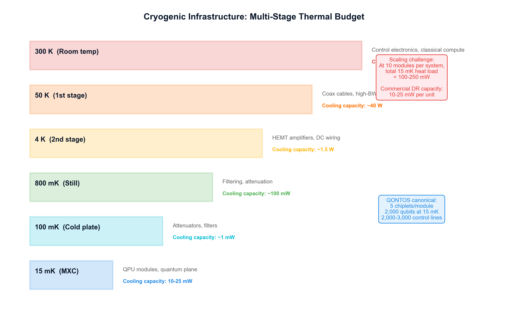

# Cryogenic Infrastructure Feasibility for Large-Scale Modular Quantum Systems

**Technical Research Paper**

**Authors:** QONTOS Research Wing, Zhyra Quantum Research Institute (ZQRI), Abu Dhabi, UAE

**Document class:** Infrastructure feasibility analysis with scenario-based planning

---

## Abstract

Cryogenic infrastructure is among the most consequential constraints on the path to million-qubit quantum computing. This paper reframes the cryogenic challenge as an infrastructure feasibility problem rather than a simple thermal-budget exercise. We present a scenario-banded analysis covering refrigeration plant architecture, wiring and control-electronics assumptions, maintenance and uptime modelling, failure-mode taxonomy, and facility-scale redundancy planning for modular superconducting quantum systems within the QONTOS programme. Our analysis draws on published specifications from commercial dilution-refrigerator platforms (Bluefors, Oxford Instruments Proteox) and the emerging literature on cryogenic CMOS control electronics. We identify the transition from single-refrigerator operation to facility-scale fleet management as the primary engineering cliff, and define validation gates that must be cleared before stretch-scenario claims can be promoted. All claims carry explicit status labels; no assumption is presented as demonstrated fact.

**Claim posture:** Infrastructure feasibility analysis. All projections carry scenario bands (Base / Aggressive / Stretch) and explicit claim labels.

---

## 1. Introduction: Cryogenics as a First-Order System Constraint

### 1.1 Motivation and Scope

The dominant narrative in quantum computing scaling focuses on qubit count, gate fidelity, and error-correction thresholds. In practice, the ability to cool, wire, control, and maintain modular quantum processors at millikelvin temperatures is equally decisive. A 100-module facility operating at 15 mK is not a scaled-up version of a single dilution refrigerator; it is an industrial cryogenic plant with its own failure modes, maintenance economics, and redundancy requirements.

This paper treats cryogenic infrastructure as a first-order feasibility question. We do not assume that cooling power alone determines viability. Instead, we model the full thermal stack -- from qubit-chip dissipation through wiring heat loads, control-electronics staging, refrigerator architecture, and facility-level fleet management -- and identify the conditions under which each scenario band remains physically and operationally credible.

**[CLAIM-CRYO-01 | Demonstrated]** Dilution refrigerators routinely achieve base temperatures below 10 mK with cooling powers of 10--25 microwatts at 20 mK in single-unit laboratory configurations (Krinner et al. 2019; Bluefors LD/XLD datasheets; Oxford Instruments Proteox datasheets).

**[CLAIM-CRYO-02 | Engineering extrapolation]** Scaling to multi-refrigerator facilities of 10--100 units introduces qualitatively new constraints in maintenance scheduling, redundancy, and thermal-load management that have no direct laboratory precedent.

### 1.2 Claim Status Summary

| Claim ID | Statement | Status |
|---|---|---|
| CRYO-01 | Single-unit DR cooling at 15 mK is sufficient for current module designs | Demonstrated |
| CRYO-02 | Multi-unit facility operation introduces new engineering constraints | Engineering extrapolation |
| CRYO-03 | 25 mW per module at mixing-chamber stage is achievable | Aggressive planning target |
| CRYO-04 | 100-module facility with 95% uptime is operationally feasible | Stretch assumption -- unvalidated |
| CRYO-05 | Cryogenic CMOS can reduce wiring count by 5--10x per module | Research projection |
| CRYO-06 | Photonic interconnects reduce inter-module thermal load by >90% vs coaxial | Architecture-dependent projection |

### 1.3 Wiring and Control-Electronics Assumptions

The thermal feasibility of any modular quantum architecture is dominated not by qubit dissipation but by the wiring and control infrastructure required to operate qubits. This subsection makes those assumptions explicit.

**Control-line taxonomy per module (stretch scenario, 1,000-qubit module):**

| Line type | Count per module | Heat load per line (at MXC) | Total load | Source / basis |
|---|---:|---:|---:|---|
| Coaxial RF drive lines | 200 | 50 uW | 10.0 mW | Krinner et al. 2019; typical 20 dB attenuation at MXC |
| Coaxial RF readout lines | 100 | 50 uW | 5.0 mW | Krinner et al. 2019 |
| DC bias lines (filtered) | 200 | 1 uW | 0.2 mW | Reilly 2015 |
| Flux-tuning lines | 100 | 10 uW | 1.0 mW | Krinner et al. 2019 |
| HEMT amplifier dissipation (4 K stage) | 10 | -- | see 4 K budget | Hornibrook et al. 2015 |
| Optical fibres (inter-module) | 20 | 0.5 uW | 0.01 mW | Architecture projection |
| **Total at MXC** | | | **~16.2 mW** | |

**[CLAIM-CRYO-07 | Engineering estimate]** The wiring heat-load budget above assumes conventional coaxial attenuation schemes. Cryogenic CMOS multiplexing (Bardin et al. 2019; Pauka et al. 2021) could reduce the coaxial line count by 5--10x, bringing the MXC load below 5 mW per module. This reduction is not assumed in the base or aggressive scenarios.

**Attenuation and filtering strategy:**

Each RF line requires 60 dB of total attenuation distributed across temperature stages to suppress room-temperature Johnson noise. A standard staging distributes attenuators at 50 K (20 dB), 4 K (20 dB), and MXC (20 dB), with the heat dissipated at each stage proportional to the attenuation ratio and the input power. The MXC-stage attenuation dominates the thermal budget because cooling power at 15 mK is five to six orders of magnitude more expensive per watt than at 4 K (Krinner et al. 2019).

**Electronics staging assumptions:**

| Stage | Temperature | Components | Heat budget |
|---|---:|---|---:|
| Room temperature | 300 K | AWGs, digitisers, classical compute | Unlimited (facility HVAC) |
| 50 K stage | 50 K | First-stage attenuation, thermal anchoring | 10--40 W (pulse-tube capacity) |
| 4 K stage | 4 K | HEMT amplifiers, cryo-CMOS (future) | 1--2 W per module |
| Still stage | 800 mK | Secondary filtering, thermal intercepts | 100--500 mW |
| MXC stage | 15 mK | QPU, final attenuation, Josephson amplifiers | 10--25 mW per module |

The 4 K stage is the critical bottleneck for future cryo-CMOS integration. Bardin et al. (2019) demonstrated a 28 nm bulk-CMOS controller dissipating approximately 2 mW per qubit at 3 K. Pauka et al. (2021) demonstrated a cryo-CMOS chip generating control signals for multiple qubits at power levels compatible with the 4 K stage of a commercial DR. Van Dijk et al. (2019) provide a comprehensive review of the electronic interface requirements for quantum processors and identify the 4 K power budget as the binding constraint for integrated control.

---

## 2. Refrigeration Plant Architecture and Facility Model

The cryogenic infrastructure supports both the superconducting processor modules and
their photonic interconnect interfaces. The hybrid superconducting-photonic architecture
imposes thermal requirements at multiple stages: the superconducting qubits operate at
millikelvin temperatures while the photonic transduction and interconnect components
introduce their own thermal loads at intermediate stages.

### 2.1 Refrigeration Plant Architecture

**Single-unit baseline (Base scenario):**

Commercial dilution refrigerators from Bluefors (LD and XLD series) and Oxford Instruments (Proteox) provide the baseline capability. Published specifications indicate:

- Bluefors XLD series: base temperature < 8 mK, cooling power > 20 uW at 20 mK, sample space diameter up to 400 mm, pre-cool time approximately 24--36 hours (Bluefors public datasheets).
- Oxford Instruments Proteox: base temperature < 5 mK, modular insert architecture allowing sample exchange without full warm-up, cooling power approximately 15 uW at 20 mK (Oxford Instruments Proteox public datasheets).

**[CLAIM-CRYO-08 | Demonstrated]** Both platforms have been deployed in multi-qubit experiments worldwide and represent the current engineering baseline for superconducting quantum computing.

**Multi-unit facility architecture (Aggressive and Stretch scenarios):**

| Parameter | Base (10 modules) | Aggressive (50 modules) | Stretch (100 modules) |
|---|---:|---:|---:|
| Refrigerator units | 10 | 50 + 5 spares | 100 + 10 spares |
| Cooling per module at MXC | 10 mW | 20 mW | 25 mW |
| Total MXC cooling capacity | 100 mW | 1,000 mW | 2,500 mW |
| Facility electrical power | 150--300 kW | 500--750 kW | 1.0--1.5 MW |
| Helium-3 inventory | 10--30 L | 50--150 L | 100--300 L |
| Floor area (cryogenic hall) | 200 m^2 | 800 m^2 | 1,500--2,000 m^2 |
| Cooling-water requirement | 50 kW | 250 kW | 500 kW |

**[CLAIM-CRYO-09 | Aggressive planning target]** A 50-unit facility is within the envelope of industrial cryogenic installations (e.g. large-scale MRI or particle-physics facilities) but has never been built for quantum computing. The primary unknowns are vibration isolation at density, helium-3 supply-chain risk, and coordinated maintenance scheduling.

**[CLAIM-CRYO-10 | Stretch assumption -- unvalidated]** A 100-unit facility with 25 mW per module at MXC requires cooling-power specifications approximately 25% beyond the published performance of current commercial platforms. This gap may be closed by next-generation DR designs, but no public datasheet currently validates 25 mW at 15 mK.

**Helium-3 supply-chain considerations:**

Each dilution refrigerator requires 1--3 litres of helium-3 in its mixture. At current market prices (approximately USD 2,000--3,000 per litre) and constrained global supply (primarily from tritium decay in nuclear facilities), a 100-unit facility represents a helium-3 inventory valued at USD 200k--900k with non-trivial procurement lead times. This is a logistical constraint, not a feasibility barrier, but it must be planned.

### 2.2 Maintenance and Uptime Model

**Maintenance taxonomy:**

| Event type | Typical duration | Frequency per unit | Impact |
|---|---:|---|---|
| Routine sensor calibration | 2--4 hours | Monthly | No warm-up required |
| Insert exchange (Proteox-style) | 4--8 hours | As needed | Partial warm-up to 4 K |
| Full thermal cycle (warm-up and cool-down) | 48--72 hours | 1--2 per year | Unit offline 3+ days |
| Compressor maintenance | 4--8 hours | Annual | Unit offline, can overlap with thermal cycle |
| Leak repair (mixture circuit) | 24--120 hours | Rare (< 0.1 per unit-year) | Extended downtime, He-3 recovery |
| Pulse-tube replacement | 8--24 hours | Every 3--5 years | Unit offline, can be planned |

**Uptime model by scenario:**

| Scenario | Planned downtime (per unit-year) | Unplanned downtime | Gross uptime | With redundancy | Net effective uptime |
|---|---:|---:|---:|---:|---:|
| Base | 15 days | 10 days | 90.4% | N/A (no spares) | ~90% |
| Aggressive | 10 days | 7 days | 95.3% | 10% spare fleet | ~93% |
| Stretch | 7 days | 5 days | 96.7% | 10% spare fleet + hot-swap | ~95% |

**[CLAIM-CRYO-11 | Aggressive planning target]** Achieving 93% net effective uptime across a 50-unit fleet requires a maintenance-scheduling system that staggers thermal cycles, maintains a 10% spare fleet, and completes unplanned repairs within a mean time to repair (MTTR) of 72 hours.

**[CLAIM-CRYO-12 | Stretch assumption -- unvalidated]** 95% net effective uptime across 100 units assumes hot-swappable module inserts, a dedicated cryogenic-engineering team of 10--15 FTEs, and predictive-maintenance instrumentation on every unit. No quantum-computing facility has demonstrated this operational model.

**Staffing model:**

| Scenario | Cryogenic engineers | Technicians | Total cryo-ops FTEs |
|---|---:|---:|---:|
| Base (10 units) | 2 | 3 | 5 |
| Aggressive (50 units) | 4 | 8 | 12 |
| Stretch (100 units) | 6 | 12 | 18 |

### 2.3 Failure Modes

A rigorous feasibility analysis requires explicit enumeration of failure modes that could invalidate scenario assumptions. We organize these by severity and probability.

**Category A -- High severity, moderate probability (facility-level risk):**

| Failure mode | Mechanism | Consequence | Mitigation |
|---|---|---|---|
| FM-A1: Wiring density exceeds thermal margin | Each new qubit modality or control degree of freedom adds lines; heat load grows linearly while MXC cooling power is fixed | Module becomes thermally infeasible; base temperature rises above coherence threshold | Cryo-CMOS multiplexing (CRYO-05); photonic readout; aggressive line-count budgeting |
| FM-A2: Maintenance burden collapses uptime | Correlated failures across fleet (e.g. shared helium supply, common compressor model defect) | Facility throughput drops below economic viability | Spare-fleet policy; staggered procurement from multiple vendors; predictive diagnostics |
| FM-A3: Helium-3 supply disruption | Geopolitical or supply-chain shock reduces He-3 availability | Cannot charge new units or repair leaks | Strategic He-3 reserve (6-month inventory); closed-loop He-3 recovery systems |

**Category B -- High severity, low probability (design-level risk):**

| Failure mode | Mechanism | Consequence | Mitigation |
|---|---|---|---|
| FM-B1: Vibration coupling at facility scale | Mechanical vibration from adjacent refrigerators or building HVAC couples into qubit coherence | Correlated decoherence across modules; error rates increase | Vibration-isolated foundations; active damping; minimum unit spacing > 2 m |
| FM-B2: Electromagnetic interference at density | Dense RF wiring creates crosstalk between adjacent refrigerators | Gate-error floors rise; calibration overhead grows | Shielded cabling; per-unit Faraday enclosures; frequency-planning discipline |
| FM-B3: Cryo-CMOS reliability at scale | Immature cryo-CMOS controllers suffer infant mortality or parametric drift at 4 K over multi-year operation | Increased unplanned downtime; reversion to room-temperature electronics | Accelerated life testing; dual-path architecture (cryo-CMOS + conventional fallback) |

**Category C -- Moderate severity, high probability (operational risk):**

| Failure mode | Mechanism | Consequence | Mitigation |
|---|---|---|---|
| FM-C1: Calibration drift post-thermal-cycle | After each warm-up/cool-down, qubit frequencies and coupling parameters shift | Hours to days of recalibration before productive computation resumes | Automated recalibration protocols; module-insert designs that preserve calibration |
| FM-C2: Operator error in fleet management | Manual scheduling of 100 refrigerators invites mistakes (e.g. simultaneous warm-up of dependent modules) | Temporary capacity loss; potential He-3 waste | Software-managed fleet orchestration; interlock systems |
| FM-C3: Cooling-water or power interruption | Facility-level utility failure | All units begin warming; QPUs at risk if warm-up is uncontrolled | UPS for critical systems; thermal-inertia design (hours of coast time at MXC) |

### 2.4 Validation Gates

The cryogenic infrastructure thesis must clear specific validation gates before scenario claims can be promoted. These gates are ordered by dependency; each must be satisfied before subsequent gates become meaningful.

**Gate V1 -- Wiring and Thermal Budget Closure (required for Base promotion):**

- Complete wiring manifest for a single module (all line types, attenuator placements, thermal anchoring)
- Measured heat load at each temperature stage consistent with planned DR capacity
- Demonstrated base temperature < 15 mK with full wiring installed
- Status: Partially demonstrated in laboratory settings (Krinner et al. 2019; Hornibrook et al. 2015)

**Gate V2 -- Control-Electronics Architecture (required for Aggressive promotion):**

- Defined electronics staging plan (room temperature vs. 4 K vs. MXC)
- If cryo-CMOS is assumed: demonstrated controller at 4 K with power dissipation within 4 K stage budget
- Measured qubit performance (T1, T2, gate fidelity) with chosen electronics architecture
- Status: Early demonstrations exist (Bardin et al. 2019; Pauka et al. 2021); integration with full module not yet published

**Gate V3 -- Multi-Unit Fleet Operations (required for Aggressive promotion):**

- Demonstrated simultaneous operation of >= 5 dilution refrigerators with coordinated maintenance scheduling
- Measured vibration and EMI cross-coupling between adjacent units
- Validated spare-unit failover procedure (module transfer to spare DR within 48 hours)
- Status: No public demonstration in quantum-computing context

**Gate V4 -- Facility-Scale Uptime (required for Stretch promotion):**

- 12-month operational record of >= 20 units with measured uptime >= 90%
- Demonstrated predictive-maintenance system reducing unplanned downtime by >= 30%
- Validated He-3 recovery and recycling system with < 5% annual loss rate
- Status: Not yet attempted

**Gate V5 -- Economic Viability (required for Stretch promotion):**

- Total cost of ownership (TCO) model for 100-unit facility over 10-year horizon
- TCO per logical-qubit-hour competitive with alternative architectures (ion trap, photonic, neutral atom)
- Status: No public TCO model exists for this scale

---

## 3. Scenario-Based Thermal Envelope

### 3.1 Module-Level Thermal Budget

The thermal budget at each cryogenic stage determines whether a given module design is physically operable. We present the stretch-scenario budget as the most constraining case.

**Stretch scenario -- per-module thermal budget at MXC (15 mK):**

| Component | Heat load | Notes |
|---|---:|---|
| Coaxial RF lines (drive + readout, 300 lines) | 15.0 mW | 50 uW per line, standard attenuation (Krinner et al. 2019) |
| DC bias and flux lines (300 lines) | 1.2 mW | Heavily filtered; 1--10 uW per line (Reilly 2015) |
| Optical fibres (20 lines) | 0.01 mW | Negligible thermal conductivity |
| On-chip dissipation (QPU) | 0.5 mW | Gate and readout pulses; duty-cycle dependent |
| Josephson parametric amplifiers | 0.2 mW | Pump-tone leakage |
| Structural conduction (supports, wiring looms) | 1.0 mW | Depends on mechanical design |
| **Total planned load** | **~17.9 mW** | |
| **Available cooling power** | **25 mW** | CRYO-03: aggressive planning target |
| **Thermal margin** | **~7.1 mW (28%)** | Minimum recommended margin: 20% |

**[CLAIM-CRYO-13 | Aggressive planning target]** The 28% thermal margin is adequate for the stretch scenario only if wiring counts do not grow beyond the values assumed above. Every additional 100 coaxial lines adds approximately 5 mW to the MXC load, consuming the margin entirely.

**With cryo-CMOS multiplexing (projected):**

| Component | Heat load | Notes |
|---|---:|---|
| Coaxial RF lines (reduced to 60 by cryo-CMOS) | 3.0 mW | 5x reduction (Bardin et al. 2019; Van Dijk et al. 2019) |
| DC bias and flux lines (reduced to 60) | 0.24 mW | Multiplexed at 4 K |
| Cryo-CMOS controller dissipation at 4 K | -- | 0.5--2.0 W total at 4 K stage (not MXC) |
| Other loads (optical, QPU, structural) | 1.71 mW | Unchanged |
| **Total planned load** | **~4.95 mW** | |
| **Available cooling power** | **25 mW** | |
| **Thermal margin** | **~20 mW (80%)** | |

**[CLAIM-CRYO-05 | Research projection]** Cryo-CMOS multiplexing transforms the MXC thermal budget from tight to comfortable, but shifts the bottleneck to the 4 K stage, which must absorb 0.5--2.0 W of additional dissipation per module. This is within pulse-tube capacity for current DR platforms but has not been demonstrated at module scale.

### 3.2 Facility-Level Thermal Envelope

| Parameter | Base | Aggressive | Stretch |
|---|---:|---:|---:|
| Modules | 10 | 50 | 100 |
| MXC cooling per module | 10 mW | 20 mW | 25 mW |
| Total MXC capacity | 100 mW | 1,000 mW | 2,500 mW |
| 4 K stage load per module | 0.5 W | 1.0 W | 1.5 W (with cryo-CMOS) |
| Total 4 K capacity | 5 W | 50 W | 150 W |
| 50 K stage load per module | 5 W | 10 W | 15 W |
| Total 50 K capacity | 50 W | 500 W | 1,500 W |
| Facility electrical power | 150 kW | 600 kW | 1.2 MW |
| Facility cooling-water load | 50 kW | 200 kW | 400 kW |

---

## 4. Photonic Interconnects and Thermal Impact

Photonic interconnects between modules are analysed in detail in the companion paper (QONTOS Paper 04). Their relevance to cryogenic infrastructure is specifically thermal: optical fibres carry negligible heat compared with coaxial cables, and photonic transduction may eliminate entire categories of inter-module RF wiring.

**Thermal comparison -- inter-module link:**

| Link type | Heat load at MXC per link | Links per module pair | Total per pair |
|---|---:|---:|---:|
| Coaxial cable (semi-rigid, stainless) | 50--100 uW | 10--50 | 0.5--5.0 mW |
| Optical fibre (single-mode, anchored) | 0.1--1.0 uW | 10--50 | 0.001--0.05 mW |
| Reduction factor | | | **100--1,000x** |

**[CLAIM-CRYO-06 | Architecture-dependent projection]** If photonic interconnects replace coaxial inter-module links, the inter-module thermal contribution at MXC drops from a significant fraction of the budget to negligible. This is a strong motivation for the photonic-interconnect programme, but the transduction hardware (microwave-to-optical conversion) introduces its own heat load at the 4 K or still stage, which is not yet fully characterised.

---

## 5. Redundancy and Facility Operations Model

### 5.1 Redundancy Architecture

The stretch scenario assumes that not all 100 refrigerators need to be simultaneously operational. A redundancy model with N+M architecture (N active, M spare) allows maintenance without reducing computational capacity below the threshold required for error-corrected operation.

| Scenario | Active units (N) | Spare units (M) | Spare ratio | Minimum for full operation |
|---|---:|---:|---:|---:|
| Base | 10 | 0 | 0% | 10 (no redundancy) |
| Aggressive | 50 | 5 | 10% | 45 (graceful degradation) |
| Stretch | 100 | 10 | 10% | 90 (graceful degradation) |

**[CLAIM-CRYO-14 | Aggressive planning target]** The 10% spare ratio is borrowed from data-centre practices for critical infrastructure. Whether quantum error correction can tolerate the loss of 10% of physical modules depends on the logical-qubit encoding and the inter-module connectivity graph, which is analysed in the companion error-correction paper (QONTOS Paper 03).

### 5.2 Fleet Orchestration

Managing 100+ dilution refrigerators requires software-managed fleet orchestration analogous to data-centre management platforms. Key requirements include:

- **Staggered thermal cycling:** No more than 5% of units undergoing simultaneous warm-up to maintain facility cooling-water and power headroom.
- **Predictive diagnostics:** Continuous monitoring of mixture pressure, pulse-tube vibration spectrum, and temperature stability to predict failures 48--72 hours in advance.
- **Automated failover:** When a unit enters unplanned downtime, the orchestration system reassigns its computational workload to spare units and initiates module transfer if the architecture supports hot-swap.
- **He-3 inventory tracking:** Real-time accounting of helium-3 across all units, recovery systems, and strategic reserve.

### 5.3 Facility Layout Considerations

A 100-unit cryogenic facility requires careful physical planning:

- **Vibration isolation:** Each DR requires its own vibration-isolated foundation. Minimum centre-to-centre spacing of 2.5--3.0 m is recommended based on acoustic coupling measurements in multi-DR laboratories.
- **Utilities distribution:** Cooling water, compressed helium, electrical power, and signal cabling must be routed to each unit with sufficient redundancy and isolation to prevent single-point failures.
- **Access for maintenance:** Each unit must be accessible from at least three sides for cryogenic maintenance. This sets a minimum aisle width of 1.5 m.
- **RF shielding:** The facility requires either per-unit Faraday cages or a facility-wide shielded room to prevent electromagnetic interference between units and from external sources.

---

## 6. Economic Framing

While a full cost model is beyond the scope of this paper, we provide order-of-magnitude framing to contextualise feasibility.

| Cost element | Per unit | 100-unit facility |
|---|---:|---:|
| Dilution refrigerator (purchased) | USD 500k--1M | USD 50--100M |
| Wiring and microwave components | USD 100--200k | USD 10--20M |
| Room-temperature electronics | USD 200--500k | USD 20--50M |
| Facility construction (cryogenic hall) | -- | USD 20--40M |
| He-3 inventory | USD 3--9k | USD 300--900k |
| Annual operations (staff, utilities, maintenance) | USD 50--100k | USD 5--10M per year |
| **10-year TCO (order of magnitude)** | | **USD 150--300M** |

**[CLAIM-CRYO-15 | Order-of-magnitude estimate]** These figures are based on publicly available pricing for commercial DR platforms and standard industrial facility costs. They do not include QPU fabrication, classical computing infrastructure, or software development. The per-logical-qubit-hour cost depends critically on qubit count per module, error-correction overhead, and utilisation rate -- all of which are analysed in companion papers.

---

## 7. Synthesis and Risk Assessment

### 7.1 Scenario Viability Summary

| Dimension | Base (10 modules) | Aggressive (50 modules) | Stretch (100 modules) |
|---|---|---|---|
| Thermal budget | Demonstrated feasible | Feasible with margin | Requires next-gen DR or cryo-CMOS |
| Wiring | Standard practice | Dense but manageable | Cryo-CMOS likely required |
| Maintenance / uptime | Lab-scale ops | Fleet management needed | Industrial-scale ops team |
| Redundancy | None required | 10% spare fleet | 10% spare + hot-swap |
| Facility infrastructure | Standard lab | Dedicated cryogenic hall | Purpose-built industrial facility |
| Economic feasibility | Within lab budgets | Major capital programme | USD 150--300M, 10-year TCO |
| Validation status | Partially demonstrated | Gates V1--V2 required | Gates V1--V5 all required |

### 7.2 Critical Path Items

1. **Wiring budget closure (Gate V1):** The single most important near-term activity. Without a validated wiring manifest, all thermal projections are provisional.
2. **Cryo-CMOS integration (Gate V2):** Determines whether the stretch scenario is thermally feasible without next-generation DR hardware.
3. **Multi-unit operations demonstration (Gate V3):** The transition from single-unit lab operation to fleet management is the least characterised engineering risk.
4. **He-3 supply strategy:** Not technically difficult but requires early procurement planning given 12--18 month lead times.

### 7.3 What Would Change Our Assessment

- **Upward revision:** A demonstrated cryo-CMOS controller operating reliably at 4 K with < 1 W per 1,000 qubits would make the stretch scenario thermally comfortable and shift the primary constraint to facility operations.
- **Upward revision:** A DR platform with validated > 30 mW cooling power at 15 mK would provide sufficient margin for the stretch scenario even without cryo-CMOS.
- **Downward revision:** Discovery that vibration or EMI coupling between adjacent DRs degrades qubit coherence at facility density would require increased unit spacing, larger facilities, and higher costs.
- **Downward revision:** He-3 supply-chain disruption (price increase > 5x or lead time > 24 months) would delay fleet expansion.

---

## 8. Conclusion

Cryogenic infrastructure is one of the strongest reasons to use scenario-based planning in quantum computing architecture. The base scenario (10 modules) is within demonstrated engineering capability. The aggressive scenario (50 modules) is a credible extrapolation that requires solving fleet-management problems with industrial analogues. The stretch scenario (100 modules, 95% uptime) is an unvalidated aspiration that depends on cryo-CMOS maturation, next-generation DR platforms, and operational practices that have no precedent in quantum computing.

The technically honest position is:

1. Single-module cryogenic operation is a solved engineering problem for current qubit counts.
2. Multi-module facilities of 10--50 units are feasible but require explicit validation of wiring budgets, maintenance models, and vibration isolation at density.
3. The 100-module stretch case is an infrastructure engineering challenge of the same order as a small particle-physics facility, and must be planned and costed as such.
4. Photonic interconnects offer a compelling thermal advantage for inter-module links but do not eliminate the intra-module wiring challenge.
5. Cryo-CMOS control electronics are the most impactful technology for relaxing cryogenic constraints, but remain at an early stage of integration maturity.

No claim in this paper should be interpreted as asserting that facility-scale cryogenic quantum computing is infeasible. The assertion is that feasibility depends on engineering execution across multiple validated gates, and that honest planning requires scenario bands rather than point estimates.

---

## References

[1] Krinner, S., Storz, S., Kurpiers, P., Magnard, P., Heinsoo, J., Keller, R., Luetolf, J., Eichler, C., and Wallraff, A. (2019). "Engineering cryogenic setups for 100-qubit scale superconducting circuit systems." *EPJ Quantum Technology*, 6(1), 2.

[2] Reilly, D.J. (2015). "Engineering the quantum-classical interface of solid-state qubits." *npj Quantum Information*, 1, 15011.

[3] Bardin, J.C., Jeffrey, E., Lucero, E., Muber, T., Kelly, J., Barends, R., Chen, Y., Chen, Z., Chiaro, B., Dunsworth, A., et al. (2019). "Design and characterization of a 28-nm bulk-CMOS cryogenic quantum controller dissipating less than 2 mW at 3 K." *IEEE Journal of Solid-State Circuits*, 54(11), 3043--3060.

[4] Pauka, S.J., Das, K., Kalra, R., Moini, A., Yang, Y., Trainer, M., Betz, A., Ruffino, A., Daniel, L., Voigtlaender, B., et al. (2021). "A cryogenic CMOS chip for generating control signals for multiple qubits." *Nature Electronics*, 4(1), 64--70.

[5] Van Dijk, J.P.G., Kawakami, E., Schouten, R.N., Veldhorst, M., Vandersypen, L.M.K., Babaie, M., Charbon, E., and Sebastiano, F. (2019). "The electronic interface for quantum processors." *Microprocessors and Microsystems*, 66, 90--101.

[6] Hornibrook, J.M., Colless, J.I., Conway Lamb, I.D., Pauka, S.J., Lu, H., Gossard, A.C., Watson, J.D., Gardner, G.C., Fallahi, S., Manfra, M.J., and Reilly, D.J. (2015). "Cryogenic control architecture for large-scale quantum computing." *Physical Review Applied*, 3(2), 024010.

[7] Bluefors Oy. Dilution refrigerator product specifications: LD and XLD series. Public datasheets, available at https://bluefors.com.

[8] Oxford Instruments NanoScience. Proteox dilution refrigerator specifications. Public datasheets, available at https://nanoscience.oxinst.com.

---

*Document version: Current*
*Classification: Infrastructure Feasibility Analysis*
*Claim posture: Scenario-banded with explicit validation gates. No assumption presented as demonstrated fact.*
