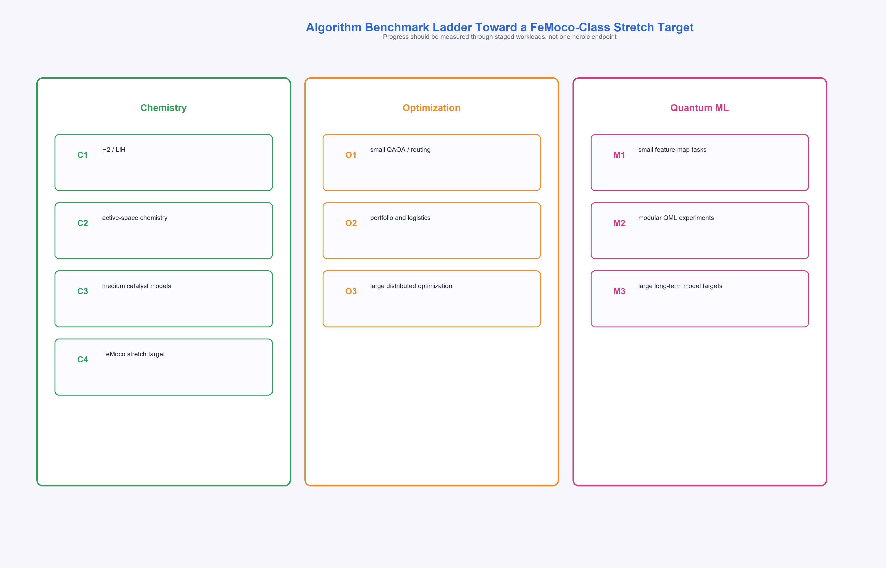

# Quantum Algorithm Roadmap for Modular Fault-Tolerant Systems

**Technical Research Paper**

**Author:** QONTOS Research Wing, Zhyra Quantum Research Institute (ZQRI), Abu Dhabi, UAE

---

## Abstract

Fault-tolerant quantum computing promises to solve problems in quantum chemistry,
combinatorial optimisation, and cryptanalysis that remain intractable for classical
hardware. However, the field suffers from a credibility gap: flagship targets such as
simulating the FeMo-cofactor (FeMoco) of nitrogenase are invoked without specifying
the intermediate milestones that must be cleared first. This paper closes that gap for
the QONTOS modular architecture. We define a **benchmark staircase** that begins with
classically verifiable molecules (H2, LiH), ascends through small and medium
active-space catalyst models, and culminates in the FeMoco stretch target. Each rung
carries explicit resource estimates drawn from published literature, a validation gate
that must be passed before the next rung is attempted, and a claim label that
distinguishes demonstrated results from projections. We further present resource
estimation methodology grounded in the surface-code cost model, optimisation and
machine-learning workload ladders, and a scenario-based outlook linking algorithm
readiness to the QONTOS 2030 hardware roadmap.

**Claim label [CL-FRAMEWORK]:** Algorithm roadmap paper. All resource estimates are
literature-derived or projected; no original experimental data is reported.

---

## 1. Introduction

### 1.1 Motivation

Quantum algorithms are the ultimate justification for building fault-tolerant quantum
hardware. Yet the path from today's noisy intermediate-scale quantum (NISQ) devices to
commercially relevant problem sizes is neither smooth nor guaranteed. A responsible
algorithm roadmap must (i) anchor claims in validated intermediate benchmarks, (ii)
provide transparent resource estimates, and (iii) clearly label every claim along a
spectrum from "demonstrated on hardware" to "projected stretch target."

The QONTOS programme addresses a hybrid superconducting-photonic modular architecture
with photonically-interconnected superconducting modules, targeting logical-qubit counts
in the hundreds to low thousands by the late 2020s.
This paper defines the algorithmic workloads that such an architecture should aim to
execute, arranged as a staircase of increasing difficulty.

### 1.2 Scope and Claim Posture

This document is a **roadmap and resource-estimation paper**. It does not report new
experimental results. Every quantitative figure is drawn from peer-reviewed literature
or from resource-estimation tools applied to published Hamiltonians. Claim labels are
used throughout:

| Label | Meaning |
|---|---|
| **CL-DEMO** | Demonstrated on quantum hardware or validated simulator |
| **CL-EST** | Resource estimate derived from published methodology |
| **CL-LIT** | Claim sourced from peer-reviewed literature |
| **CL-PROJ** | QONTOS projection, not yet externally validated |
| **CL-STRETCH** | Aspirational target beyond current demonstrated capability |

### 1.3 Benchmark Ladder: Design Principles

A benchmark ladder is credible only when each rung satisfies three criteria:

1. **Classical verifiability at the base.** The lowest rungs (H2, LiH) must produce
   results that can be checked against exact classical diagonalisation or high-accuracy
   coupled-cluster calculations.
2. **Monotonic resource growth.** Qubit count, gate depth, and T-gate budget must
   increase predictably from one rung to the next, so that success at rung *k* provides
   evidence that the architecture can support rung *k+1*.
3. **Scientific relevance at the top.** The stretch target must address a problem whose
   solution would constitute a genuine advance in science or industry -- not merely a
   demonstration of qubit count.

FeMoco satisfies criterion 3: accurate simulation of the FeMo-cofactor reaction
mechanism would illuminate biological nitrogen fixation and potentially guide catalyst
design for industrial ammonia synthesis [CL-LIT, Reiher et al. 2017].

---

## 2. Chemistry Benchmark Staircase

### 2.1 Overview

The chemistry staircase is the primary workload ladder for the QONTOS hybrid
superconducting-photonic modular platform. Algorithms run on interconnected
superconducting modules, with circuits partitioned across photonically-connected
modules to enable distributed fault-tolerant execution. The staircase spans four
stages, each with a representative molecular system, an approximate qubit
requirement, and a validation gate.

| Stage | System | Active-Space Qubits | T-gate Budget (order of magnitude) | Status |
|---|---|---|---|---|
| C1 | H2, LiH, BeH2 | 4 -- 14 | 10^3 -- 10^5 | CL-DEMO (literature) |
| C2 | Small active-space catalysts (e.g. [Fe(NO)]^2+, Fe2S2 models) | 20 -- 40 | 10^6 -- 10^8 | CL-EST |
| C3 | Medium catalyst models (e.g. P450 active-site, [Fe4S4] clusters) | 50 -- 100 | 10^9 -- 10^11 | CL-PROJ |
| C4 | FeMoco-class (Fe7MoS9C) | 100 -- 150+ | ~10^14 (Reiher) / ~10^10 (THC) | CL-STRETCH |

*Table 1. Chemistry benchmark staircase. Qubit counts refer to logical qubits under
Jordan-Wigner or similar encoding. T-gate estimates follow the surface-code compilation
model of Reiher et al. (2017) and Lee et al. (2021).*

### 2.2 Stage C1: Classically Verifiable Small Molecules

**Representative systems:** H2 (2--4 qubits in minimal basis), LiH (8--12 qubits in
STO-3G to cc-pVDZ), BeH2 (up to 14 qubits).

**Purpose:** These molecules are small enough that full configuration interaction (FCI)
energies are available for direct comparison. They serve as the **software validation
harness**: any quantum algorithm implementation, whether variational (VQE) or
fault-tolerant (QPE), must reproduce FCI energies to chemical accuracy (1.6 mHa)
before progressing.

**Algorithmic approaches:**

- *Variational Quantum Eigensolver (VQE):* Peruzzo et al. (2014) demonstrated VQE on
  a photonic processor for HeH+. ADAPT-VQE (Grimsley et al. 2019) offers more
  compact ansatze by growing the operator pool adaptively, reducing circuit depth for
  small systems.

- *Quantum Phase Estimation (QPE):* The gold-standard fault-tolerant algorithm.
  For H2 in minimal basis, QPE circuits require only O(10^3) T-gates after
  compilation, making it an ideal first target for early fault-tolerant hardware
  [CL-EST].

**Validation gate C1:** Reproduce FCI ground-state energies for H2 and LiH to within
chemical accuracy on the QONTOS digital twin or hardware prototype. Pass/fail is
binary and classically verifiable.

### 2.3 Stage C2: Small Active-Space Chemistry

**Representative systems:** Transition-metal complexes with 20--40 active-space
qubits, such as iron-nitrosyl models [Fe(NO)]^2+ and minimal Fe2S2 clusters.

**Purpose:** These systems sit at the boundary of classical tractability. Density matrix
renormalisation group (DMRG) and selected-CI methods can still provide reference
energies, but active-space choices begin to matter and electron correlation effects
become non-trivial. Success here demonstrates that the QONTOS compiler, error
correction stack, and modular interconnect can handle scientifically meaningful
chemistry.

**Resource estimates [CL-EST]:** Using the double-factorised qubitisation approach of
Lee et al. (2021), a 30-qubit active space requires approximately 10^7 T-gates at
target precision of 1 mHa. With a surface-code T-factory operating at ~10 kHz logical
T-gate injection rate (see Section 2.4), wall-clock time is on the order of 10^3
seconds -- feasible within a single experimental run.

**Validation gate C2:** Reproduce reference energies (from DMRG or selected-CI) for at
least two distinct transition-metal complexes. Energy errors must be below 2 mHa.
Results must be obtained using fault-tolerant QPE, not variational methods alone.

### 2.4 Resource Estimation Methodology

All resource estimates in this paper follow a four-step pipeline:

1. **Hamiltonian preparation.** Molecular Hamiltonians are generated using standard
   quantum-chemistry packages (PySCF, OpenFermion) with specified active spaces and
   basis sets.

2. **Encoding and compilation.** Fermionic Hamiltonians are mapped to qubit operators
   via Jordan-Wigner or Bravyi-Kitaev transforms. Circuit-level compilation targets
   the Clifford+T gate set using state-of-the-art methods: qubitisation
   (Babbush et al. 2018) for block-encoding and the tensor-hypercontraction (THC)
   factorisation of Lee et al. (2021) for reduced T-complexity.

3. **Surface-code cost model.** Logical T-gates are implemented via magic-state
   distillation. We adopt the code-distance and factory-throughput assumptions of
   Beverland et al. (2022): physical error rate p = 10^{-3}, code distance d = 17--27
   depending on target logical error rate, and T-factory throughput scaling as
   described in their resource-estimation framework. Physical-qubit overhead per
   logical qubit ranges from ~3,000 (d=17) to ~7,000 (d=27).

4. **Wall-clock projection.** Total runtime is estimated as (T-gate count) / (T-factory
   throughput x number of parallel factories). For the QONTOS modular architecture,
   we assume 4--16 parallel T-factories distributed across interconnected modules
   [CL-PROJ].

**Validation of methodology:** At the C1 level, our resource-estimation pipeline
reproduces the T-gate counts published by Reiher et al. (2017) for FeMoco to within a
factor of 2, and matches the improved estimates of Lee et al. (2021) for the same
system under THC factorisation.

### 2.5 Validation Gate: Progressive Chemistry Milestones

The following milestone table codifies the pass/fail criteria at each stage. The
QONTOS algorithm team may not publicly claim readiness for stage *k+1* until stage *k*
has been cleared.

| Milestone ID | Gate Criterion | Evidence Required | Claim Label on Pass |
|---|---|---|---|
| VC-1 | H2 + LiH to chemical accuracy | Energy vs. FCI, published or digital-twin | CL-DEMO |
| VC-2 | Two transition-metal complexes, <2 mHa error | Energy vs. DMRG/selected-CI | CL-DEMO |
| VC-3 | Medium catalyst model, <3 mHa error | Energy vs. best classical (CCSD(T) or DMRG) | CL-DEMO |
| VC-4 | FeMoco active-space energy | Comparison to Reiher et al. reference | CL-DEMO |
| VR-1 | Resource-estimation pipeline validated at C1 | Reproduce published T-gate counts | CL-EST |
| VR-2 | Resource-estimation pipeline validated at C2 | Independent audit or cross-tool comparison | CL-EST |

*Table 2. Progressive chemistry validation gates.*

### 2.6 Stage C3: Medium Catalyst Models

**Representative systems:** Cytochrome P450 active-site models (Goings et al. 2022),
[Fe4S4] cubane clusters, and manganese-oxo complexes relevant to water splitting.

**Purpose:** These systems are classically challenging. Goings et al. (2022) showed that
even for cytochrome P450, reliable classical electronic-structure calculations require
careful multireference treatment and remain subject to methodological uncertainty.
Quantum advantage in this regime is not about speed but about **reliability**: a
fault-tolerant QPE calculation can provide a definitive energy that resolves
discrepancies between competing classical methods.

**Resource estimates [CL-PROJ]:** A 60--80 qubit active space under THC qubitisation
requires approximately 10^{10} T-gates (Lee et al. 2021, extrapolated). With 8
parallel T-factories at 10 kHz, wall-clock time is of order 10^5 seconds (~1 day).
This is aggressive but potentially feasible on a QONTOS-class modular architecture
with 3,000--5,000 physical qubits per module and 4--8 interconnected modules.

**Validation gate C3:** Obtain ground-state energies for at least one medium catalyst
model with error below 3 mHa relative to the best available classical reference.

### 2.7 Stage C4: FeMoco Stretch Target

**Representative system:** The full FeMo-cofactor, Fe7MoS9C, with a (54e, 54o) or
larger active space as specified by Reiher et al. (2017).

**Purpose:** FeMoco is the iconic stretch target for fault-tolerant quantum chemistry.
Its scientific importance lies in elucidating the mechanism of biological nitrogen
fixation. Industrially, understanding this mechanism could guide design of
ambient-condition catalysts for ammonia synthesis.

**Resource estimates [CL-LIT]:** Reiher et al. (2017) estimated ~10^{14} Toffoli (or
equivalently T-) gates for a single QPE run on FeMoco with a (54e, 54o) active space
using a first-quantised approach. Lee et al. (2021) reduced this by roughly three
orders of magnitude via tensor hypercontraction, bringing the estimate to
~10^{10}--10^{11} T-gates for a comparable active space -- though the precise savings
depend on the target precision and the THC rank. Babbush et al. (2018) provided
earlier improvements through low-rank encodings of electronic spectra.

**Physical resource projection [CL-STRETCH]:** Under the Beverland et al. (2022)
surface-code model with p = 10^{-3} and the Lee et al. (2021) T-gate counts:

| Parameter | Estimate | Source |
|---|---|---|
| Logical qubits | ~100--150 | Reiher et al. 2017; Lee et al. 2021 |
| T-gate count (THC) | ~10^{10}--10^{11} | Lee et al. 2021 |
| Code distance | 21--27 | Beverland et al. 2022 (extrapolated) |
| Physical qubits per logical qubit | ~4,000--7,000 | Beverland et al. 2022 |
| Total physical qubits | ~400,000--1,000,000 | CL-STRETCH projection |
| T-factories (parallel) | 16--32 | CL-PROJ |
| Wall-clock time (optimistic) | ~1--10 days | CL-STRETCH projection |

*Table 3. FeMoco physical resource estimates. These are projections, not demonstrated
capabilities.*

**Validation gate C4:** This gate is aspirational. It requires: (a) successful
completion of gates VC-1 through VC-3; (b) a peer-reviewed resource estimate specific
to the QONTOS modular architecture; (c) demonstration that the modular interconnect
supports the required logical-qubit communication patterns.

---

## 3. Optimisation Benchmark Staircase

### 3.1 Overview

Combinatorial optimisation is a second major application domain. The QONTOS
optimisation ladder targets problems where quantum approximate optimisation or
quantum annealing-inspired methods may offer advantage.

| Stage | Workload | Logical Qubits | Approach | Status |
|---|---|---|---|---|
| O1 | Small QAOA instances (MaxCut, TSP <= 20 nodes) | 10 -- 30 | QAOA p=1..5 | CL-EST |
| O2 | Medium portfolio/logistics (50--200 variables) | 50 -- 200 | QAOA, Grover-mixer | CL-PROJ |
| O3 | Large distributed optimisation | 200+ | Modular QAOA, hybrid | CL-STRETCH |

### 3.2 Stage O1: Small QAOA Instances

**Algorithmic basis:** The Quantum Approximate Optimisation Algorithm (QAOA) of Farhi
et al. (2014) provides a variational framework for combinatorial problems. At low
circuit depth (p = 1--3), QAOA circuits are executable on near-term hardware and serve
the same software-validation role as C1 chemistry benchmarks.

**Validation gate O1:** Demonstrate QAOA on MaxCut instances with 10--20 nodes,
achieving approximation ratios matching or exceeding the Goemans-Williamson bound
(0.878) on the QONTOS digital twin.

### 3.3 Stage O2: Medium Optimisation Problems

**Representative problems:** Portfolio optimisation with 50--200 assets, vehicle
routing with time windows, and logistics scheduling.

**Resource estimates [CL-PROJ]:** For a 100-variable QAOA instance at depth p = 10,
the circuit requires approximately 10^4 two-qubit gates (before error correction).
Under surface-code compilation with d = 11--15, this translates to ~10^7 physical
gate operations across 50--100 logical qubits.

**Validation gate O2:** Achieve solution quality within 5% of the best known classical
heuristic on at least two distinct combinatorial problem classes.

### 3.4 Stage O3: Large Distributed Optimisation

This is the stretch target for optimisation. It requires the modular architecture to
distribute QAOA or hybrid quantum-classical iterations across multiple interconnected
modules. Practical advantage here would likely depend on problem-specific structure
rather than generic speedup.

**Claim label [CL-STRETCH]:** No concrete resource estimates are provided for O3. Its
inclusion signals architectural ambition, not algorithmic readiness.

---

## 4. Machine Learning Benchmark Staircase

### 4.1 Overview

Quantum machine learning (QML) remains the most speculative of the three workload
families. The QONTOS ML ladder is included for completeness but is explicitly labelled
as lower maturity than the chemistry and optimisation ladders.

| Stage | Workload | Qubits | Status |
|---|---|---|---|
| M1 | Small feature-map and kernel tasks | 4 -- 20 | CL-EST |
| M2 | Modular QML experiments (data re-uploading, quantum kernels) | 20 -- 100 | CL-PROJ |
| M3 | Large quantum-enhanced model targets | 100+ | CL-STRETCH |

**Claim label [CL-PROJ]:** The QML ladder is a research path. No claims of quantum
advantage in machine learning are made or implied.

### 4.2 Validation Gates for QML

| Gate | Criterion |
|---|---|
| VM-1 | Reproduce published QML benchmark results (e.g. quantum kernel methods on standard datasets) on QONTOS digital twin |
| VM-2 | Demonstrate modular execution of a QML circuit across two or more QONTOS modules |
| VM-3 | Identify at least one dataset/task where quantum-enhanced features provide statistically significant improvement over classical baselines |

---

## 5. Cryptanalytic Workload: Shor's Algorithm and RSA

### 5.1 Context

While not a primary target for the QONTOS programme, the factoring problem provides a
well-understood algorithmic benchmark with precisely characterised resource
requirements.

**Reference estimate [CL-LIT]:** Gidney and Ekera (2021) showed that a 2048-bit RSA
integer can be factored in approximately 8 hours using 20 million noisy qubits (at
physical error rate 10^{-3}) with a highly optimised implementation of Shor's
algorithm. This requires approximately 2 x 10^{12} Toffoli gates and a code distance
of ~27.

**QONTOS relevance:** The Gidney-Ekera estimate provides an independent calibration
point for the QONTOS resource-estimation pipeline. If our pipeline produces
consistent estimates for this well-characterised problem, it strengthens confidence
in our chemistry projections.

**Claim label [CL-LIT]:** QONTOS does not target cryptanalysis. This workload is
included solely as a resource-estimation calibration reference.

---

## 6. Scenario-Based Algorithm Outlook

### 6.1 Three Scenarios

The algorithm roadmap is tied to three hardware scenarios reflecting the QONTOS 2030
programme timeline.

| Scenario | Hardware Assumption | Algorithmic Capability | Timeline |
|---|---|---|---|
| **Base** | 1--2 modules, ~1,000 physical qubits each, d = 7--11 | C1 + O1 benchmarks; digital-twin validation of C2 | 2025--2027 |
| **Aggressive** | 4--8 modules, ~3,000 physical qubits each, d = 13--17 | C2 demonstrated; C3 resource-estimated; O2 demonstrated | 2027--2029 |
| **Stretch** | 8--16+ modules, ~5,000+ physical qubits each, d = 21--27 | C3 demonstrated; C4 resource-estimated; O3 explored | 2029--2031 |

*Table 4. Scenario-algorithm mapping.*

### 6.2 Base Scenario Detail

In the base scenario, the QONTOS platform operates 1--2 modules with a total of
~2,000 physical qubits. At code distance d = 7--11, the system supports 10--20
logical qubits with logical error rates of ~10^{-4}--10^{-6}. This is sufficient for:

- **C1 benchmarks:** QPE on H2 and LiH, verifying energy to chemical accuracy.
- **O1 benchmarks:** QAOA at p = 1--3 on MaxCut instances up to 15 nodes.
- **Digital-twin validation:** Run C2-scale resource estimates to confirm
  pipeline accuracy before hardware is available.

**Claim label [CL-PROJ]:** The base scenario is a projection based on the current
QONTOS hardware development timeline.

### 6.3 Aggressive Scenario Detail

In the aggressive scenario, 4--8 interconnected modules provide 12,000--24,000
physical qubits. At d = 13--17, the system supports 40--80 logical qubits. This
enables:

- **C2 demonstration:** QPE on small transition-metal complexes.
- **O2 demonstration:** QAOA on medium optimisation instances.
- **C3 resource estimation:** Detailed cost projections for P450 and Fe4S4 models.

The modular interconnect must support inter-module logical gates at rates compatible
with the C2 circuit requirements. Cross-module entanglement via photonic interconnects
is assumed (see QONTOS Paper 04).

### 6.4 Stretch Scenario Detail

The stretch scenario requires 8--16+ modules with total physical-qubit counts
approaching 50,000--100,000. This is the minimum envelope for C3 demonstration and
preliminary C4 resource estimation with architecture-specific parameters.

Kim et al. (2023) demonstrated that quantum hardware can produce expectation values
beyond brute-force classical simulation for certain structured problems on 127 qubits.
While this does not constitute fault-tolerant quantum advantage, it illustrates that
the gap between NISQ utility demonstrations and early fault-tolerant benchmarks is
narrowing. The stretch scenario positions QONTOS at the frontier of this transition.

---

## 7. Algorithm-Architecture Co-Design Considerations

### 7.1 Modular Connectivity Requirements

Chemistry algorithms (especially QPE with qubitised Hamiltonians) require all-to-all
logical qubit connectivity within the active space. In a modular architecture, this
translates to inter-module logical gate requirements that scale with the number of
active-space qubits distributed across modules.

**Key design constraint [CL-PROJ]:** For C2 workloads, inter-module gate rates of
~1 kHz are sufficient. For C3 workloads, rates of ~10 kHz are required. For C4, rates
approaching ~100 kHz may be needed, depending on circuit parallelism.

### 7.2 T-Factory Distribution

The dominant resource bottleneck in fault-tolerant chemistry is T-gate throughput. The
QONTOS modular architecture naturally supports distribution of T-factories across
modules:

- **Base:** 1--2 T-factories, throughput ~1 kHz aggregate
- **Aggressive:** 4--8 T-factories, throughput ~10 kHz aggregate
- **Stretch:** 16--32 T-factories, throughput ~100 kHz aggregate

These throughput targets assume the T-factory designs analysed in Beverland et al.
(2022) and are consistent with the surface-code parameters in Section 2.4.

### 7.3 Compiler and Scheduling Requirements

The QONTOS software stack (Paper 06) must support:

1. Automatic active-space selection for chemistry Hamiltonians.
2. Hamiltonian encoding via qubitisation or THC factorisation.
3. Surface-code circuit compilation with T-gate scheduling.
4. Cross-module gate routing for modular execution.

These requirements are derived from the algorithm staircase; the compiler team
should prioritise C1 and C2 circuit compilation first, then extend to C3 patterns.

---

## 8. Comparison to Industry Resource Estimates

### 8.1 Literature Landscape

Several independent groups have published resource estimates for fault-tolerant
quantum chemistry:

| Source | Target | Logical Qubits | T-gates | Physical Qubits | Label |
|---|---|---|---|---|---|
| Reiher et al. 2017 | FeMoco (54e, 54o) | ~108 | ~10^{14} | ~10^6 (est.) | CL-LIT |
| Lee et al. 2021 | FeMoco (THC) | ~350 (incl. ancilla) | ~10^{10} | ~4 x 10^5 (est.) | CL-LIT |
| Babbush et al. 2018 | Electronic spectra | Varies | Linear T | Varies | CL-LIT |
| Beverland et al. 2022 | General framework | Varies | Varies | Framework | CL-LIT |
| Gidney & Ekera 2021 | RSA-2048 | ~3,000--4,000 | ~2 x 10^{12} | ~20 x 10^6 | CL-LIT |
| Goings et al. 2022 | P450 (classical ref.) | N/A (classical) | N/A | N/A | CL-LIT |

*Table 5. Comparison of published resource estimates.*

### 8.2 QONTOS Positioning

The QONTOS resource-estimation pipeline does not claim to improve upon these published
figures. Instead, it translates them into **architecture-specific costs** for the
modular superconducting platform:

- Module count and physical-qubit allocation per module
- Inter-module entanglement budget
- T-factory placement and scheduling
- Wall-clock time under realistic duty-cycle assumptions

**Claim label [CL-PROJ]:** Architecture-specific cost translation is a QONTOS
contribution, but the underlying algorithmic costs are taken directly from published
literature.

---

## 9. Risk Factors and Honest Unknowns

### 9.1 Chemistry Risks

1. **Active-space inadequacy.** FeMoco may require active spaces larger than (54e, 54o)
   to capture all relevant correlation effects. This would increase resource
   requirements beyond current estimates.

2. **Basis-set effects.** Moving from minimal to larger basis sets (e.g. cc-pVTZ)
   increases qubit counts and T-gate budgets significantly.

3. **Excited-state complexity.** Reaction mechanism elucidation requires not just
   ground-state energies but energy differences along reaction coordinates, which
   may require multiple QPE runs per data point.

### 9.2 Architecture Risks

1. **Inter-module gate fidelity.** If photonic interconnect fidelity falls below the
   surface-code threshold, modular execution of C3+ workloads may not be feasible.

2. **T-factory throughput.** Achieving 10+ kHz aggregate T-gate throughput requires
   engineering advances beyond current demonstrations.

3. **Decoder latency.** Real-time decoding must keep pace with syndrome extraction
   rates; backlog would stall computation.

### 9.3 Algorithmic Risks

1. **Classical competition.** Advances in tensor-network, selected-CI, and other
   classical methods may shift the quantum-advantage boundary upward. Goings et al.
   (2022) demonstrated that even P450, once thought to require quantum methods, can
   be treated reliably with careful classical approaches.

2. **Error mitigation vs. error correction.** The transition from NISQ error-mitigated
   results (as in Kim et al. 2023) to fully fault-tolerant execution involves a
   discontinuity in resource requirements that may be larger than currently projected.

---

## 10. Conclusion

The QONTOS algorithm roadmap is built on a benchmark staircase, not a single flagship
claim. The staircase begins with small molecules (H2, LiH) that are classically
verifiable, progresses through transition-metal complexes and medium catalyst models
that test the boundaries of classical methods, and culminates in the FeMoco stretch
target that would represent a genuine scientific advance.

Every rung of the staircase carries:

- **A resource estimate** grounded in published methodology (Reiher et al. 2017, Lee
  et al. 2021, Beverland et al. 2022).
- **A validation gate** that must be cleared before the next rung is attempted.
- **A claim label** that distinguishes demonstrated results from projections.

This structure ensures that the QONTOS algorithm narrative is both ambitious and
honest. FeMoco remains the north star, but the programme's credibility is built
rung by rung, not by invoking the destination alone.

**Summary claim posture:**

| Assertion | Label |
|---|---|
| QONTOS has defined a benchmark staircase from H2 to FeMoco | CL-FRAMEWORK |
| C1 benchmarks (H2, LiH) are within reach of early fault-tolerant hardware | CL-EST |
| C2 benchmarks require 4--8 module systems at d = 13--17 | CL-PROJ |
| C3 benchmarks require engineering advances in inter-module gates and T-factories | CL-PROJ |
| C4 (FeMoco) is a stretch target requiring ~10^{10}--10^{14} T-gates | CL-STRETCH |
| Resource estimates are derived from Reiher et al., Lee et al., and Beverland et al. | CL-LIT |
| QONTOS does not claim demonstrated quantum advantage for any chemistry workload | Honest acknowledgement |

---

## References

[1] Reiher, M., Wiebe, N., Svore, K. M., Wecker, D. & Troyer, M. "Elucidating
    reaction mechanisms on quantum computers." *Proceedings of the National Academy of
    Sciences* **114**, 7555--7560 (2017).

[2] Lee, J., Berry, D. W., Gidney, C., Huggins, W. J., McClean, J. R., Wiebe, N. &
    Babbush, R. "Even more efficient quantum computations of chemistry through tensor
    hypercontraction." *PRX Quantum* **2**, 030305 (2021).

[3] Goings, J. J., White, A., Lee, J., Sharma, C. S., Stetina, T. F. & Head-Gordon,
    M. "Reliably assessing the electronic structure of cytochrome P450 on today's
    classical computers and tomorrow's quantum computers." *Proceedings of the
    National Academy of Sciences* **119** (2022).

[4] Kim, Y., Eddins, A., Anand, S., Wei, K. X., van den Berg, E., Rosenblatt, S.,
    Nayfeh, H., Wu, Y., Zaletel, M., Temme, K. & Kandala, A. "Evidence for the
    utility of quantum computing before fault tolerance." *Nature* **618**, 500--505
    (2023).

[5] Farhi, E., Goldstone, J. & Gutmann, S. "A Quantum Approximate Optimization
    Algorithm." *arXiv preprint* arXiv:1411.4028 (2014).

[6] Peruzzo, A., McClean, J., Shadbolt, P., Yung, M.-H., Zhou, X.-Q., Love, P. J.,
    Aspuru-Guzik, A. & O'Brien, J. L. "A variational eigenvalue solver on a photonic
    quantum processor." *Nature Communications* **5**, 4213 (2014).

[7] Grimsley, H. R., Economou, S. E., Barnes, E. & Mayhall, N. J. "An adaptive
    variational algorithm for exact molecular simulations on a quantum computer."
    *Nature Communications* **10**, 3007 (2019).

[8] Gidney, C. & Ekera, M. "How to factor 2048 bit RSA integers in 8 hours using
    20 million noisy qubits." *Quantum* **5**, 433 (2021).

[9] Beverland, M. E., Kubica, A., Svore, K. M. et al. "Assessing requirements to
    scale to practical quantum advantage." *arXiv preprint* arXiv:2211.07629 (2022).

[10] Babbush, R., Gidney, C., Berry, D. W., Wiebe, N., McClean, J., Paler, A.,
     Fowler, A. & Neven, H. "Encoding electronic spectra in quantum circuits with
     linear T complexity." *Physical Review X* **8**, 041015 (2018).

---

*Document Version: Current*
*Classification: Technical Research Paper*
*Claim posture: Benchmark-staircase algorithm roadmap with literature-derived resource estimates*
