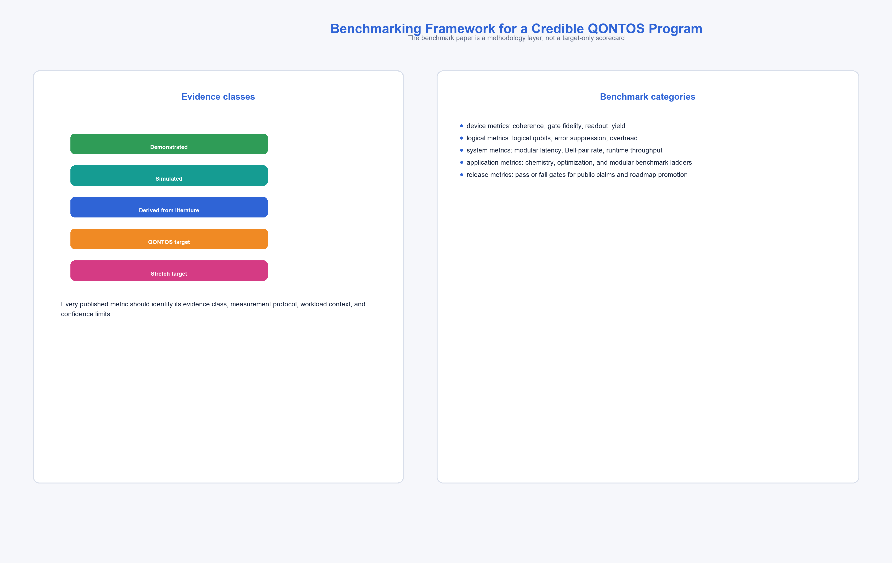

# Benchmarking Framework for Large-Scale Modular Quantum Systems

**Technical Research Paper**

**Author:** QONTOS Research Wing, Zhyra Quantum Research Institute (ZQRI), Abu Dhabi, UAE

---

## Abstract

Credible quantum computing programs require benchmark frameworks that distinguish measured results from architectural projections and aspirational targets. This paper defines the QONTOS benchmarking framework: a layered protocol suite that spans simulator-backed orchestration, digital-twin modeling, noisy baselines, and eventual fault-tolerant modular hardware. We specify exact benchmark definitions grounded in the peer-reviewed literature --- including randomized benchmarking, Quantum Volume, CLOPS, and application-oriented suites --- together with measurement conditions, confidence-interval reporting requirements, baseline comparisons, and pass/fail gating thresholds. The framework classifies every reported metric by its evidence level using mandatory claim labels and establishes a modular-system benchmarking methodology for the QONTOS hybrid superconducting-photonic architecture, covering both intra-module (superconducting) performance and cross-module (photonic) metrics such as inter-module gate fidelity and Bell pair generation rates. All protocols reference the open-source `qontos-benchmarks` repository as the canonical implementation. This paper serves as the credibility backbone of the QONTOS paper series: no claim in any companion paper is valid unless it maps to a benchmark, protocol, or validation gate defined here.

**Claim label:** METHODOLOGY --- benchmark design, protocol specification, and release gating framework. No performance claims are made in this paper; all numeric values appearing in target tables carry explicit QONTOS-TARGET or STRETCH-TARGET labels.

---

## 1. Introduction: Benchmarking as the Credibility Engine

### 1.1 Motivation and Scope

The quantum computing field suffers from a credibility gap. Headline metrics are frequently reported without specifying measurement conditions, noise models, or the boundary between measured values and architectural projections. Proctor et al. (2022) demonstrated that even well-intentioned benchmark reporting can mislead when measurement protocols are underspecified [4]. Lubinski et al. (2023) further showed that application-oriented benchmarks require careful normalization to enable meaningful cross-platform comparison [5].

**[CLAIM-METHODOLOGY]** The QONTOS benchmarking framework addresses this gap by requiring every reported metric to carry: (a) a claim label specifying its evidence basis, (b) a complete measurement-condition record, (c) at least one baseline comparison, and (d) a confidence interval or explicit uncertainty statement.

This paper serves a structural role in the QONTOS paper series. Papers 01 through 08 and Paper 10 contain architectural claims, algorithm projections, and roadmap targets. None of those claims are valid in isolation. Each must trace to a benchmark definition, measurement protocol, or validation gate specified here. If a claim cannot be mapped to this framework, it must be labeled UNVALIDATED until a corresponding benchmark is defined.

### 1.2 Claim Label Taxonomy

Every metric, result, or projection reported in any QONTOS paper must carry exactly one of the following labels:

| Claim Label | Definition | Evidence Required |
|---|---|---|
| MEASURED-SIMULATOR | Result obtained on the QONTOS simulator-backed pipeline | Reproducible run log with version hash |
| MEASURED-HARDWARE | Result obtained on physical quantum hardware | Device specification, calibration data, raw counts |
| DIGITAL-TWIN-PROJECTION | Result from a calibrated noise model and modular runtime simulation | Noise model parameters, simulation configuration |
| NOISY-BASELINE | Result from a standardized depolarizing or realistic noise channel | Noise channel specification, comparison to analytic bound |
| QONTOS-TARGET | Planned performance level under stated assumptions | Assumption list, dependency on hardware parameters |
| STRETCH-TARGET | Aspirational performance level requiring multiple breakthroughs | Explicit list of required breakthroughs |
| LITERATURE-VALUE | Value taken from a published, peer-reviewed source | Full citation with DOI or arXiv ID |
| UNVALIDATED | Claim that does not yet map to a benchmark protocol | Must be resolved before any public communication |

### 1.3 Benchmark Definitions

This section defines the core benchmarks used throughout the QONTOS program, grounded in their original peer-reviewed specifications.

**Randomized Benchmarking (RB).** Introduced by Knill et al. (2008), randomized benchmarking estimates average gate fidelity by measuring the decay of sequence fidelity as a function of the number of random Clifford gates applied to a qubit register [3]. The protocol is efficient because the number of required sequences scales polynomially, and the result is largely independent of state-preparation and measurement (SPAM) errors. QONTOS adopts standard RB as the Layer-0 single-qubit and two-qubit gate characterization protocol.

**Interleaved Randomized Benchmarking (IRB).** Magesan et al. (2012) extended RB to isolate the error rate of a specific gate by interleaving it between random Clifford operations [2]. The ratio of the interleaved and reference decay rates yields the error per gate for the target operation. QONTOS uses IRB to characterize individual gate types --- particularly cross-module entangling gates whose fidelity is critical to the modular architecture (see Paper 01).

**Quantum Volume (QV).** Defined by Cross et al. (2019), Quantum Volume measures the largest square circuit (depth = width = d) that a quantum computer can execute with a heavy-output-generation probability exceeding 2/3 [1]. The protocol involves sampling random SU(4) circuits, computing the heavy-output set classically, and verifying that the quantum device's heavy-output fraction passes a one-sided binomial test at the 97.7% confidence level (two sigma). IBM (2024) has maintained and updated the operational definition [6]. QONTOS reports QV at each benchmark layer with the full Cross et al. protocol, including the confidence-level requirement.

**Circuit Layer Operations Per Second (CLOPS).** Introduced by Wack et al. (2021), CLOPS measures the throughput of a quantum computing system by counting the number of QV-equivalent circuit layers that can be executed per second, including compilation, execution, and result retrieval [7]. CLOPS captures the full-stack latency that determines practical utility. QONTOS reports CLOPS with explicit decomposition into compilation time, queue time, execution time, and classical post-processing time.

**Application-Oriented Benchmarks.** Lubinski et al. (2023) defined a suite of application-oriented benchmarks spanning chemistry (VQE), optimization (QAOA, MaxCut), machine learning (quantum kernel methods), and simulation (Hamiltonian dynamics) [5]. Each benchmark specifies a problem family, a scaling parameter, and a figure of merit. QONTOS adopts this framework for its application benchmark ladder (Section 5).

**SupermarQ.** Tomesh et al. (2022) introduced a scalable benchmark framework that decomposes quantum program performance into communication, computation, critical depth, entanglement, and parallelism features [8]. QONTOS uses SupermarQ feature vectors to characterize workload difficulty independently of hardware.

### 1.4 Measurement Conditions

**[CLAIM-METHODOLOGY]** Every reported benchmark result must include the following metadata record. Results lacking any required field are classified UNVALIDATED.

| Field | Required | Description |
|---|---|---|
| claim_label | Yes | One of the labels from Section 1.2 |
| benchmark_id | Yes | Canonical identifier from `qontos-benchmarks` repo |
| benchmark_layer | Yes | L0, L1, L2, or L3 (see Section 2.1) |
| execution_environment | Yes | Simulator, digital twin, or hardware (with device ID) |
| workload_specification | Yes | Circuit family, width, depth, parameter set |
| noise_model | Yes | Exact noise channel or "none" for ideal simulation |
| hardware_assumptions | Yes | Physical qubit count, connectivity, gate set, gate times |
| modular_assumptions | Conditional | Required for L1+ results: module count, inter-module link fidelity, topology |
| reconstruction_method | Conditional | Required if post-processing affects the metric |
| confidence_interval | Yes | 95% CI from bootstrap or analytic bound; or explicit uncertainty statement |
| software_version | Yes | Git commit hash of `qontos-benchmarks` harness |
| timestamp | Yes | ISO 8601 execution timestamp |
| reproducibility_hash | Yes | SHA-256 of the full run configuration |

---

## 2. Benchmark Layers and Modular-System Benchmarking



### 2.1 Layer Definitions

QONTOS organizes benchmarks into four layers reflecting the maturity of the execution environment. Because QONTOS builds a hybrid superconducting-photonic modular architecture --- combining high-coherence tantalum-on-silicon transmon qubits (Paper 02) with photonic interconnects for inter-module entanglement distribution (Paper 04) --- the benchmark framework must capture performance along both the superconducting device axis and the photonic networking axis. Each layer therefore includes metrics for intra-module (superconducting) operations and cross-module (photonic) operations such as inter-module gate fidelity, Bell pair generation rate, and distributed circuit overhead:

| Layer | Environment | Evidence Class | Typical Use |
|---|---|---|---|
| L0 | Simulator-backed orchestration pipeline | MEASURED-SIMULATOR | Current platform validation; scheduler and compiler benchmarks |
| L1 | Digital-twin modular runtime | DIGITAL-TWIN-PROJECTION | Modular architecture projections; noise-aware scheduling |
| L2 | Prototype hardware integration | MEASURED-HARDWARE | Early device characterization; module-pair experiments |
| L3 | Large-scale fault-tolerant modular system | QONTOS-TARGET or STRETCH-TARGET | Roadmap milestones; flagship application projections |

**Layer promotion rule.** A metric may only advance from a lower layer to a higher layer when the evidence requirements of the higher layer are fully satisfied. A digital-twin projection (L1) does not become a hardware result (L2) merely by asserting that the noise model is realistic. Hardware measurement on a calibrated device with raw data is required.

### 2.2 Benchmark Protocol Specification

Each benchmark in the `qontos-benchmarks` repository is defined by a protocol file containing:

```
benchmark_id: QV-STANDARD-001
benchmark_name: Quantum Volume (Cross et al. 2019)
version: 1.0.0
layers: [L0, L1, L2, L3]
protocol:
  1. Select target width d.
  2. Generate N >= 100 random SU(4) circuits of depth d on d qubits.
  3. For each circuit, compute the ideal heavy-output set classically.
  4. Execute each circuit on the target backend with S >= 100 shots.
  5. Compute the heavy-output fraction h_i for each circuit.
  6. Compute the mean heavy-output fraction h_mean = (1/N) * sum(h_i).
  7. Apply one-sided binomial test: reject H0 (h_mean <= 2/3) at alpha = 0.023.
  8. Report QV = 2^d if test passes; otherwise report QV < 2^d.
baselines:
  - ideal_simulator: h_mean must equal theoretical heavy-output fraction
      within statistical error
  - noisy_baseline: depolarizing channel at p = 0.001 per gate
  - digital_twin: calibrated noise model from most recent device characterization
pass_threshold: h_mean > 2/3 with 97.7% confidence
confidence_interval: 95% bootstrap CI over N circuits
```

**[CLAIM-METHODOLOGY]** This protocol format is mandatory for all benchmarks. The `qontos-benchmarks` repository (https://github.com/qontos/qontos-benchmarks) contains the reference implementation of every protocol defined in this paper.

### 2.3 Modular-System Benchmarking

Modular quantum architectures --- where multiple superconducting quantum processing units (QPUs) are connected via photonic interconnects for entanglement distribution --- introduce benchmark challenges absent from monolithic systems. In the QONTOS hybrid superconducting-photonic platform, cross-module metrics are as critical as intra-module metrics because the photonic links determine the effective fidelity and throughput of distributed quantum operations. Martiel et al. (2021) identified coprocessor-level benchmarking as a distinct problem requiring metrics that capture inter-module communication overhead [9].

**[CLAIM-METHODOLOGY]** QONTOS defines the following modular-system benchmark extensions:

**Inter-module gate fidelity.** Measured via IRB (Magesan et al. 2012) [2] applied specifically to entangling gates that span module boundaries. The reference decay rate is obtained from intra-module gates of the same type. The ratio quantifies the modular overhead.

**Modular Quantum Volume (MQV).** Extension of the QV protocol where the d-qubit register is distributed across k modules. The protocol requires that qubit assignment to modules follows the QONTOS partitioner output (see Paper 06) rather than manual placement. MQV is reported as a pair (QV_value, k_modules) to distinguish it from monolithic QV.

**Distributed CLOPS (D-CLOPS).** Extension of CLOPS where circuit layers include inter-module communication steps. D-CLOPS is always reported alongside monolithic CLOPS on the same workload to quantify the modular throughput penalty.

**Cross-module entanglement rate.** The number of Bell pairs generated per second across a module boundary, measured with full tomographic verification. This metric feeds directly into the photonic interconnect specifications of Paper 04.

**Module-aware circuit partitioning overhead.** The ratio of total two-qubit gates after partitioning to the minimum two-qubit gate count on an all-to-all connected ideal machine. This quantifies the cost of the modular constraint and benchmarks the partitioner quality (Paper 06).

---

## 3. Baseline Comparisons and Gating Thresholds

### 3.1 Three Mandatory Baselines

**[CLAIM-METHODOLOGY]** Every benchmark result at any layer must be reported alongside at least one of the following baselines. L2 and L3 results require all three.

**Ideal simulator baseline.** The benchmark is executed on a noiseless statevector or tensor-network simulator with the same circuit, qubit count, and measurement configuration. This establishes the theoretical performance ceiling and verifies that the benchmark harness itself is correct.

**Noisy baseline.** The benchmark is executed on a standardized noise model: symmetric depolarizing noise at error rate p = 10^{-3} per single-qubit gate and p = 10^{-2} per two-qubit gate, with T1 = 100 us and T2 = 100 us relaxation. This establishes a common reference point for cross-paper and cross-system comparison. The noise parameters are chosen to approximate the state of the art for superconducting transmon qubits as of 2024.

**Digital-twin baseline.** The benchmark is executed on a calibrated noise model derived from the most recent hardware characterization data. For L0 results (where no hardware exists), the digital-twin baseline uses the noise parameters specified in Paper 02 (tantalum-silicon qubits) and Paper 04 (photonic interconnects). The digital-twin baseline is updated with each hardware calibration cycle.

### 3.2 Baseline Comparison Protocol

Results must be presented in the following tabular format:

| Metric | Ideal Simulator | Noisy Baseline | Digital Twin | Measured Value | Claim Label |
|---|---|---|---|---|---|
| QV (d=5) | 32 | 32 | 32 | --- | MEASURED-SIMULATOR |
| QV (d=10) | 1024 | 256 | 512 | --- | DIGITAL-TWIN-PROJECTION |
| CLOPS | --- | --- | --- | --- | QONTOS-TARGET |

**[CLAIM-METHODOLOGY]** The "Measured Value" column remains empty ("---") until a hardware measurement is obtained. Under no circumstances may a digital-twin projection be placed in the "Measured Value" column.

**Competitive comparison rule.** When comparing QONTOS results to published results from other systems, measured values, literature projections, and QONTOS targets must occupy clearly separated columns. The source and measurement conditions for each external value must be cited with full bibliographic reference.

### 3.3 Pass/Fail Thresholds

Each benchmark layer has explicit gating thresholds that must be satisfied before results can be promoted or published.

**Layer L0 gates:**

| Gate ID | Requirement | Pass Criterion |
|---|---|---|
| G0-1 | Benchmark protocol implemented in `qontos-benchmarks` | Protocol file exists, unit tests pass, CI green |
| G0-2 | Ideal simulator baseline reproduces analytic expectation | Deviation < 3 sigma from theoretical value |
| G0-3 | Noisy baseline produces expected degradation | Result falls within analytic noise bound +/- 10% |
| G0-4 | Run is fully reproducible from configuration hash | Re-execution with same hash produces result within CI |

**Layer L1 gates:**

| Gate ID | Requirement | Pass Criterion |
|---|---|---|
| G1-1 | All L0 gates passed | Documented in benchmark report |
| G1-2 | Noise model parameters sourced from published device data or Paper 02/04 | Parameter provenance documented |
| G1-3 | Modular assumptions explicitly stated | Module count, topology, inter-module fidelity recorded |
| G1-4 | Digital-twin result bounded by ideal and noisy baselines | ideal >= digital_twin >= noisy (for fidelity-type metrics) |

**Layer L2 gates:**

| Gate ID | Requirement | Pass Criterion |
|---|---|---|
| G2-1 | All L1 gates passed | Documented in benchmark report |
| G2-2 | Hardware device calibration data available | Calibration timestamp within 24 hours of measurement |
| G2-3 | Raw measurement data archived | Data hash recorded in benchmark report |
| G2-4 | Result consistent with digital-twin prediction within 3 sigma | Or deviation explained by identified error source |

**Layer L3 gates:**

| Gate ID | Requirement | Pass Criterion |
|---|---|---|
| G3-1 | All L2 gates passed on constituent modules | Documented per module |
| G3-2 | Modular integration benchmark (MQV, D-CLOPS) reported | Cross-module metrics present |
| G3-3 | Application benchmark from ladder completed | At least one rung above current validated level |
| G3-4 | Fault-tolerance overhead measured, not assumed | Decoder latency and syndrome extraction included |

---

## 4. Current QONTOS Benchmark Surface

### 4.1 Current Benchmark Harness

**[CLAIM-MEASURED-SIMULATOR]** The QONTOS benchmark harness is implemented in the `qontos-benchmarks` repository and currently supports the following capabilities:

| Capability | Status | Implementation |
|---|---|---|
| Randomized benchmarking (RB) | Implemented | `qontos-benchmarks/rb/` --- Knill et al. protocol [3] |
| Interleaved RB | Implemented | `qontos-benchmarks/irb/` --- Magesan et al. protocol [2] |
| Quantum Volume | Implemented | `qontos-benchmarks/qv/` --- Cross et al. protocol [1] |
| CLOPS | Implemented | `qontos-benchmarks/clops/` --- Wack et al. protocol [7] |
| Application benchmarks (H2, LiH) | Implemented | `qontos-benchmarks/apps/chemistry/` --- Lubinski et al. suite [5] |
| Small QAOA benchmarks | Implemented | `qontos-benchmarks/apps/optimization/` |
| Modular QV (MQV) | In development | `qontos-benchmarks/modular/mqv/` |
| Distributed CLOPS | In development | `qontos-benchmarks/modular/dclops/` |
| SupermarQ feature extraction | Planned | `qontos-benchmarks/supermarq/` --- Tomesh et al. framework [8] |

**Execution environments currently supported:**

- **Statevector simulator:** Ideal noiseless execution for baseline generation and harness validation. Up to 30 qubits on standard hardware, up to 40 qubits on high-memory nodes.
- **Noisy simulator:** Depolarizing and relaxation noise models with configurable parameters. Validates noise-sensitivity of benchmark circuits.
- **Digital-twin runtime:** Modular architecture simulator with configurable module count, topology, inter-module gate fidelity, and classical communication latency. Implements the scheduling and partitioning algorithms from Paper 06.

**[CLAIM-MEASURED-SIMULATOR]** Current L0 benchmark results are generated on the simulator-backed pipeline and are fully reproducible from the configuration hashes stored in the benchmark report archive.

### 4.2 Benchmark Report Format

Every benchmark execution produces a structured report containing:

```
report_id: RPT-2025-001-QV
benchmark_id: QV-STANDARD-001
execution_timestamp: 2025-01-15T14:30:00Z
software_version: qontos-benchmarks@a3f7c2d
environment: simulator/statevector
configuration_hash: sha256:9f86d081884c7d659a2feaa0c55ad015...
baselines:
  ideal_simulator:
    value: 32
    confidence_interval: [32, 32]
  noisy_baseline:
    noise_model: depolarizing(p1=0.001, p2=0.01)
    value: 16
    confidence_interval: [8, 32]
  digital_twin:
    noise_model: tantalum_silicon_v2(T1=200us, T2=150us, p2=0.005)
    value: 32
    confidence_interval: [16, 32]
result:
  value: 32
  confidence_interval: [32, 32]
  claim_label: MEASURED-SIMULATOR
gates_passed: [G0-1, G0-2, G0-3, G0-4]
gates_failed: []
```

---

## 5. Application Benchmark Ladder

**[CLAIM-METHODOLOGY]** QONTOS benchmarks application-level progress using graduated workload ladders rather than a single flagship endpoint. Each rung specifies a problem family, a scaling parameter, a figure of merit, and a minimum fidelity threshold.

### 5.1 Chemistry Ladder

| Rung | Workload | Qubits | Method | Figure of Merit | Threshold | Claim Posture |
|---|---|---|---|---|---|---|
| C1 | H2 ground-state energy | 2--4 | VQE / exact | Chemical accuracy (1.6 mHa) | Energy error < 1.6 mHa | MEASURED-SIMULATOR |
| C2 | LiH dissociation curve | 6--12 | VQE | Chemical accuracy across bond lengths | Mean error < 1.6 mHa | MEASURED-SIMULATOR |
| C3 | Small active-space catalysts (e.g., [Fe2S2]) | 20--40 | QPE / VQE | Energy relative to CCSD(T) | Error < 4 mHa | DIGITAL-TWIN-PROJECTION |
| C4 | Medium catalyst models | 50--100 | QPE | Energy relative to DMRG | Error < 10 mHa | QONTOS-TARGET |
| C5 | FeMoco-class (FeMo-cofactor of nitrogenase) | 100--200 active orbitals | Fault-tolerant QPE | Energy relative to best classical | Error < 1.6 mHa | STRETCH-TARGET |

**[CLAIM-METHODOLOGY]** FeMoco (rung C5) remains the flagship stretch benchmark, but no QONTOS communication may reference FeMoco without also reporting current validated performance on rungs C1 and C2. This ensures that the distance between current capability and the flagship target is always visible.

### 5.2 Optimization Ladder

| Rung | Workload | Qubits | Method | Figure of Merit | Threshold | Claim Posture |
|---|---|---|---|---|---|---|
| O1 | MaxCut on 3-regular graphs (n <= 16) | 8--16 | QAOA (p=1..4) | Approximation ratio vs. Goemans-Williamson | Ratio > 0.8 | MEASURED-SIMULATOR |
| O2 | Portfolio optimization (n <= 30 assets) | 15--30 | QAOA / VQE | Solution quality vs. classical solver | Within 5% of optimal | DIGITAL-TWIN-PROJECTION |
| O3 | Vehicle routing / scheduling (n <= 100 nodes) | 50--100 | Hybrid quantum-classical | Time-to-solution vs. classical heuristic | Competitive TTS | QONTOS-TARGET |
| O4 | Large-scale combinatorial optimization | 1000+ | Modular hybrid | Quantum speedup demonstration | Measurable advantage | STRETCH-TARGET |

### 5.3 Simulation Ladder

| Rung | Workload | Qubits | Method | Figure of Merit | Threshold | Claim Posture |
|---|---|---|---|---|---|---|
| S1 | Ising model dynamics (n <= 20) | 10--20 | Trotterization | Fidelity vs. exact | F > 0.95 | MEASURED-SIMULATOR |
| S2 | Heisenberg model (n <= 50) | 25--50 | Product formulas | Observable error | Error < 5% | DIGITAL-TWIN-PROJECTION |
| S3 | Lattice gauge theory | 100+ | Fault-tolerant simulation | Observable convergence | Controlled error | STRETCH-TARGET |

### 5.4 Flagship Benchmark Rule

**[CLAIM-METHODOLOGY]** No flagship benchmark (C5, O4, S3) may appear in any QONTOS communication without the following accompanying information:

1. Current validated rung on the same ladder (e.g., C2 for chemistry).
2. Number of rungs between current capability and the flagship.
3. Explicit list of architectural and algorithmic requirements for each intermediate rung.
4. Estimated timeline with uncertainty range for each rung transition.

---

## 6. System-Level Metric Definitions

### 6.1 Gate-Level Metrics

| Metric | Protocol | Reference | QONTOS Implementation |
|---|---|---|---|
| Single-qubit gate error | Standard RB | Knill et al. 2008 [3] | `qontos-benchmarks/rb/single_qubit.py` |
| Two-qubit gate error | IRB | Magesan et al. 2012 [2] | `qontos-benchmarks/irb/two_qubit.py` |
| Cross-module gate error | IRB (modular variant) | Magesan et al. 2012 [2] | `qontos-benchmarks/modular/irb_cross.py` |
| SPAM error | Dedicated SPAM protocol | Knill et al. 2008 [3] | `qontos-benchmarks/spam/` |

### 6.2 System-Level Metrics

| Metric | Protocol | Reference | QONTOS Implementation |
|---|---|---|---|
| Quantum Volume | Heavy-output generation test | Cross et al. 2019 [1] | `qontos-benchmarks/qv/standard.py` |
| Modular QV | Distributed heavy-output test | This paper | `qontos-benchmarks/modular/mqv/` |
| CLOPS | QV-layer throughput | Wack et al. 2021 [7] | `qontos-benchmarks/clops/standard.py` |
| Distributed CLOPS | Modular QV-layer throughput | This paper | `qontos-benchmarks/modular/dclops/` |

### 6.3 Logical-Qubit Metrics

**[CLAIM-METHODOLOGY]** A logical qubit is counted as usable only when all of the following are specified:

1. **Error-correcting code family** (e.g., surface code, color code, qLDPC).
2. **Code distance** and corresponding physical-to-logical qubit ratio.
3. **Decoder type** and measured or projected decoding latency.
4. **Logical error rate** per logical cycle, with the cycle duration specified.
5. **Correction cycle budget** for the target computation.

| Metric | Base (L1/L2) | Aggressive (L2/L3) | Stretch (L3) | Claim Label |
|---|---|---|---|---|
| Physical-to-logical ratio | 1000:1 | 300:1 | 100:1 | QONTOS-TARGET |
| Logical error rate | 10^{-4} per cycle | 10^{-6} per cycle | 10^{-8} per cycle | QONTOS-TARGET |
| Decoder latency | < 1 us | < 0.5 us | < 0.1 us | QONTOS-TARGET |
| Logical qubit count | 1--20 | 100--1,000 | 10,000+ | STRETCH-TARGET |

### 6.4 Scenario Targets (System Level)

**[CLAIM-QONTOS-TARGET / STRETCH-TARGET]** The following targets define the QONTOS roadmap milestones. Each is a target, not a measured result.

| Metric | L0 Current | L1 Near-term | L2 Mid-term | L3 Long-term | Claim Label |
|---|---|---|---|---|---|
| Quantum Volume | Simulator-validated | 2^{10}--2^{15} | 2^{15}--2^{20} | 2^{20}+ | QONTOS-TARGET escalating to STRETCH-TARGET |
| CLOPS | Simulator throughput | 10^3--10^5 | 10^5--10^8 | 10^8--10^{12} | QONTOS-TARGET escalating to STRETCH-TARGET |
| Logical qubits | N/A | 1--20 | 100--1,000 | 10,000+ | QONTOS-TARGET escalating to STRETCH-TARGET |
| Cross-module Bell rate | N/A | 10^3 pairs/s | 10^6 pairs/s | 10^9 pairs/s | QONTOS-TARGET |
| Circuit depth (supported) | 10^3 layers | 10^4 layers | 10^6 layers | 10^{12} layers (flagship) | STRETCH-TARGET |

---

## 7. Confidence Interval and Statistical Reporting

### 7.1 Mandatory Statistical Requirements

**[CLAIM-METHODOLOGY]** All benchmark results must report uncertainty using the following conventions:

1. **Quantum Volume:** One-sided binomial test at alpha = 0.023 (97.7% confidence, i.e., two sigma), per Cross et al. (2019) [1]. Additionally report the 95% bootstrap confidence interval for the mean heavy-output fraction.
2. **CLOPS:** Report mean and standard deviation over at least 10 independent executions. Report 95% CI using the t-distribution.
3. **Gate fidelity (RB/IRB):** Report the fit uncertainty from the exponential decay model. Use at least 30 random sequences per sequence length and at least 6 sequence lengths. Report 95% CI on the error-per-gate parameter.
4. **Application benchmarks:** Report the mean and 95% CI of the figure of merit over at least 10 independent runs with different random seeds (for variational methods) or shot allocations.

### 7.2 Significance Testing for Improvement Claims

**[CLAIM-METHODOLOGY]** Any claim that a new QONTOS version, algorithm, or hardware configuration improves benchmark performance must be supported by a two-sided hypothesis test at the alpha = 0.05 significance level. The test must account for multiple comparisons if more than one metric is simultaneously evaluated (Bonferroni correction or equivalent).

---

## 8. Release and Communication Gating

### 8.1 Benchmark Maturity Levels

Before any benchmark result may appear in a QONTOS publication, presentation, or communication, it must have passed through the following maturity stages:

| Stage | Name | Requirements |
|---|---|---|
| M0 | Protocol draft | Benchmark protocol file written; not yet implemented |
| M1 | Harness implemented | Code in `qontos-benchmarks`; unit tests pass |
| M2 | Baselines validated | Ideal, noisy, and digital-twin baselines all produce expected results |
| M3 | Report generated | Full benchmark report with all metadata fields populated |
| M4 | Peer reviewed | Report reviewed by at least one QONTOS team member not involved in execution |
| M5 | Publication ready | All gates passed; report archived with reproducibility hash |

### 8.2 Safe Communication Language

The following language is pre-approved for external communication:

- "QONTOS has **measured** [metric] = [value] on its simulator-backed pipeline" --- requires M5, MEASURED-SIMULATOR
- "QONTOS **projects** [metric] = [value] under [assumptions] using its digital twin" --- requires M5, DIGITAL-TWIN-PROJECTION
- "QONTOS **targets** [metric] = [value] for its [timeline] modular architecture" --- requires M3, QONTOS-TARGET
- "QONTOS has defined a **stretch target** of [metric] = [value] requiring [breakthroughs]" --- requires M3, STRETCH-TARGET

### 8.3 Prohibited Communication Language

The following formulations are prohibited unless the corresponding MEASURED-HARDWARE result at M5 exists:

- "QONTOS achieves Quantum Volume X"
- "QONTOS demonstrates CLOPS of Y"
- "QONTOS has Z logical qubits operational"
- "QONTOS demonstrates quantum advantage"
- "QONTOS outperforms [competitor] on [benchmark]"

---

## 9. Connection to the QONTOS Paper Series

This benchmarking framework provides the validation backbone for every companion paper:

| Paper | Key Claims Validated Here |
|---|---|
| Paper 01: Scaled Architecture | Module count targets, inter-module fidelity requirements (Section 2.3, 6.4) |
| Paper 02: Tantalum-Silicon Qubits | Gate fidelity benchmarks, T1/T2 characterization protocols (Section 6.1) |
| Paper 03: Error Correction | Logical error rate definitions, overhead ratios (Section 6.3) |
| Paper 04: Photonic Interconnects | Cross-module Bell rate, inter-module gate fidelity (Section 2.3) |
| Paper 05: AI Decoding | Decoder latency benchmarks, logical error rate measurement (Section 6.3) |
| Paper 06: Software Stack | CLOPS, partitioning overhead, scheduler benchmarks (Section 6.2, 2.3) |
| Paper 07: Cryogenic Infrastructure | Hardware calibration protocols feeding digital-twin baselines (Section 3.1) |
| Paper 08: Quantum Algorithms | Application benchmark ladder, chemistry and optimization rungs (Section 5) |
| Paper 10: Roadmap 2030 | All scenario targets, layer promotion rules, milestone gating (Section 6.4, 3.3) |

**[CLAIM-METHODOLOGY]** If a claim in any companion paper cannot be traced to a benchmark definition, measurement condition, or validation gate in this paper, that claim must carry the UNVALIDATED label until the corresponding benchmark is added to this framework.

---

## 10. Conclusion

Benchmarking is not a post-hoc validation exercise --- it is the structural foundation on which every QONTOS claim stands or falls. This paper has established:

1. **A claim-label taxonomy** (Section 1.2) that forces every metric to declare its evidence basis.
2. **Rigorous benchmark definitions** (Section 1.3) grounded in peer-reviewed protocols from Knill et al. [3], Magesan et al. [2], Cross et al. [1], Wack et al. [7], Lubinski et al. [5], and Tomesh et al. [8].
3. **Mandatory measurement conditions** (Section 1.4) ensuring reproducibility and comparability.
4. **Modular-system benchmarking extensions** (Section 2.3) for distributed quantum architectures, including MQV and D-CLOPS.
5. **Three mandatory baselines** (Section 3.1) --- ideal simulator, noisy baseline, and digital twin --- against which every result must be compared.
6. **Explicit pass/fail gates** (Section 3.3) at each benchmark layer preventing premature promotion of results.
7. **Application benchmark ladders** (Section 5) that ensure the distance between current capability and flagship targets is always visible.
8. **Statistical reporting requirements** (Section 7) including confidence intervals, significance testing, and multiple-comparison corrections.
9. **Communication gating** (Section 8) that prevents unsafe language from reaching external audiences.

The most important contribution of this paper is not any individual benchmark definition but the structural discipline it imposes: the requirement that every claim maps to a protocol, every protocol maps to an implementation, every implementation produces baselines, and every result carries a confidence interval and a claim label. This discipline is what transforms a research program from a collection of aspirational targets into a credible engineering effort.

**[CLAIM-METHODOLOGY]** All benchmark protocols, harness code, baseline configurations, and report templates are maintained in the `qontos-benchmarks` repository (https://github.com/qontos/qontos-benchmarks). This paper and the repository evolve together: any change to a benchmark protocol in the repository must be reflected in an updated version of this paper, and vice versa.

---

## References

[1] Cross, A. W., Bishop, L. S., Sheldon, S., Nation, P. D., & Gambetta, J. M. (2019). Validating quantum computers using randomized model circuits. *Physical Review A*, 100, 032328.

[2] Magesan, E., Gambetta, J. M., & Emerson, J. (2012). Efficient measurement of quantum gate error by interleaved randomized benchmarking. *Physical Review Letters*, 109, 080505.

[3] Knill, E., Leibfried, D., Reichle, R., Britton, J., Blakestad, R. B., Jost, J. D., Langer, C., Ozeri, R., Seidelin, S., & Wineland, D. J. (2008). Randomized benchmarking of quantum gates. *Physical Review A*, 77, 012307.

[4] Proctor, T., Rudinger, K., Young, K., Nielsen, E., & Blume-Kohout, R. (2022). Measuring the capabilities of quantum computers. *Nature Physics*, 18, 75--79.

[5] Lubinski, T., Johri, S., Varosy, P., Coleman, J., Zhao, L., Necaise, J., Baldwin, C. H., Mayer, K., & Proctor, T. (2023). Application-oriented performance benchmarks for quantum computing. *IEEE Transactions on Quantum Engineering*, 4, 3100332.

[6] IBM Quantum. (2024). Quantum Volume. IBM Quantum documentation and methodology. https://quantum.ibm.com/

[7] Wack, A., Paik, H., Javadi-Abhari, A., Jurcevic, P., Faro, I., Gambetta, J. M., & Johnson, B. R. (2021). Quality, speed, and scale: Three key attributes to measure the performance of near-term quantum computers. arXiv:2110.14108.

[8] Tomesh, T., Gokhale, P., Paulson, V., Kasi, P., Eddins, A., Baker, J. M., & Chong, F. T. (2022). SupermarQ: A scalable quantum benchmark framework. In *Proceedings of the IEEE International Symposium on High-Performance Computer Architecture (HPCA)*.

[9] Martiel, S., Ayral, T., & Allouche, C. (2021). Benchmarking quantum coprocessors in an application-centric, hardware-agnostic, and scalable way. arXiv:2104.10698.

---

*Document Version: Final*
*Classification: Technical Research Paper --- Credibility Backbone*
*Claim posture: METHODOLOGY --- benchmark design, protocol specification, and release gating framework*
*Implementation reference: https://github.com/qontos/qontos-benchmarks*
