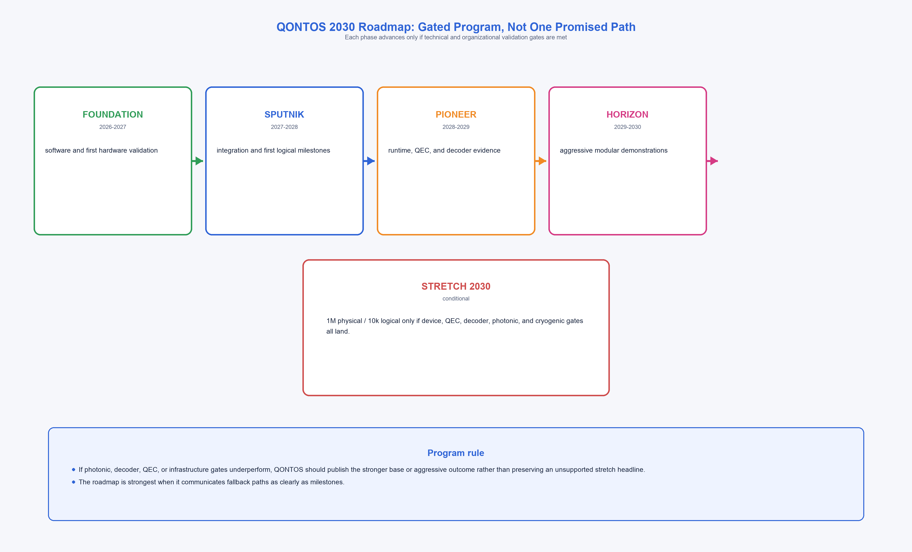
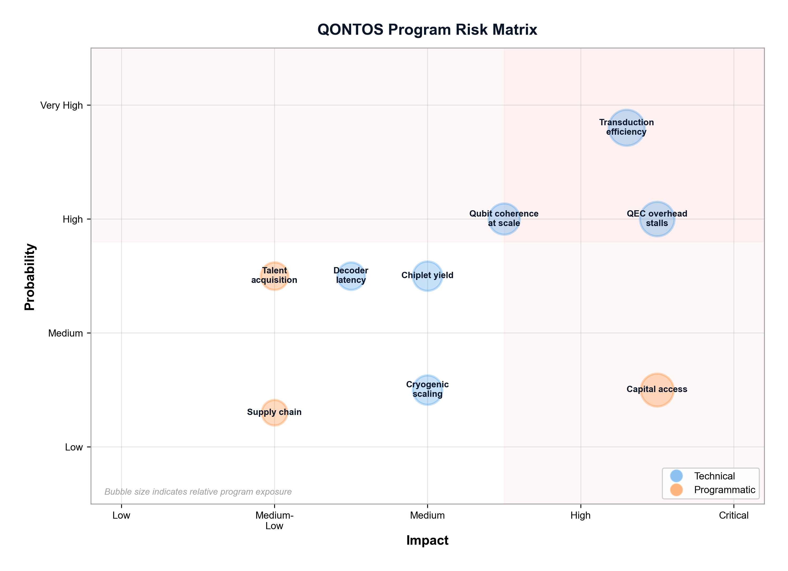

# Gated Engineering Plan for Million-Qubit Modular Quantum Computing: A Scenario-Based Roadmap Through 2030

**Technical Research Paper — Capstone Integration Document**

**Author:** QONTOS Research Wing, Zhyra Quantum Research Institute (ZQRI), Abu Dhabi, UAE

**Series Position:** Paper 10 of 10 — Program Integration and Roadmap

**Cite as:** QONTOS-ZQRI-2025-010

---

## Abstract

This capstone paper presents a gated engineering plan for the QONTOS modular quantum computing program through 2030. Rather than a single-path narrative toward one million physical qubits, we define three explicit scenarios — Base, Aggressive, and Stretch — each with measurable validation gates, quantitative no-go conditions, and concrete fallback plans. The canonical architecture proceeds through four integration levels: chiplet (approximately 2,000 qubits), module (approximately 10,000 qubits), system (approximately 100,000 qubits), and data center (approximately 1,000,000 qubits). Each level is gated by subsystem milestones in device performance, quantum error correction (QEC) overhead, photonic interconnects, cryogenic infrastructure, and classical control. We synthesize requirements from the nine preceding papers in the QONTOS series and map them onto a five-phase program with explicit decision points. Under aggressive but explicit assumptions regarding device coherence, QEC overhead reduction, and interconnect fidelity, QONTOS could reach quantum advantage on selected applications within the 2030 timeframe. The stretch scenario of 10,000 logical qubits remains a conditional north star, reachable only if every major subsystem achieves its aggressive-case milestone on schedule.

**[CLAIM-ROADMAP]** This document is a scenario-based engineering plan. All targets are conditional on stated subsystem milestones and are not unconditional predictions.

---

## 1. Introduction and Roadmap Philosophy

### 1.1 Motivation

The quantum computing industry has entered a phase where credible roadmaps must move beyond aspirational qubit counts toward engineering plans with explicit decision logic. IBM has published development roadmaps projecting 100,000-qubit systems through modular architectures [1]. Google Quantum AI has demonstrated error correction below the surface code threshold [2]. These milestones confirm that large-scale fault-tolerant quantum computing is an engineering challenge with identifiable subsystem dependencies, not a speculative ambition.

**[CLAIM-CONTEXT]** The transition from NISQ-era demonstrations [10] to fault-tolerant systems requires systematic planning with quantitative gates, not aspirational timelines.

However, as the National Academies consensus study emphasized, scaling to practical quantum advantage requires simultaneous advances across multiple subsystems — qubits, error correction, interconnects, control, and software — with failure in any single domain potentially blocking the entire program [8]. This reality demands scenario-based planning.

### 1.2 Roadmap Design Principles

This roadmap is built on four principles:

1. **Scenario discipline.** Every phase specifies Base, Aggressive, and Stretch outcomes. The program is designed to deliver value at every scenario level.
2. **Quantitative gates.** Advancement from one phase to the next requires meeting measurable subsystem milestones. Qualitative assessments ("looks promising") are insufficient.
3. **Explicit no-go conditions.** Each phase defines conditions under which advancement is blocked and fallback plans are activated.
4. **Cross-subsystem coordination.** A qubit milestone without a corresponding QEC or interconnect milestone does not constitute phase completion.

### 1.3 Scenario Summary

| Scenario | 2030 Target | Governing Assumption |
|---|---|---|
| **Base** | 10,000-20,000 physical qubits; 10-20 logical qubits; commercially relevant modular platform | Current device trajectories with incremental improvement |
| **Aggressive** | 100,000 physical qubits; 100-1,000 logical qubits; fault-tolerant demonstrations on flagship applications | Major but plausible subsystem breakthroughs achieved on schedule |
| **Stretch** | 1,000,000 physical qubits; 10,000 logical qubits; quantum advantage on catalysis and cryptographic workloads | Every subsystem achieves its aggressive-case milestone; no major integration surprises |

**[CLAIM-PROJECTION]** The Stretch scenario is not a baseline expectation. It is a conditional planning target that requires simultaneous success across all subsystem domains.

### 1.4 Canonical Architecture Hierarchy

The QONTOS architecture (detailed in Paper 1 [13]) follows a four-level integration hierarchy:

| Level | Name | Approximate Physical Qubits | Integration Challenge |
|---|---|---|---|
| L1 | Chiplet | ~2,000 | On-chip wiring, yield, frequency targeting |
| L2 | Module | ~10,000 | Multi-chiplet packaging, shared cryogenic environment, intra-module coupling |
| L3 | System | ~100,000 | Photonic inter-module links, distributed QEC, classical control scaling |
| L4 | Data Center | ~1,000,000 | Multi-dilution-refrigerator networking, system-level orchestration, power management |

This hierarchy is consistent with modular architectures proposed by Monroe et al. [4] and reflected in IBM's modular quantum roadmap [1]. Each level introduces qualitatively new engineering challenges that cannot be addressed by simply scaling the previous level.

---

## 2. Subsystem Milestone Framework



Before defining program phases, we establish the subsystem milestones that gate phase transitions. The QONTOS program builds a hybrid superconducting-photonic modular architecture: high-coherence tantalum-on-silicon transmon qubits provide the computational substrate within each module, while photonic interconnects enable entanglement distribution across modules. Accordingly, the milestone framework tracks both the superconducting device track (coherence, gate fidelity, yield) and the photonic interconnect track (transduction efficiency, Bell pair fidelity and rate, link count) in parallel. Each milestone is drawn from the preceding papers in the QONTOS series.

### 2.1 Device Performance Milestones (from Paper 2)

| Milestone ID | Metric | Base | Aggressive | Stretch |
|---|---|---|---|---|
| D-1 | T1 relaxation time | 300 us | 800 us | >1 ms |
| D-2 | T2 coherence time | 200 us | 500 us | >800 us |
| D-3 | Single-qubit gate error | 1e-3 | 5e-4 | 1e-4 |
| D-4 | Two-qubit gate error | 5e-3 | 1e-3 | 5e-4 |
| D-5 | Chiplet yield (functional qubits per 2,000-qubit chiplet) | >85% | >92% | >96% |

**[CLAIM-ENGINEERING]** Device milestones D-1 through D-4 are informed by demonstrated tantalum-on-silicon transmon performance and near-term projections. Kim et al. [12] demonstrated utility-scale quantum computation with comparable gate fidelities in a 127-qubit processor.

### 2.2 Quantum Error Correction Milestones (from Paper 3)

| Milestone ID | Metric | Base | Aggressive | Stretch |
|---|---|---|---|---|
| Q-1 | Effective QEC overhead (physical-to-logical ratio) | 1,000:1 | 300:1 | 100:1 |
| Q-2 | Logical error rate per round | 1e-4 | 1e-6 | 1e-8 |
| Q-3 | Code distance achieved | d=5 | d=9 | d=13 |
| Q-4 | Decoder latency (per syndrome round) | <10 us | <1 us | <500 ns |

**[CLAIM-ENGINEERING]** The Stretch overhead target of 100:1 is informed by Bravyi et al. [3], who demonstrated high-threshold fault-tolerant quantum memory with overheads substantially below previous estimates. The Aggressive 300:1 target reflects surface-code implementations with moderate code distance and realistic physical error rates, consistent with analyses by Chamberland et al. [11].

### 2.3 Interconnect Milestones (from Paper 4)

| Milestone ID | Metric | Base | Aggressive | Stretch |
|---|---|---|---|---|
| I-1 | Microwave-to-optical transduction efficiency | <1% | 5-15% | >25% |
| I-2 | Inter-module Bell pair fidelity | 85% | 95% | >99% |
| I-3 | Bell pair generation rate | 1 kHz | 100 kHz | >1 MHz |
| I-4 | Number of inter-module links per module | 1-2 | 4-8 | 16+ |

**[CLAIM-ENGINEERING]** Transduction efficiency is the single highest-risk interconnect parameter. Current laboratory demonstrations remain below 5% end-to-end efficiency for microwave-to-optical conversion.

### 2.4 Cryogenic and Control Milestones (from Papers 5 and 7)

| Milestone ID | Metric | Base | Aggressive | Stretch |
|---|---|---|---|---|
| C-1 | Cooling power at 20 mK per module | 20 uW | 50 uW | >100 uW |
| C-2 | Classical control lines per module | 5,000 | 15,000 | 50,000+ |
| C-3 | Cryogenic multiplexing ratio | 4:1 | 16:1 | 64:1 |
| C-4 | Power consumption per physical qubit | 50 W | 15 W | 5 W |

### 2.5 Software and Algorithmic Milestones (from Papers 6 and 8)

| Milestone ID | Metric | Base | Aggressive | Stretch |
|---|---|---|---|---|
| S-1 | Circuit compilation latency (1,000-qubit program) | <60 s | <5 s | <1 s |
| S-2 | Distributed runtime overhead | >50% | <20% | <5% |
| S-3 | Benchmark reproducibility (replay fidelity) | 90% | 98% | >99.5% |
| S-4 | Application circuits demonstrated | Variational only | Fault-tolerant subroutines | Full FTQC workloads |

---

## 3. Five-Phase Gated Program

The program proceeds through five named phases. Each phase has a duration of approximately 12-18 months. Phase transitions require meeting quantitative validation gates; failure triggers explicit fallback plans.

### 3.1 Phase 1: FOUNDATION (2025 - 2026)

**Primary Objective:** Establish the canonical hybrid superconducting-photonic architecture, software platform, benchmarking methodology, and device characterization baseline. On the superconducting track, freeze chiplet design parameters and begin tantalum-on-silicon transmon characterization. On the photonic track, survey transduction approaches and define the inter-module link specification.

#### 3.1.1 Scenario Outcomes

| Dimension | Base | Aggressive | Stretch Relevance |
|---|---|---|---|
| Hardware | Device parameter survey complete; chiplet design frozen | First 2,000-qubit chiplet fabricated and characterized | Chiplet yield data supports L1 integration |
| QEC | Surface code simulations at d=3 validated | d=5 logical qubit demonstrated on partner hardware | QEC overhead modeling consistent with Q-1 aggressive target |
| Software | Orchestration platform v1.0 deployed | Hardware-in-the-loop simulation validated | Digital twin predicts physical system within 10% |
| Benchmarks | Benchmark methodology paper published (Paper 9) | Benchmark ladder defined through L2 scale | Benchmark targets set for all four architecture levels |

#### 3.1.2 Validation Gates

- **GATE-F1:** Canonical architecture constants (chiplet size, module topology, interconnect type) formally frozen and documented.
- **GATE-F2:** Benchmark methodology peer-reviewed and reproducible on at least two independent simulation backends.
- **GATE-F3:** Device assumptions table populated with literature-grounded values for all milestones D-1 through D-5, with explicit uncertainty ranges.
- **GATE-F4:** Software platform demonstrates end-to-end circuit compilation, execution (simulated), and result replay.

#### 3.1.3 No-Go Conditions

- No coherent benchmark program after 12 months. **Action:** Restructure benchmarking team; do not advance to Phase 2.
- Device literature survey reveals no plausible path to D-1 Base milestones. **Action:** Re-evaluate qubit modality; consider alternative platforms.
- Software platform cannot compile circuits for >500 qubits. **Action:** Refactor compiler architecture before Phase 2.

#### 3.1.4 Fallback Plan

If FOUNDATION gates are not met, QONTOS continues as a software-first orchestration and digital-twin platform. Hardware integration shifts to partnership model with external qubit providers. The software stack remains commercially viable independent of proprietary hardware.

---

### 3.2 Phase 2: SPUTNIK (2026 - 2027)

**Primary Objective:** Validate the chiplet-to-module integration path and demonstrate first logical qubits. On the superconducting track, fabricate and characterize the first multi-chiplet module with tantalum-on-silicon transmons. On the photonic track, characterize intra-module coupling and plan the first inter-module entanglement experiment via microwave-to-optical transduction.

#### 3.2.1 Scenario Outcomes

| Dimension | Base | Aggressive | Stretch Relevance |
|---|---|---|---|
| Hardware | Multi-chiplet packaging demonstrated; 5,000-qubit module partially populated | Full 10,000-qubit module fabricated with >85% yield | Module yield data supports L2 target |
| QEC | d=5 logical qubit demonstrated with overhead <2,000:1 | d=7 logical qubit with overhead approaching 500:1 | QEC overhead trajectory consistent with Q-1 stretch target |
| Interconnects | Intra-module coupling characterized | First inter-module entanglement experiment planned | Transduction efficiency reaches 3-5% in lab |
| Cryogenics | Single dilution refrigerator supports one module | Thermal budget validated for two-module configuration | Cooling power meets C-1 base milestone |

#### 3.2.2 Validation Gates

- **GATE-S1:** At least one 2,000-qubit chiplet fabricated with yield meeting D-5 Base threshold (>85%).
- **GATE-S2:** Logical qubit lifetime exceeds 10x physical qubit T1 time using surface code at d >= 5.
- **GATE-S3:** Module thermal budget analysis demonstrates feasibility of 10,000-qubit module within single cryostat.
- **GATE-S4:** Inter-module entanglement experiment design review passed with identified transduction pathway.

#### 3.2.3 No-Go Conditions and Fallback Examples

- **Chiplet yield below 80%.** If D-5 falls below the Base threshold, the 10,000-qubit module target is not viable at current chiplet size. **Fallback:** Pivot to smaller module topology (4,000-6,000 qubits) using higher-yield chiplet subsets. Extend Phase 2 by 6 months.
- **QEC overhead above 3,000:1 at d=5.** Indicates physical error rates are insufficiently low for the targeted code. **Fallback:** Invest in device improvement (gate error reduction) before scaling module count. Defer Phase 3 logical-qubit targets.
- **Module thermal budget exceeds cryostat capacity by >2x.** **Fallback:** Reduce module population to 5,000 qubits; redesign wiring for lower thermal load.

**[CLAIM-ENGINEERING]** The chiplet yield gate is critical. Modular architectures assume that defective qubits can be mapped around, but yield below 80% makes mapping overhead prohibitive and degrades effective code distance.

---

### 3.3 Phase 3: PIONEER (2027 - 2028)

**Primary Objective:** Validate multi-module distributed execution and demonstrate fault-tolerant subroutines. On the superconducting track, operate multi-module systems with validated gate fidelities across the deployed transmon population. On the photonic track, generate inter-module Bell pairs at scale and demonstrate distributed quantum error correction across photonically linked modules.

#### 3.3.1 Scenario Outcomes

| Dimension | Base | Aggressive | Stretch Relevance |
|---|---|---|---|
| Hardware | 2-module system (20,000 qubits) operational | 5-module system (50,000 qubits) with photonic links | Module count supports path to L3 (100,000 qubits) |
| QEC | Distributed surface code across 2 modules | Distributed d=9 code with overhead approaching 300:1 | Overhead trajectory supports Q-1 stretch target |
| Interconnects | Bell pairs generated at >1 kHz between modules | Bell pair fidelity >93% at >10 kHz rate | Transduction efficiency exceeds 10% |
| Software | Distributed runtime manages 2-module workloads | Compiler optimizes circuit partitioning across 5 modules | Runtime overhead <20% for distributed execution |
| Algorithms | Variational algorithms on logical qubits | First fault-tolerant subroutine (e.g., phase estimation on small molecule) | Application roadmap validated for flagship workloads |

#### 3.3.2 Validation Gates

- **GATE-P1:** Inter-module Bell pair fidelity exceeds I-2 Base threshold (85%) with rate exceeding I-3 Base threshold (1 kHz).
- **GATE-P2:** Distributed surface code maintains logical error rate within 2x of single-module performance.
- **GATE-P3:** Decoder latency meets Q-4 Base threshold (<10 us per syndrome round) at multi-module scale.
- **GATE-P4:** At least one fault-tolerant subroutine executed end-to-end on logical qubits with verified output.

#### 3.3.3 No-Go Conditions and Fallback Examples

- **Transduction efficiency stays below 5%.** If I-1 cannot reach the Aggressive threshold, full photonic multi-system networking (L4) is not viable within the 2030 timeframe. **Fallback:** Do not advance to full photonic multi-system architecture. Instead, pursue direct microwave inter-module coupling within a single large cryostat, limiting system scale to approximately 50,000 qubits. Retire Stretch scenario for L4; redefine Aggressive target as ceiling.
- **Decoder latency exceeds 50 us at multi-module scale.** Syndrome data from distributed modules overwhelms classical processing. **Fallback:** Reduce code distance (accept higher logical error rate); invest in AI-accelerated decoding (Paper 5 [14]). Defer fault-tolerant demonstrations to Phase 4.
- **Communication overhead exceeds 40% of circuit depth.** Distributed execution is dominated by inter-module latency. **Fallback:** Redesign module topology for higher intra-module connectivity; reduce inter-module communication by algorithmic circuit restructuring.

**[CLAIM-ENGINEERING]** The transduction gate is the single highest-risk decision point in the entire roadmap. If microwave-to-optical conversion cannot achieve practical efficiency, the architecture must pivot from optical inter-refrigerator links to dense microwave coupling within shared cryogenic environments, fundamentally limiting the data-center scale.

---

### 3.4 Phase 4: HORIZON (2028 - 2029)

**Primary Objective:** Scale to system-level integration (100,000 qubits) and demonstrate quantum advantage on targeted applications. On the superconducting track, deploy 10-module systems with production-grade transmon chiplets meeting Aggressive device milestones. On the photonic track, establish a full photonic mesh between modules with Bell pair fidelity above 97% and demonstrate multi-refrigerator photonic links for the Stretch path.

#### 3.4.1 Scenario Outcomes

| Dimension | Base | Aggressive | Stretch Relevance |
|---|---|---|---|
| Hardware | 3-5 module system (30,000-50,000 qubits) | 10-module system (100,000 qubits) with full photonic mesh | Hardware path to L4 validated |
| QEC | Logical error rate <1e-4 at d=7 | Logical error rate <1e-6 at d=9; overhead ~300:1 | Overhead trajectory on track for 100:1 |
| Interconnects | Stable inter-module links at >10 kHz | Bell pair fidelity >97% at >100 kHz | Transduction >15%; multi-refrigerator link demonstrated |
| Applications | Quantum simulation of small molecules outperforms classical heuristics | Phase estimation on industrially relevant molecule (e.g., FeMoco active site subproblem) | Resource estimates validated for full catalysis workload per Reiher et al. [5] |
| Software | Production-grade orchestration for multi-module systems | Automatic circuit partitioning with <10% overhead | Full-stack optimization from application to physical layer |

#### 3.4.2 Validation Gates

- **GATE-H1:** Effective QEC overhead at or below 300:1 for at least one code configuration. This is the critical threshold for Aggressive-scenario viability.
- **GATE-H2:** At least one application benchmark demonstrates quantum advantage over best-known classical algorithm on a well-defined problem instance.
- **GATE-H3:** Multi-refrigerator photonic link demonstrated (if pursuing Stretch) with end-to-end fidelity meeting I-2 Aggressive threshold.
- **GATE-H4:** Benchmark ladder (Paper 9 [15]) shows monotonic improvement across at least three consecutive measurement campaigns.

#### 3.4.3 No-Go Conditions and Fallback Examples

- **Effective QEC overhead remains above 300:1.** If Q-1 Aggressive target is not met, the 2030 logical-qubit targets must be downgraded. **Fallback:** Reduce 2030 logical-qubit target from 10,000 (Stretch) to 1,000-3,000. Redefine Stretch as a post-2030 objective. Concentrate resources on maximizing logical qubit quality rather than count.
- **No application benchmark shows quantum advantage.** **Fallback:** Shift application focus from exact quantum advantage to quantum-centric supercomputing (hybrid quantum-classical workflows). Publish detailed resource estimates for advantage-scale problems per Beverland et al. [6] to guide post-2030 planning.
- **Photonic multi-refrigerator link fidelity below 90%.** **Fallback:** Constrain architecture to single-refrigerator systems. Maximum scale approximately 100,000 physical qubits. Retire L4 data-center scenario.

**[CLAIM-PROJECTION]** Reiher et al. [5] estimated that simulating the FeMoco active site of nitrogenase requires approximately 4,000 logical qubits with T-gate counts in the billions. This remains a stretch-scenario flagship application, feasible only if both QEC overhead and logical gate rates meet their aggressive targets.

---

### 3.5 Phase 5: SUMMIT (2029 - 2030)

**Primary Objective:** Determine whether the Stretch architecture is reachable; deliver the strongest achievable system. On the superconducting track, all deployed chiplets must meet Aggressive device milestones across the full population. On the photonic track, stable inter-refrigerator photonic links must sustain high-fidelity Bell pair distribution at rates supporting data-center-scale distributed quantum computation.

#### 3.5.1 Scenario Outcomes

| Dimension | Base | Aggressive | Stretch |
|---|---|---|---|
| Hardware | 50,000 physical qubits across 5+ modules | 100,000+ physical qubits across 10+ modules | 1,000,000 physical qubits across 100+ modules in multi-refrigerator data center |
| Logical qubits | 10-50 | 100-1,000 | 10,000 |
| QEC overhead | ~1,000:1 | ~300:1 | ~100:1 |
| Applications | Useful quantum simulations; hybrid workflows | Fault-tolerant demonstrations on flagship problems | Quantum advantage on catalysis (Reiher et al. [5]) or cryptographic workloads (Gidney and Ekera [7]) |
| Commercial readiness | Cloud-accessible modular platform | Enterprise quantum computing service | Full-scale quantum data center |

#### 3.5.2 Validation Gates

- **GATE-SM1:** Device milestones D-1 through D-5 meet at least Aggressive thresholds across the deployed chiplet population.
- **GATE-SM2:** QEC overhead at or below target for declared scenario (300:1 for Aggressive, 100:1 for Stretch).
- **GATE-SM3:** Interconnect milestones I-1 through I-4 meet at least Aggressive thresholds.
- **GATE-SM4:** At least one flagship application benchmark demonstrates claimed computational advantage with full audit trail (benchmark methodology from Paper 9 [15]).
- **GATE-SM5:** System operates continuously for >168 hours (one week) without requiring manual intervention beyond scheduled maintenance.

#### 3.5.3 No-Go Conditions

- **Any critical subsystem remains at Base performance.** If even one subsystem (device, QEC, interconnect, cryogenics, or software) cannot exceed its Base milestone, the Stretch scenario is retired. **Fallback:** Ship the strongest Aggressive architecture achievable. Publish a revised post-2030 roadmap for Stretch targets.
- **System reliability below 95% uptime over 30-day evaluation period.** **Fallback:** Focus on reliability engineering before expanding scale. Defer L4 integration.

#### 3.5.4 Stretch-Scenario Specific Requirements

For SUMMIT to declare Stretch success, ALL of the following must hold simultaneously:

1. Physical qubit count exceeds 500,000 with clear path to 1,000,000
2. Effective QEC overhead at or below 150:1 (with trajectory toward 100:1)
3. Transduction efficiency exceeds 20% with stable multi-refrigerator links
4. At least one application demonstrates computational advantage that cannot be replicated by classical means within 1,000x the time
5. Full software stack supports automated compilation, execution, and verification at data-center scale

**[CLAIM-ROADMAP]** The simultaneous satisfaction of all five conditions is the defining test of the Stretch scenario. Failure of any single condition triggers fallback to the Aggressive architecture.

---

## 4. Scenario Planning Tables

### 4.1 Architecture Scenario Table

| Parameter | Base (2030) | Aggressive (2030) | Stretch (2030) |
|---|---|---|---|
| Physical qubits | 10,000-20,000 | 100,000 | 1,000,000 |
| Logical qubits | 10-20 | 100-1,000 | 10,000 |
| Effective QEC overhead | ~1,000:1 | ~300:1 | ~100:1 |
| Architecture level | L2 (Module) | L3 (System) | L4 (Data Center) |
| Modules deployed | 1-2 | 10 | 100+ |
| Inter-module link type | Microwave direct | Photonic intra-refrigerator | Photonic inter-refrigerator |
| Dilution refrigerators | 1 | 1-2 | 10+ |
| Decoder type | Software MWPM | FPGA-accelerated | ASIC or neural-network |
| Flagship application | Variational simulations | FT subroutines on small molecules | Full catalysis / cryptanalysis |

### 4.2 Investment Scenario Table

| Category | Base | Aggressive | Stretch |
|---|---|---|---|
| Hardware R&D | $30-50M | $100-150M | $200-300M |
| Fabrication and packaging | $10-20M | $50-80M | $150-200M |
| Cryogenic infrastructure | $5-10M | $20-40M | $80-120M |
| Software and algorithms | $15-25M | $30-50M | $50-80M |
| Operations and facilities | $5-10M | $15-25M | $50-80M |
| **Total envelope** | **$65-115M** | **$215-345M** | **$530-780M** |

**[CLAIM-ESTIMATE]** Investment figures are planning envelopes informed by McKinsey's Quantum Technology Monitor [9] and publicly available data from comparable quantum hardware programs. Actual expenditure depends on technology maturation rates and partnership structures.

### 4.3 Application Scenario Table

| Application Domain | Base | Aggressive | Stretch |
|---|---|---|---|
| Quantum chemistry | Small-molecule VQE | FT phase estimation on subproblems | Full FeMoco simulation [5] |
| Materials science | Variational lattice models | Hubbard model at useful scale | Correlated-electron materials |
| Optimization | QAOA on toy instances | Hybrid quantum-classical optimization | Grover-accelerated search on structured problems |
| Cryptography | Shor's algorithm on <20-bit integers | Shor's algorithm on 256-bit integers | RSA-2048 factoring feasibility [7] |
| Machine learning | Quantum kernel methods | Quantum-enhanced feature spaces | Provable quantum advantage on learning tasks |

**[CLAIM-CONTEXT]** Gidney and Ekera [7] estimated that factoring a 2048-bit RSA integer requires approximately 20 million noisy qubits or roughly 4,000 logical qubits at high code distance, placing this firmly in the Stretch scenario. Beverland et al. [6] provide detailed resource estimates confirming that most applications of economic interest require fault-tolerant systems exceeding 1,000 logical qubits.

---

## 5. Risk Matrix



### 5.1 Technical Risk Assessment

| Risk ID | Risk Description | Probability | Impact | Scenario Affected | Mitigation |
|---|---|---|---|---|---|
| R-01 | Transduction efficiency plateaus below 5% | High | Critical | Stretch, Aggressive | Pursue parallel transduction approaches (piezoelectric, electro-optic); design fallback microwave-only architecture |
| R-02 | QEC overhead remains above 500:1 | Medium | High | Stretch | Invest in higher-threshold codes (e.g., Bravyi et al. [3] approaches); improve physical error rates |
| R-03 | Chiplet yield below 80% at production scale | Medium | High | All | Develop defect-mapping protocols; reduce chiplet size; increase redundancy |
| R-04 | Decoder latency exceeds real-time threshold | Medium | High | Aggressive, Stretch | AI-accelerated decoding (Paper 5); ASIC decoder development |
| R-05 | Cryogenic cooling insufficient for dense modules | Medium | Medium | Stretch | Reduce qubit density per module; distribute across more refrigerators |
| R-06 | Classical control wiring does not scale | Medium | Medium | Stretch | Cryo-CMOS multiplexing; photonic control links |
| R-07 | No application demonstrates quantum advantage by 2029 | Medium | High | Aggressive, Stretch | Refocus on hybrid quantum-classical workflows; target narrow advantage demonstrations |
| R-08 | Supply chain disruption for specialized components | Low | High | All | Multi-source procurement; strategic inventory |
| R-09 | Key personnel departure in critical subsystem teams | Medium | Medium | All | Knowledge documentation; competitive retention; distributed expertise |
| R-10 | Competing platform achieves advantage first, reducing funding | Low | Medium | All | Maintain technology-agnostic software layer; pursue partnerships |

### 5.2 Programmatic Risk Assessment

| Risk ID | Risk Description | Probability | Impact | Mitigation |
|---|---|---|---|---|
| P-01 | Sustained capital access interrupted | Low-Medium | Critical | Phase program to deliver commercial value at Base scenario; diversify funding sources |
| P-02 | Fabrication partner capacity constraints | Medium | High | Establish relationships with multiple foundries; develop in-house packaging capability |
| P-03 | Regulatory changes affecting quantum technology export | Low | Medium | Monitor policy landscape; maintain compliance infrastructure |
| P-04 | Timeline optimism bias in phase planning | High | Medium | Build 6-month buffer into each phase; enforce gate discipline |

---

## 6. Cross-Paper Dependencies

The QONTOS research series comprises ten papers, each addressing a subsystem or cross-cutting concern. This capstone paper integrates their findings. The following table maps dependencies between papers and roadmap phases.

### 6.1 Paper-to-Phase Dependency Matrix

| Paper | Title | FOUNDATION | SPUTNIK | PIONEER | HORIZON | SUMMIT |
|---|---|---|---|---|---|---|
| Paper 1 | Scaled Architecture | Critical | Critical | Important | Important | Important |
| Paper 2 | Tantalum-Silicon Qubits | Critical | Critical | Critical | Important | Gate check |
| Paper 3 | Error Correction 100:1 | Important | Critical | Critical | Critical | Gate check |
| Paper 4 | Photonic Interconnects | Informational | Important | Critical | Critical | Gate check |
| Paper 5 | AI Decoding | Informational | Important | Important | Critical | Critical |
| Paper 6 | Software Stack | Critical | Critical | Critical | Critical | Critical |
| Paper 7 | Cryogenic Infrastructure | Informational | Important | Important | Critical | Critical |
| Paper 8 | Quantum Algorithms | Informational | Informational | Important | Critical | Critical |
| Paper 9 | Benchmarking | Critical | Critical | Critical | Critical | Critical |
| Paper 10 | Roadmap (this paper) | Defining | Governing | Governing | Governing | Defining |

*Legend: Critical = blocking dependency; Important = significant input; Informational = contextual reference; Defining = this paper sets the framework; Governing = this paper sets the gates.*

### 6.2 Key Cross-Paper Dependencies

1. **Paper 2 gates Paper 3.** QEC overhead (Paper 3) is fundamentally determined by physical error rates (Paper 2). If device milestones D-3 and D-4 are not met, no QEC scheme can achieve the targeted overhead ratios.

2. **Paper 4 gates Paper 1 at L3+.** The system-level and data-center-level architecture (Paper 1) requires photonic interconnects (Paper 4). Without transduction milestones I-1 and I-2, the architecture cannot scale beyond L2.

3. **Paper 5 enables Paper 3 at scale.** AI-accelerated decoding (Paper 5) is required to meet decoder latency milestones Q-4 at Aggressive and Stretch scales. Classical MWPM decoders are sufficient only for Base-scenario code distances.

4. **Paper 7 constrains Paper 1.** Cryogenic cooling capacity (Paper 7) sets hard physical limits on qubit density per module. Milestone C-1 directly constrains the canonical architecture hierarchy.

5. **Paper 9 validates all papers.** The benchmarking methodology (Paper 9) provides the measurement framework for all subsystem milestones. Without reproducible benchmarks, no gate can be formally passed.

6. **Paper 8 drives Paper 3 requirements.** Algorithmic resource estimates (Paper 8) determine the logical qubit count and logical gate count required for quantum advantage, which in turn set the QEC overhead and code distance requirements.

---

## 7. Integration and Decision Logic

### 7.1 Phase Transition Decision Tree

Each phase transition follows a structured decision process:

```
PHASE N COMPLETE?
  |
  +-- All gates met at Aggressive+ level --> Advance to Phase N+1 (Aggressive/Stretch track)
  |
  +-- All gates met at Base level ---------> Advance to Phase N+1 (Base track); reassess Stretch viability
  |
  +-- One or more gates failed ------------> Activate fallback plan
       |
       +-- Fallback recoverable in <6 months --> Extend Phase N; retry gates
       |
       +-- Fallback requires >6 months -------> Restructure Phase N+1 scope; downgrade scenario ceiling
       |
       +-- Fundamental no-go condition --------> Retire affected scenario; redirect resources
```

### 7.2 Scenario Transition Rules

- **Stretch to Aggressive downgrade:** Triggered if any subsystem cannot demonstrate a credible path to its Stretch milestone by the end of PIONEER (Phase 3). The Stretch scenario becomes a post-2030 research target.
- **Aggressive to Base downgrade:** Triggered if QEC overhead remains above 500:1 at the end of HORIZON (Phase 4), or if no application benchmark shows meaningful quantum speedup.
- **Base scenario is always maintained.** The program is designed to deliver commercially relevant technology at the Base level under all plausible outcomes.

### 7.3 Annual Review Cadence

In addition to phase-transition gates, the program conducts annual subsystem reviews:

| Review | Timing | Scope |
|---|---|---|
| Device Review | Q1 annually | D-1 through D-5 progress; yield trends; fabrication partner status |
| QEC Review | Q2 annually | Q-1 through Q-4 progress; decoder development; code selection |
| Systems Review | Q3 annually | Integration status; cryogenic performance; control scaling |
| Program Review | Q4 annually | Scenario viability assessment; budget reallocation; go/no-go decisions |

---

## 8. Comparison with Industry Roadmaps

### 8.1 IBM Quantum Roadmap

IBM's development roadmap [1] projects a path to 100,000-qubit systems through modular architectures based on classical and quantum communication links between processors. The QONTOS roadmap shares the modular philosophy but differs in three respects: (a) QONTOS targets higher qubit counts in the Stretch scenario through photonic inter-refrigerator networking; (b) QONTOS makes QEC overhead an explicit gate rather than a background assumption; and (c) QONTOS defines explicit fallback architectures at each phase.

**[CLAIM-CONTEXT]** IBM's roadmap provides important industry context but does not define the QONTOS architecture. The QONTOS program must independently validate its subsystem milestones.

### 8.2 Google Quantum AI

Google's demonstration of error correction below the surface code threshold [2] is a landmark result that validates the fundamental viability of the surface-code approach used in the QONTOS QEC subsystem. However, Google's demonstrated system operates at a scale (approximately 100 physical qubits for a single logical qubit) that corresponds to QONTOS Phase 2 milestones, not Phase 5 targets.

### 8.3 Industry-Wide Context

Preskill's characterization of the NISQ era [10] remains relevant: current quantum computers are noisy, intermediate-scale devices that fall short of fault tolerance. The QONTOS roadmap is explicitly designed to transition from NISQ through early fault tolerance (Base scenario) to large-scale fault tolerance (Stretch scenario), with the recognition that most of the industry will likely operate in the NISQ-to-early-FT regime through 2030.

**[CLAIM-CONTEXT]** McKinsey's Quantum Technology Monitor [9] projects that the quantum computing market could reach tens of billions of dollars by 2040, with fault-tolerant systems capturing the majority of value. The QONTOS program is positioned to contribute to this market at any scenario level.

---

## 9. Workforce and Organizational Requirements

### 9.1 Team Scaling by Phase

| Phase | Core Team Size | Key Hires | Critical Capabilities |
|---|---|---|---|
| FOUNDATION | 30-50 | Architecture leads; benchmark engineers; device physicists | Architecture definition; simulation; benchmarking |
| SPUTNIK | 80-120 | Fabrication engineers; packaging specialists; QEC researchers | Chiplet fabrication; module integration; logical qubit demonstration |
| PIONEER | 150-200 | Photonic engineers; distributed systems architects; cryogenic engineers | Inter-module networking; distributed runtime; multi-module cryogenics |
| HORIZON | 250-350 | Application scientists; reliability engineers; systems integrators | Application development; system-level integration; production engineering |
| SUMMIT | 400-500 | Operations engineers; commercial team; customer engineering | Production operations; enterprise deployment; customer support |

### 9.2 Critical Capability Gaps

The following capabilities are identified as high-priority recruitment targets:

1. **Microwave-to-optical transduction expertise.** Fewer than 200 researchers worldwide have deep experience with high-efficiency transduction. Recruitment or partnership is essential.
2. **Cryogenic systems engineering at scale.** Multi-refrigerator quantum computing installations do not yet exist. Experience from adjacent fields (particle physics, space systems) is transferable but not directly applicable.
3. **Fault-tolerant compilation.** Compilers for fault-tolerant quantum circuits are in early research stages. This capability must be developed in-house.

---

## 10. External Communication Framework

### 10.1 Recommended Public Framing

The technically credible public statement for the QONTOS program is:

> QONTOS is pursuing a modular quantum computing roadmap with Base, Aggressive, and Stretch scenarios through 2030. The Stretch scenario targets one million physical qubits and ten thousand logical qubits, contingent on achieving specific milestones in qubit performance, error correction overhead, photonic interconnects, cryogenic infrastructure, and classical control systems. Each phase of the program is gated by measurable subsystem milestones with explicit fallback plans.

### 10.2 Communication Guardrails

| Statement Type | Acceptable | Not Acceptable |
|---|---|---|
| Architecture targets | "Our Stretch scenario targets..." | "We will build..." |
| Timeline | "Under aggressive assumptions, by 2030..." | "By 2030, we will deliver..." |
| Application claims | "Our resource estimates indicate that..." | "We will achieve quantum advantage in..." |
| Comparison | "Our architecture shares principles with..." | "Our approach is superior to..." |

**[CLAIM-ROADMAP]** All external communications must use scenario-qualified language. Unqualified claims about the Stretch scenario are not supported by this roadmap.

---

## 11. Conclusion

This capstone paper defines the QONTOS program as a gated engineering plan rather than a single-path promise. The five-phase structure — FOUNDATION, SPUTNIK, PIONEER, HORIZON, and SUMMIT — provides a disciplined sequence of decision points, each governed by quantitative subsystem milestones with explicit fallback plans.

The roadmap's strength lies in its intellectual honesty. The Base scenario delivers a commercially relevant modular quantum computing platform under conservative assumptions. The Aggressive scenario requires major but plausible breakthroughs in device performance, QEC overhead, and photonic interconnects — breakthroughs that are consistent with current research trajectories demonstrated by Google [2], IBM [1], and leading academic groups [3, 12]. The Stretch scenario of one million physical qubits and ten thousand logical qubits remains a conditional north star, achievable only if every subsystem meets its aggressive-case milestone on schedule.

Under aggressive but explicit assumptions regarding device coherence (T1 > 800 us, two-qubit gate error < 1e-3), QEC overhead reduction (effective ratio below 300:1 via high-threshold codes), and interconnect fidelity (transduction efficiency above 15%, Bell pair fidelity above 97%), QONTOS could reach quantum advantage on selected applications — particularly quantum chemistry simulations and fault-tolerant subroutine demonstrations — within the 2030 timeframe. Full-scale advantage on flagship problems such as FeMoco simulation [5] or RSA-2048 factoring [7] remains a Stretch-scenario outcome contingent on achieving the 100:1 overhead target and deploying data-center-scale infrastructure.

**[CLAIM-ROADMAP]** The roadmap is feasible only if it remains gated, scenario-based, and tightly linked to benchmark evidence. The stretch scenario is not a commitment; it is a conditional engineering target that defines the program's maximum ambition while the Base and Aggressive scenarios ensure that every phase delivers tangible value regardless of which subsystem breakthroughs materialize.

The QONTOS program, as defined in this ten-paper series, represents a comprehensive and technically grounded approach to building large-scale modular quantum computers. Its credibility rests not on the boldness of its targets but on the rigor of its gates.

---

## References

[1] IBM, "IBM Quantum Development Roadmap," public roadmap document, IBM Quantum, 2024. Available: https://www.ibm.com/quantum/roadmap

[2] Google Quantum AI, "Quantum error correction below the surface code threshold," *Nature*, 2024.

[3] S. Bravyi, A. W. Cross, J. M. Gambetta, D. Maslov, P. Rall, and T. J. Yoder, "High-threshold and low-overhead fault-tolerant quantum memory," *Nature*, vol. 627, pp. 778-782, 2024.

[4] C. Monroe, R. Raussendorf, A. Ruthven, K. R. Brown, P. Maunz, L.-M. Duan, and J. Kim, "Large-scale modular quantum-computer architecture with atomic memory and photonic interconnects," *Physical Review A*, vol. 89, p. 022317, 2014.

[5] M. Reiher, N. Wiebe, K. M. Svore, D. Wecker, and M. Troyer, "Elucidating reaction mechanisms on quantum computers," *Proceedings of the National Academy of Sciences*, vol. 114, no. 29, pp. 7555-7560, 2017.

[6] M. E. Beverland, P. Murali, M. Troyer, K. M. Svore, T. Hoefler, V. Kliuchnikov, G. H. Low, M. Soeken, A. Sundaram, and A. Vaschillo, "Assessing requirements to scale to practical quantum advantage," arXiv:2211.07629, 2022.

[7] C. Gidney and M. Ekera, "How to factor 2048 bit RSA integers in 8 hours using 20 million noisy qubits," *Quantum*, vol. 5, p. 433, 2021.

[8] National Academies of Sciences, Engineering, and Medicine, *Quantum Computing: Progress and Prospects*, The National Academies Press, Washington, DC, 2019.

[9] McKinsey & Company, "Quantum Technology Monitor," McKinsey Digital, 2024.

[10] J. Preskill, "Quantum Computing in the NISQ era and beyond," *Quantum*, vol. 2, p. 79, 2018.

[11] C. Chamberland, K. Noh, P. Arrangoiz-Arriola, E. T. Campbell, C. T. Hann, J. Iverson, H. Putterman, T. C. Bohdanowicz, S. T. Flammia, A. Keller, G. Refael, J. Preskill, L. Jiang, A. H. Safavi-Naeini, O. Painter, and F. G. S. L. Brandao, "Building a fault-tolerant quantum computer using concatenated cat codes," *PRX Quantum*, vol. 3, 2022.

[12] Y. Kim, A. Eddins, S. Anand, K. X. Wei, E. van den Berg, S. Rosenblatt, H. Nayfeh, Y. Wu, M. Zaletel, K. Temme, and A. Kandala, "Evidence for the utility of quantum computing before fault tolerance," *Nature*, vol. 618, pp. 500-505, 2023.

[13] QONTOS Research Wing, "QONTOS Scaled Architecture for Modular Quantum Computing," QONTOS-ZQRI-2025-001, Paper 1 of 10.

[14] QONTOS Research Wing, "AI-Accelerated Quantum Error Decoding," QONTOS-ZQRI-2025-005, Paper 5 of 10.

[15] QONTOS Research Wing, "Benchmarking Methodology for Modular Quantum Systems," QONTOS-ZQRI-2025-009, Paper 9 of 10.

---

*Document Version: Final*
*Classification: Technical Research Paper — Capstone Integration Document*
*Claim posture: Scenario-based gated engineering plan with quantitative milestones, explicit no-go conditions, and fallback architectures*
*Series: QONTOS Modular Quantum Computing Research Series, Paper 10 of 10*
